# Swarm-Ev2 项目蓝图

> **文档目的**：为开发者提供系统架构的全局视图，消除历史开发中可能产生的误解。
>
> **最后更新**：2026-02-02 | **版本**：MVP 1.0

---

## 1. 核心理念

Swarm-Ev2 是一个**双层群体智能**系统，用于自动化解决机器学习问题。

### 1.1 两层含义

| 层级 | 名称 | 进化单位 | 进化方式 |
|------|------|---------|---------|
| **上层** | Agent 层 | Agent 的 Prompt（Role + Strategy） | LLM 驱动的 Prompt 变异 |
| **下层** | Solution 层 | 代码解决方案（7 个基因块） | 遗传算法（交叉 + 变异） |

### 1.2 设计哲学

```
Agent 决定"怎么写代码" → Solution 是"代码本身"
Agent 进化慢（每 3 Epoch）→ Solution 进化快（每 Epoch）
Agent 是"老师" → Solution 是"作业"
```

---

## 2. MVP 架构总览

### 2.1 核心组件职责

```
┌────────────────────────────────────────────────────────────────┐
│                        main.py                                  │
│                     （Epoch 循环控制）                           │
│                                                                 │
│  for epoch in range(num_epochs):                               │
│      orchestrator._run_single_epoch()   # 生成方案              │
│      solution_evolution.run_epoch()     # 遗传算法优化          │
│      agent_evolution.evolve()           # Agent 进化（每3轮）   │
└────────────────────────────────────────────────────────────────┘
                              │
              ┌───────────────┴───────────────┐
              ▼                               ▼
┌──────────────────────────┐    ┌──────────────────────────────┐
│   SolutionEvolution      │    │       Orchestrator           │
│      （决策层）           │    │        （执行层）             │
│                          │    │                              │
│ 职责:                    │    │ 职责:                        │
│ ├─ 筛选种群（12 个）     │───▶│ ├─ 调用 Agent 生成代码       │
│ ├─ 精英保留（top-3）     │    │ ├─ 执行代码（Interpreter）   │
│ ├─ 锦标赛选择父代        │    │ ├─ Review 评估（LLM）        │
│ ├─ 制定交叉计划          │    │ └─ 记录到 Journal            │
│ └─ 制定变异目标          │    │                              │
│                          │    │ 对外接口:                     │
│ 调用:                    │    │ ├─ execute_merge_task()      │
│ ├─ orchestrator          │    │ └─ execute_mutate_task()     │
│ │   .execute_merge_task()│    │                              │
│ └─ orchestrator          │    │                              │
│     .execute_mutate_task()│    │                              │
└──────────────────────────┘    └──────────────────────────────┘
```

### 2.2 一句话定位

| 组件 | 一句话定位 |
|------|-----------|
| **main.py** | Epoch 循环的"调度器" |
| **SolutionEvolution** | 遗传算法的"大脑"（决定谁交叉、谁变异） |
| **Orchestrator** | 任务执行的"手脚"（调用 Agent、执行代码、评估） |
| **Journal** | 所有节点的"档案馆" |
| **Agent** | 代码生成的"工人" |

---

## 3. 单个 Epoch 的执行流程

```mermaid
flowchart TD
    subgraph "Epoch N"
        A[开始] --> B["[1] Orchestrator._run_single_epoch(5)"]

        subgraph "Orchestrator 执行层"
            B --> B1[选择父节点/从零开始]
            B1 --> B2[Agent 生成代码]
            B2 --> B3[Interpreter 执行代码]
            B3 --> B4[LLM Review 评估]
            B4 --> B5[记录到 Journal]
            B5 --> B6{还有步数?}
            B6 -->|是| B1
            B6 -->|否| C
        end

        C["[2] SolutionEvolution.run_epoch()"]

        subgraph "SolutionEvolution 决策层"
            C --> C1[从 Journal 筛选 good_nodes]
            C1 --> C2{数量 >= 12?}
            C2 -->|否| C9[跳过进化]
            C2 -->|是| C3[精英保留 top-3]
            C3 --> C4[锦标赛选择父代对]
            C4 --> C5["交叉: orchestrator.execute_merge_task()"]
            C5 --> C6["变异: orchestrator.execute_mutate_task()"]
            C6 --> C7[返回最佳节点]
        end

        C7 --> D{Epoch % 3 == 0?}
        C9 --> D
        D -->|是| E["[3] AgentEvolution.evolve()"]
        D -->|否| F[结束]
        E --> F
    end
```



---

## 4. 关键数据流

### 4.1 Node 的生命周期

```
Agent.generate()
    │
    ▼
┌──────────────────┐
│   Node 对象       │  ← 刚生成，只有 code 和 plan
│   .code = "..."  │
│   .plan = "..."  │
│   .is_buggy = ?  │
└──────────────────┘
    │
    ▼ Interpreter.run()
┌──────────────────┐
│   Node 对象       │  ← 执行后，有 term_out 和 exec_time
│   .term_out      │
│   .exec_time     │
│   .exc_type      │
└──────────────────┘
    │
    ▼ Orchestrator._review_node()
┌──────────────────┐
│   Node 对象       │  ← Review 后，有 metric_value 和 is_buggy
│   .metric_value  │
│   .is_buggy      │
│   .lower_is_better│
└──────────────────┘
    │
    ▼ Journal.append()
┌──────────────────┐
│   Journal        │  ← 所有节点都在这里
│   .nodes = [...]  │
│   .get_best_node()│
└──────────────────┘
```

### 4.2 Journal 是唯一的真理来源

| 场景 | 如何使用 Journal |
|------|-----------------|
| Orchestrator 选择父节点 | `journal.get_best_node()` |
| SolutionEvolution 获取种群 | `[n for n in journal.nodes if not n.is_buggy][-12:]` |
| 最终输出最佳方案 | `journal.get_best_node(only_good=True)` |

---

## 5. 遗传算法的 MVP 简化

### 5.1 原始设计 vs MVP 实现

| 维度 | 原始设计（Phase 3.4） | MVP 实现（当前） |
|------|----------------------|-----------------|
| **初始种群** | `ParallelEvaluator.batch_generate(12)` | 从 Journal 中筛选 |
| **评估方式** | 并行正则提取 | Orchestrator 内 LLM Review |
| **交叉策略** | 随机 + 信息素驱动 | 仅随机（50% A/B） |
| **种群来源** | 固定封闭进化 | 动态从 Journal 获取 |

### 5.2 MVP 简化的原因

1. **降低依赖**：SolutionEvolution 不直接依赖 Agent/Evaluator/ExperiencePool
2. **职责分离**：决策（SolutionEvolution）与执行（Orchestrator）解耦
3. **快速验证**：先跑通流程，后优化性能

### 5.3 已知的性能牺牲

| 牺牲项 | 影响 | 未来优化方向 |
|--------|------|-------------|
| 无并行评估 | 性能下降 ~4x | 恢复 `ParallelEvaluator` |
| 无信息素驱动 | 收敛速度慢 ~20% | 恢复 `GeneSelector` |
| 串行生成 | 吞吐量低 | 恢复 `batch_generate()` |

---

## 6. 七大基因块

每个 Solution 的代码被划分为 7 个基因块，用于交叉和变异：

| 基因块 | 标记 | 说明 |
|--------|------|------|
| DATA | `# [SECTION: DATA]` | 数据加载与预处理 |
| MODEL | `# [SECTION: MODEL]` | 模型定义 |
| LOSS | `# [SECTION: LOSS]` | 损失函数 |
| OPTIMIZER | `# [SECTION: OPTIMIZER]` | 优化器配置 |
| REGULARIZATION | `# [SECTION: REGULARIZATION]` | 正则化策略 |
| INITIALIZATION | `# [SECTION: INITIALIZATION]` | 权重初始化 |
| TRAINING_TRICKS | `# [SECTION: TRAINING_TRICKS]` | 训练技巧 |

**交叉操作**：随机决定每个基因块取自父代 A 还是父代 B。
**变异操作**：随机选择一个基因块，让 Agent 重写。

---

## 7. 三层进化机制详解

每个 Epoch 中，main.py 依次调用三个核心方法：

```python
for epoch in range(num_epochs):
    orchestrator._run_single_epoch()     # ① 探索层
    solution_evolution.run_epoch()       # ② Solution 层
    agent_evolution.evolve()             # ③ Agent 层（每 3 轮）
```

### 7.1 层级概览

```
┌─────────────────────────────────────────────────────────────────┐
│  ③ Agent 层进化（每 3 Epoch）                                    │
│     agent_evolution.evolve()                                    │
│     "培训工人" — 优化 Agent 的 Prompt                            │
└─────────────────────────────────────────────────────────────────┘
                              ▲ 读取 ExperiencePool
                              │
┌─────────────────────────────────────────────────────────────────┐
│  ② Solution 层进化（每 Epoch）                                   │
│     solution_evolution.run_epoch()                              │
│     "基因工程" — 对 Solution 进行交叉变异                        │
└─────────────────────────────────────────────────────────────────┘
                              ▲ 读取 Journal
                              │
┌─────────────────────────────────────────────────────────────────┐
│  ① 探索层（每 Step）                                             │
│     orchestrator._run_single_epoch()                            │
│     "工人干活" — 生成新的 Solution                               │
└─────────────────────────────────────────────────────────────────┘
```

### 7.2 各层职责详解

#### ① `orchestrator._run_single_epoch()` — 探索层

**职责**：让 Agent 生成新的 Solution，执行，评估，记录。

| 输入 | 输出 |
|------|------|
| 无 | Journal 中增加 N 个新节点 |
|    | ExperiencePool 中增加 N 条记录 |

**具体步骤**：
```
for step in range(steps_per_epoch):
    ├─ 选择父节点（或从零开始）
    ├─ Agent.generate() → 生成代码
    ├─ Interpreter.run() → 执行代码
    ├─ LLM Review → 评估结果
    ├─ Journal.append() → 记录节点
    └─ ExperiencePool.add() → 记录经验
```

---

#### ② `solution_evolution.run_epoch()` — Solution 层

**职责**：对 Solution 进行遗传算法优化（交叉、变异）。

| 输入 | 输出 |
|------|------|
| Journal 中的 good_nodes | Journal 中增加交叉/变异产生的新节点 |

**具体步骤**：
```
从 Journal 筛选 12 个 good_nodes 作为种群
    │
    ├─ 数量不足 12 → 跳过进化，等待更多探索
    │
    ├─ 精英保留 top-3
    ├─ 锦标赛选择父代对
    ├─ 交叉：调用 orchestrator.execute_merge_task()
    ├─ 变异：调用 orchestrator.execute_mutate_task()
    └─ 返回最佳节点
```

**关键点**：SolutionEvolution 只负责"决策"（决定谁交叉、变异哪个基因），实际执行由 Orchestrator 完成。

---

#### ③ `agent_evolution.evolve()` — Agent 层

**职责**：根据历史表现，优化 Agent 的 Prompt（Role 和 Strategy）。

| 输入 | 输出 |
|------|------|
| ExperiencePool 中的历史记录 | 更新 Agent 的配置文件（role.md, strategy_*.md） |

**具体步骤**：
```
检查 epoch % 3 == 0（每 3 轮才触发）
    │
    ├─ 从 ExperiencePool 获取每个 Agent 的统计
    │   └─ score = success_rate × avg_quality
    │
    ├─ 排序：精英（top-2） vs 弱者（bottom-2）
    │
    └─ 对弱者进行 LLM 驱动的变异：
        ├─ 变异 role.md（角色定位）
        ├─ 变异 strategy_explore.md
        ├─ 变异 strategy_merge.md
        └─ 变异 strategy_mutate.md
```

**关键点**：Agent 进化不产生新节点，而是修改 Agent 的"大脑"（Prompt 文件），影响后续 Epoch 的代码生成质量。

### 7.3 数据流动关系

```
                         ┌──────────────────┐
                         │  ExperiencePool  │
                         │   （工作记录）    │
                         └────────┬─────────┘
                                  │
               ┌──────────────────┼──────────────────┐
               │ 写入             │ 读取              │
               ▼                  ▼                  │
┌──────────────────┐    ┌───────────────────┐       │
│   orchestrator   │    │ agent_evolution   │       │
│ ._run_single_    │    │ .evolve()         │       │
│     epoch()      │    └─────────┬─────────┘       │
└────────┬─────────┘              │                 │
         │                        │ 更新            │
         │ 写入                   ▼                 │
         ▼              ┌─────────────────┐         │
┌──────────────────┐    │  Agent 配置文件  │         │
│     Journal      │    │ (role.md 等)    │         │
│   （节点档案）    │    └─────────┬───────┘         │
└────────┬─────────┘              │                 │
         │                        │ 影响生成        │
         │ 读取                   ▼                 │
         ▼              ┌─────────────────┐         │
┌──────────────────┐    │     Agent       │─────────┘
│solution_evolution│    │  .generate()    │
│ .run_epoch()     │    └─────────────────┘
└────────┬─────────┘
         │
         │ 调用
         ▼
┌──────────────────┐
│   orchestrator   │
│ .execute_merge() │
│ .execute_mutate()│
└──────────────────┘
```

### 7.4 循环关系总结

| 层级 | 方法 | 频率 | 产出 | 消费 |
|------|------|------|------|------|
| ① 探索层 | `_run_single_epoch()` | 每 Step | Journal, ExperiencePool | Agent 配置 |
| ② Solution 层 | `run_epoch()` | 每 Epoch | Journal（新节点） | Journal |
| ③ Agent 层 | `evolve()` | 每 3 Epoch | Agent 配置文件 | ExperiencePool |

**循环逻辑**：
1. **探索层**产出 Solution（记录到 Journal）+ 工作记录（记录到 ExperiencePool）
2. **Solution 层**利用 Journal 中的优秀 Solution 进行杂交/变异，产出更优 Solution
3. **Agent 层**利用 ExperiencePool 分析哪个 Agent 表现好，让差的 Agent 向好的学习，提升后续生成质量

---

## 8. 目录结构（核心模块）

```
Swarm-Ev2/
├── main.py                           # 入口：Epoch 循环控制
├── core/
│   ├── orchestrator.py               # 执行层：任务编排
│   ├── state/
│   │   ├── node.py                   # Node 数据结构
│   │   └── journal.py                # Journal 容器
│   ├── executor/
│   │   ├── interpreter.py            # 代码执行沙箱
│   │   └── workspace.py              # 工作空间管理
│   └── evolution/
│       ├── solution_evolution.py     # 决策层：遗传算法
│       ├── agent_evolution.py        # Agent 进化
│       ├── task_dispatcher.py        # 任务分发
│       ├── experience_pool.py        # 经验池
│       └── gene_parser.py            # 基因解析
├── agents/
│   ├── base_agent.py                 # Agent 基类
│   └── coder_agent.py                # 代码生成 Agent
└── utils/
    ├── config.py                     # 配置管理
    ├── logger_system.py              # 日志系统
    └── prompt_builder.py             # Prompt 构建
```

---

## 9. 常见误解澄清

### Q1: SolutionEvolution 为什么不自己调用 Agent？

**答**：职责分离。SolutionEvolution 只负责"决定做什么"（交叉计划、变异目标），Orchestrator 负责"执行"（调用 Agent、评估）。这样：
- SolutionEvolution 不需要知道 Agent 如何工作
- Orchestrator 可以统一管理所有任务的执行和评估
- 便于测试（可以 Mock Orchestrator）

### Q2: 为什么不像原设计一样一开始并行生成 12 个初始种群？

**答**：MVP 简化。当前实现是：
1. 先跑 Orchestrator 收集节点到 Journal
2. SolutionEvolution 从 Journal 中筛选种群
3. 如果 good_nodes < 12，跳过进化，继续探索

这样可以先验证架构，后续可以恢复 `ParallelEvaluator.batch_generate()`。

### Q3: Journal 中的节点会无限增长吗？

**答**：会。但这是有意为之：
- Journal 是"全历史档案"，保留所有尝试
- SolutionEvolution 只取最近的 12 个 good_nodes 作为种群
- 未来可以添加归档机制（将旧节点存储到磁盘）

### Q4: ParallelEvaluator 和 Orchestrator._review_node() 有什么区别？

**答**：

| 维度 | ParallelEvaluator | Orchestrator._review_node() |
|------|------------------|---------------------------|
| 用途 | 批量快速评估种群 | 单个节点精细评估 |
| 方式 | 正则提取 metric | LLM 智能分析 |
| 速度 | 快（~0.01s/个） | 慢（~2s/个） |
| 当前状态 | 未使用（MVP 简化） | 正在使用 |

### Q5: agent_evolution.evolve() 做了什么？它和代码生成有什么关系？

**答**：`agent_evolution.evolve()` 不直接生成代码，而是**优化 Agent 的 Prompt**。

具体流程：
1. 从 ExperiencePool 读取每个 Agent 的历史表现（成功率、平均质量）
2. 排序：表现好的成为"精英"（top-2），表现差的成为"弱者"（bottom-2）
3. 让 LLM 为弱者生成新的 Prompt（参考精英的 Prompt）
4. 更新 Agent 配置文件（`benchmark/mle-bench/agent_configs/agent_X/`）

**与代码生成的关系**：
- 下一轮 Epoch 中，Agent 会使用更新后的 Prompt 生成代码
- 类比：不是让工人换工具，而是给工人"培训"，提升他的思维方式

### Q6: 为什么 Agent 进化每 3 个 Epoch 才触发一次？

**答**：
1. **数据充足**：需要足够的 ExperiencePool 记录才能准确评估 Agent 表现
2. **稳定性**：频繁变异会导致 Agent 行为不稳定，难以收敛
3. **成本控制**：每次变异需要调用 LLM 生成新 Prompt，有 API 成本

---

## 10. 开发路线图

### 已完成（MVP）

- [x] 双层进化架构基本框架
- [x] Orchestrator 执行层（生成、执行、评估）
- [x] SolutionEvolution 决策层（精英保留、交叉、变异）
- [x] Agent 层进化（Role + Strategy 变异）
- [x] 经验池 + 任务分发器

### 待优化

- [ ] **性能优化**：恢复 ParallelEvaluator 并行评估
- [ ] **智能交叉**：恢复信息素驱动的基因选择
- [ ] **Skill 池**：动态提取和注入成功策略
- [ ] **代码清理**：移除 SolutionEvolution 中未使用的旧方法

### 长期目标

- [ ] MLE-Bench 评测集成
- [ ] 多任务并行优化
- [ ] 自适应超参数调节

---

## 11. 快速上手

### 新开发者阅读顺序

1. **本文档** - 理解全局架构
2. **CLAUDE.md** - 开发规范
3. **main.py** - 入口流程
4. **core/orchestrator.py** - 执行层实现
5. **core/evolution/solution_evolution.py** - 决策层实现

### 调试建议

```bash
# 运行主程序（小规模测试）
conda run -n Swarm-Evo python main.py --agent.max_steps=10

# 查看日志
tail -f logs/system.log

# 运行测试
conda run -n Swarm-Evo pytest tests/ -v
```

---

**文档维护者**：Swarm-Ev2 团队
**反馈渠道**：GitHub Issues
