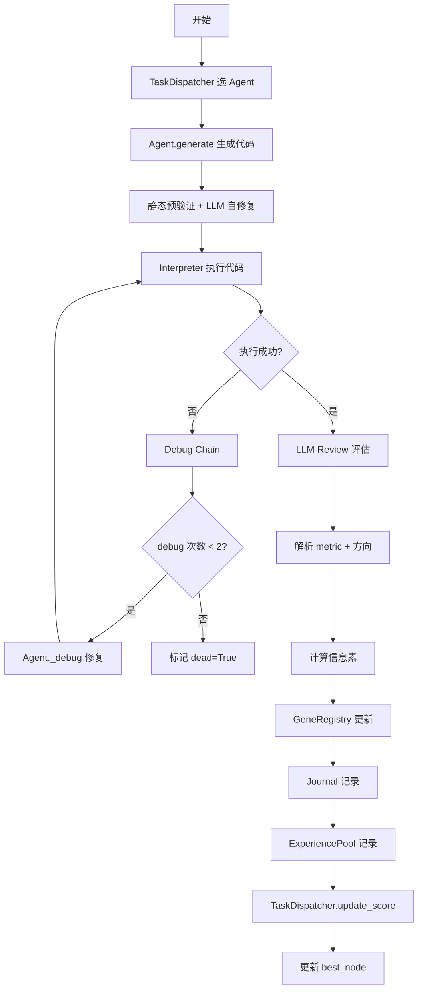

# Swarm-Ev2 项目蓝图

> **文档目的**：为开发者提供系统架构的全局视图，反映当前代码的真实结构。
>
> **最后更新**：2026-03-06

---

## 1. 核心理念

Swarm-Ev2 是一个**双层群体智能**系统，用于自动化解决 Kaggle 风格的机器学习竞赛问题。

### 1.1 两层含义

| 层级 | 名称 | 进化单位 | 进化方式 |
|------|------|---------|---------|
| **上层** | Agent 层 | Agent 的 Prompt（Role + Strategy） | LLM 驱动的 Prompt 变异 |
| **下层** | Solution 层 | 代码解决方案（4 个基因块） | 信息素驱动遗传算法（交叉 + 变异） |

### 1.2 设计哲学

```
Agent 决定"怎么写代码" → Solution 是"代码本身"
Agent 进化慢（每 3 Epoch）→ Solution 进化快（每 Epoch）
Agent 是"老师" → Solution 是"作业"
Skill 池是"教科书" → 从成功经验自动提取可复用策略
```

---

## 2. 架构总览

### 2.1 核心组件职责

```
┌────────────────────────────────────────────────────────────────┐
│                     main.py / run_mle_adapter.py               │
│                     （两阶段进化主循环）                          │
│                                                                 │
│  Phase 1: while valid_pool < target:                           │
│      orchestrator.run_epoch_draft()       # 纯 Draft 生成      │
│  Phase 2: 混合模式/进化模式                                     │
│      orchestrator.run_epoch_hybrid()      # 30% Draft + 70% GA │
│      solution_evolution.run_epoch()       # 50% merge + 50% mut│
│  每 3 Epoch: agent_evolution.evolve()     # Agent 层进化        │
└────────────────────────────────────────────────────────────────┘
                              │
              ┌───────────────┴───────────────┐
              ▼                               ▼
┌──────────────────────────┐    ┌──────────────────────────────┐
│   SolutionEvolution      │    │       Orchestrator           │
│      （决策层）           │    │        （执行层）             │
│                          │    │                              │
│ 职责:                    │    │ 职责:                        │
│ ├─ 维护 valid_pool      │───▶│ ├─ TaskDispatcher 选 Agent   │
│ ├─ 信息素 TOP-1 merge   │    │ ├─ Agent 生成代码            │
│ ├─ Tournament 选父 mutate│    │ ├─ Interpreter 执行代码      │
│ └─ 退化检测 + 替换       │    │ ├─ LLM Review 评估 + 信息素  │
│                          │    │ ├─ Debug Chain (最多 2 次)    │
│                          │    │ ├─ 经验池记录                │
│                          │    │ └─ 记录到 Journal            │
└──────────────────────────┘    └──────────────────────────────┘
```

### 2.2 一句话定位

| 组件 | 一句话定位 |
|------|-----------|
| **main.py** | 本地开发入口，两阶段进化主循环 |
| **run_mle_adapter.py** | MLE-Bench 容器适配器，混合模式主循环 |
| **Orchestrator** | 任务执行的"手脚"（选 Agent、执行、Review、记录） |
| **SolutionEvolution** | GA 的"大脑"（Phase 2 的 merge/mutate 决策） |
| **AgentEvolution** | Agent 配置进化器（Role + Strategy 变异） |
| **Journal** | 所有节点的"档案馆" |
| **ExperiencePool** | Agent 执行记录的"工作日志" |
| **TaskDispatcher** | ε-Greedy 动态 Agent 选择器 |
| **GeneRegistry** | 基因级信息素追踪表 |
| **PromptManager** | 7 层 Jinja2 Prompt 构建器 |
| **SkillManager** | Skill 池管理器（提取/评估/演化/淘汰） |
| **CoderAgent** | LLM 代码生成工人（draft/merge/mutate/debug） |

---

## 3. 两阶段进化流程

### 3.1 main.py 流程（本地开发）

```
Phase 1: Draft 模式
  while nodes < budget && valid_pool < target(8):
      orchestrator.run_epoch_draft(steps_per_epoch)
      if epoch % 3 == 0: agent_evolution.evolve()

Phase 2: 进化模式（纯 GA）
  for epoch in range(remaining_budget / steps_per_epoch):
      solution_evolution.run_epoch(steps)       # 50% merge + 50% mutate
      if epoch % 3 == 0: agent_evolution.evolve()
```

### 3.2 run_mle_adapter.py 流程（MLE-Bench 容器）

```
统一混合循环:
  while nodes < budget && !timeout:
      if valid_pool >= ga_trigger(4):
          orchestrator.run_epoch_hybrid(steps)   # 30% Draft + 70% GA
      else:
          orchestrator.run_epoch_draft(steps)    # 纯 Draft
      if epoch % 3 == 0: agent_evolution.evolve()
```

### 3.3 单步执行详解（Draft 步骤）


```mermaid
flowchart TD
    A[开始] --> B[TaskDispatcher 选 Agent]
    B --> C[Agent.generate 生成代码]
    C --> D[静态预验证 + LLM 自修复]
    D --> E[Interpreter 执行代码]
    E --> F{执行成功?}
    F -->|否| G[Debug Chain]
    G --> H{debug 次数 < 2?}
    H -->|是| I[Agent._debug 修复]
    I --> E
    H -->|否| J[标记 dead=True]
    F -->|是| K[LLM Review 评估]
    K --> L[解析 metric + 方向]
    L --> M[计算信息素]
    M --> N[GeneRegistry 更新]
    N --> O[Journal 记录]
    O --> P[ExperiencePool 记录]
    P --> Q[TaskDispatcher.update_score]
    Q --> R[更新 best_node]
```

---

## 4. 关键数据流

### 4.1 Node 的生命周期

```
CoderAgent.generate()
    │
    ▼
┌──────────────────┐
│   Node 对象       │  ← 刚生成，只有 code + plan
│   .code = "..."  │
│   .plan = "..."  │
│   .task_type     │     "draft" | "merge" | "mutate"
└──────────────────┘
    │
    ▼ validate_and_fix() → 静态预验证
    │
    ▼ Interpreter.run()
┌──────────────────┐
│   Node 对象       │  ← 执行后，有 term_out 和 exec_time
│   .term_out      │
│   .exec_time     │
│   .exc_type      │
└──────────────────┘
    │
    ▼ _review_node() → LLM Function Calling
┌──────────────────┐
│   Node 对象       │  ← Review 后，完整评估信息
│   .metric_value  │     浮点数
│   .is_buggy      │     bool
│   .lower_is_better│    bool（全局方向锁定）
│   .analysis_detail│    {key_change, insight, ...}
│   .approach_tag  │     "LightGBM + 5-fold CV"
│   .genes         │     {DATA, MODEL, TRAIN, POSTPROCESS}
│   .metadata      │     {pheromone_node, usage_count, ...}
└──────────────────┘
    │
    ├─▶ Journal.append()
    ├─▶ GeneRegistry.update_from_reviewed_node()
    ├─▶ ExperiencePool.add()
    └─▶ TaskDispatcher.update_score()
```

### 4.2 数据流动关系

```
                         ┌──────────────────┐
                         │  ExperiencePool  │
                         │  （工作记录）     │
                         └────────┬─────────┘
                                  │
               ┌──────────────────┼──────────────────┐
               │ 写入             │ 读取              │
               ▼                  ▼                  │
┌──────────────────┐    ┌───────────────────┐       │
│   Orchestrator   │    │ AgentEvolution    │       │
│ .run_epoch_draft │    │ .evolve()         │       │
│ .run_epoch_hybrid│    │                   │       │
│ .execute_merge   │    │ SkillExtractor    │       │
│ .execute_mutate  │    │ → SkillManager    │       │
└────────┬─────────┘    └─────────┬─────────┘       │
         │                        │ 更新            │
         │ 写入                   ▼                 │
         ▼              ┌─────────────────┐         │
┌──────────────────┐    │  Agent 配置     │         │
│     Journal      │    │ (PromptManager  │         │
│  （节点档案）     │    │  内存字典)      │         │
└────────┬─────────┘    └─────────┬───────┘         │
         │                        │ 影响生成        │
         │ 读取                   ▼                 │
         ▼              ┌─────────────────┐         │
┌──────────────────┐    │     Agent       │─────────┘
│SolutionEvolution │    │  .generate()    │
│ .run_epoch()     │    └─────────────────┘
│ .run_single_ga() │
└────────┬─────────┘
         │
         │ 读取
         ▼
┌──────────────────┐
│  GeneRegistry    │  ← 基因级信息素
│  （信息素追踪）   │
└──────────────────┘
```

---

## 5. 四大基因块（V6 标准）

每个 Solution 的代码使用 `# [SECTION: NAME]` 标记划分为 4 个基因块：

| 基因块 | 标记 | 说明 | 可变异子方面 |
|--------|------|------|-------------|
| DATA | `# [SECTION: DATA]` | 数据加载与特征工程 | feature_engineering, data_cleaning, augmentation, encoding |
| MODEL | `# [SECTION: MODEL]` | 模型定义与架构 | architecture, loss_function, optimizer, regularization |
| TRAIN | `# [SECTION: TRAIN]` | 训练循环与策略 | cv_strategy, early_stopping, lr_schedule, epochs |
| POSTPROCESS | `# [SECTION: POSTPROCESS]` | 后处理与提交 | ensemble, threshold, tta |

**Merge 操作**：信息素 TOP-1 全局选基因（每个位点独立选最优），退化检测（4 基因全来自同一节点时替换）。

**Mutate 操作**：Tournament 选父代 → 选非 stub 基因块 → 选子方面 → Agent 重写。

---

## 6. 三层进化机制详解

### 6.1 层级概览

```
┌─────────────────────────────────────────────────────────────────┐
│  ③ Agent 层进化（每 3 Epoch）                                    │
│     AgentEvolution.evolve()                                     │
│     "培训工人" — 优化 Agent 的 Role + Strategy Prompt            │
│     + SkillManager.evolve_skills() — 提取/合并/淘汰 Skill        │
└─────────────────────────────────────────────────────────────────┘
                              ▲ 读取 ExperiencePool
                              │
┌─────────────────────────────────────────────────────────────────┐
│  ② Solution 层进化（Phase 2 每 Epoch）                           │
│     SolutionEvolution.run_epoch() / run_single_ga_step()        │
│     "基因工程" — 信息素 merge + Tournament mutate                │
└─────────────────────────────────────────────────────────────────┘
                              ▲ 读取 Journal + GeneRegistry
                              │
┌─────────────────────────────────────────────────────────────────┐
│  ① 探索层（Phase 1 每 Step）                                     │
│     Orchestrator.run_epoch_draft() / run_epoch_hybrid()         │
│     "工人干活" — 生成/执行/评估/Debug Chain                       │
└─────────────────────────────────────────────────────────────────┘
```

### 6.2 各层职责详解

#### ① Orchestrator — 探索层（执行引擎）

**入口方法**：
- `run_epoch_draft(steps)` — Phase 1 纯 Draft 模式
- `run_epoch_hybrid(steps, solution_evolution)` — 混合模式（30% Draft + 70% GA）
- `execute_merge_task(primary_parent, gene_plan, gene_sources)` — merge 任务执行
- `execute_mutate_task(parent, target_gene, mutation_aspect)` — mutate 任务执行

**Draft 步骤内部流程**：
```
_draft_step():
    ├─ TaskDispatcher.select_agent("explore")     → ε-Greedy 选 Agent
    ├─ _build_draft_history()                     → 多样性引导（已用 approach_tag 列表）
    ├─ Agent.generate(context)                    → LLM 生成代码
    │   ├─ PromptManager.build_prompt()           → 7 层 Jinja2 渲染
    │   ├─ _call_llm_with_retry(max=5)            → 指数退避重试
    │   ├─ _parse_response_with_retry()            → 提取 plan + code
    │   └─ _validate_and_fix()                    → 静态预验证 + 1 次 LLM 修复
    ├─ _finalize_node()
    │   ├─ _execute_code()                        → subprocess 沙箱执行
    │   ├─ _review_node()                         → LLM Function Calling 评估
    │   │   ├─ metric_value + is_buggy + lower_is_better
    │   │   ├─ analysis_detail + approach_tag
    │   │   └─ Metric 合理性校验（METRIC_BOUNDS）
    │   ├─ parse_solution_genes()                 → 基因解析
    │   ├─ compute_node_pheromone()               → 信息素计算
    │   ├─ GeneRegistry.update_from_reviewed_node()
    │   ├─ Journal.append()
    │   ├─ ExperiencePool.add()
    │   ├─ TaskDispatcher.update_score()
    │   └─ _update_best_node()
    └─ _debug_chain(max=2)                        → 失败时自动修复
```

#### ② SolutionEvolution — 决策层（GA 大脑）

**触发条件**：valid_pool（非 buggy、非 dead、基因完整）数量 ≥ `ga_trigger_threshold`（默认 4）。

**Phase 2 进化策略**（`run_epoch(steps)`）：
```
每步 50/50 概率选择：
├─ Merge:
│   ├─ pheromone_with_degenerate_check()    → 信息素全局 TOP-1 选基因
│   │   ├─ build_decision_gene_pools()      → 构建决策基因池
│   │   ├─ quality = 0.3 × gene_pheromone + 0.7 × node_pheromone
│   │   └─ 退化检测：4 基因全同源时 → 替换为 second-best
│   ├─ get_primary_parent()                 → 推断主父代（贡献最多基因的节点）
│   └─ orchestrator.execute_merge_task()    → Agent 融合执行
│
└─ Mutate:
    ├─ _tournament_select(k=3)              → 锦标赛选父代
    ├─ select_mutation_target()             → 选非 stub 基因 + 子方面
    └─ orchestrator.execute_mutate_task()   → Agent 变异执行
```

#### ③ AgentEvolution — Agent 层进化

**触发条件**：epoch % 3 == 0 且经验池记录数 ≥ `min_records`（默认 20）。

**进化流程**：
```
evolve(epoch):
    ├─ _evaluate_agents()                   → score = success_rate × avg_quality
    ├─ 精英 top-2 保留，弱者 bottom-2 变异
    └─ 对每个弱者:
        ├─ _mutate_role()                   → LLM 生成新 Role（参考精英）
        ├─ _mutate_strategy("explore")      → 探索策略变异
        ├─ _mutate_strategy("merge")        → 融合策略变异
        ├─ _mutate_strategy("mutate")       → 变异策略变异
        └─ _update_skill_pool()             → Skill 池演化
            ├─ SkillExtractor.extract_skills()  → HDBSCAN 聚类 + LLM 总结
            ├─ SkillManager.add_skill()         → 去重 + 写入
            ├─ _merge_similar_skills()          → 余弦相似度去重
            └─ _deprecate_low_quality_skills()  → 淘汰低分/未使用
```

### 6.3 循环关系总结

| 层级 | 方法 | 频率 | 产出 | 消费 |
|------|------|------|------|------|
| ① 探索层 | `run_epoch_draft/hybrid` | 每 Step | Journal + ExperiencePool + GeneRegistry | Agent 配置、Skill |
| ② Solution 层 | `run_epoch/run_single_ga_step` | 每 Epoch（Phase 2） | Journal（新节点） | Journal + GeneRegistry |
| ③ Agent 层 | `evolve()` | 每 3 Epoch | Agent 配置 + Skill 池 | ExperiencePool |

---

## 7. 信息素系统

### 7.1 节点级信息素（`pheromone.py`）

```
pheromone = α × norm_score + β × success_ratio + δ × recency

  α=0.5: 归一化得分（[0,1]，基于 score_min/max）
  β=0.3: 成功率 = success_count / usage_count
  δ=0.2: 时间衰减 = exp(-0.05 × step_diff)
```

### 7.2 基因级信息素（`gene_registry.py`）

```
存储: _registry[locus][gene_id] = {pheromone, acc_sum, count, last_seen_step, content, source_node_id}
更新: 每次 Review 完成后，累积平均
查询: pheromone_eff = pheromone × exp(-0.03 × step_diff)
```

### 7.3 基因质量（`gene_selector.py`）

```
quality = 0.3 × gene_pheromone + 0.7 × node_pheromone
排序: quality 主排序 → node_pheromone → source_score → created_step
```

---

## 8. 任务分发与得分

### TaskDispatcher（ε-Greedy 策略）

```
select_agent(task_type):
    ε=0.3 概率 → 随机选择（探索）
    1-ε 概率  → 选擅长度最高的 Agent（利用），平局随机

update_score(agent_id, task_type, quality):
    new = (1-α) × old + α × quality    # α=0.3, EMA 更新
```

初始得分矩阵：每个 Agent 对 explore/merge/mutate 均为 0.5。

---

## 9. Prompt 系统

### PromptManager 7 层结构

| 层 | 名称 | 来源 | 是否可进化 |
|----|------|------|-----------|
| 1 | ROLE | `agent_configs/default/role.md` → 内存字典 | 是（AgentEvolution） |
| 2 | FORMAT | `skills/static/output_format.md` | 否 |
| 3 | TASK | context.task_desc | 否 |
| 4 | CONTEXT | parent_node + memory + data_preview | 否 |
| 5 | STRATEGY | 静态 Skill + Agent 策略配置（strategy_*.md） | 是 |
| 6 | EXAMPLES | Top-K 成功案例（SkillManager / ExperiencePool） | 动态 |
| 7 | GUIDELINES | 工作空间规则 + 时间/步数约束 | 否 |

模板文件位于 `benchmark/mle-bench/prompt_templates/`，按 task_type 分：`draft.j2`, `explore.j2`, `merge.j2`, `mutate.j2`, `debug.j2`。

Agent 配置使用**单模板 + 内存字典**方式管理：`default/` 目录模板在初始化时复制 N 份到内存，避免磁盘多副本同步问题。

---

## 10. Skill 池系统

### 10.1 提取流程（SkillExtractor）

```
ExperiencePool → 过滤成功记录（quality > 0）
    → bge-m3 向量化
    → HDBSCAN 聚类（min_cluster_size=5）
    → 每个簇 LLM 总结 → Skill Markdown
    → 质量评分 = 0.6 × avg_accuracy + 0.4 × avg_generation_rate
```

### 10.2 演化策略（SkillManager）

| 操作 | 条件 | 动作 |
|------|------|------|
| 新增 | composite_score ≥ 0.5 | 语义去重（余弦 > 0.85）后写入 |
| 合并 | 同 task_type 余弦 > 0.85 | 保留高分者，淘汰低分者 |
| 淘汰 | composite_score < 0.4 或连续 5 Epoch 未使用 | 标记 deprecated |

---

## 11. LLM 后端

### 统一接口（`core/backend/`）

| 提供商 | 模块 | 用途 |
|--------|------|------|
| OpenAI / GLM | `backend_openai.py` | 代码生成、Review（Function Calling） |
| Anthropic | `backend_anthropic.py` | Claude 系列模型 |

`query_with_config(llm_config, user_message)` 从 Config 自动提取 model/provider/api_key/base_url。

Key Pool（`key_pool.py`）支持多 API Key 轮换。

---

## 12. 执行沙箱

### Interpreter（`core/executor/interpreter.py`）

- **机制**：`subprocess.Popen`，指定 conda Python 路径
- **超时**：自适应（基于数据集大小动态计算），上限 10800s
- **并行**：槽位管理，`max_parallel_run` 控制并发数
- **输出**：`ExecutionResult` 含 term_out、exec_time、exc_type、timeout

### WorkspaceManager（`core/executor/workspace.py`）

- 数据预处理（解压 + 清理垃圾文件）
- 输入文件保护（chmod 444）
- submission 路径重写（每个节点独立 `submission_{node_id}.csv`）

---

## 13. Metric 方向系统

### 全局方向检测（`_global_lower_is_better`）

```
优先级：
1. task_desc 关键词匹配（METRIC_DIRECTION 表，62+ 个指标）
2. 首次 Review 返回时锁定
3. Fallback: higher_is_better（False）
```

### Metric 合理性校验（METRIC_BOUNDS）

防止 LLM Review 幻觉，对常见指标范围检查（如 AUC ∈ [0,1]，RMSE ≥ 0）。

---

## 14. 两个入口对比

| 维度 | main.py | run_mle_adapter.py |
|------|---------|-------------------|
| 用途 | 本地开发/测试 | MLE-Bench 容器运行 |
| 配置 | `config/default.yaml` | `config/mle_bench.yaml` |
| 数据 | `datasets/public/` | `/home/data/` |
| 进化模式 | 两阶段（Phase 1 → Phase 2） | 混合循环（Draft/Hybrid 自动切换） |
| 结果输出 | `workspace/` | `/home/submission/` + `/home/code/` |
| 环境映射 | `.env` | 容器环境变量（API_KEY→OPENAI_API_KEY） |
| 报告 | `tests/outputs/` Markdown 报告 | Journal + 经验池 JSON |

---

## 15. 目录结构

```
Swarm-Ev2/
├── main.py                                # 本地开发入口
├── run_mle_adapter.py                     # MLE-Bench 容器适配器
├── config/
│   ├── default.yaml                       # 默认配置
│   └── mle_bench.yaml                     # MLE-Bench 配置
├── agents/
│   ├── base_agent.py                      # Agent 基类 + AgentContext/AgentResult
│   └── coder_agent.py                     # CoderAgent（draft/merge/mutate/debug）
├── core/
│   ├── orchestrator.py                    # 执行层：任务编排（并行版本）
│   ├── state/
│   │   ├── node.py                        # Node 数据结构（含 genes, dead, approach_tag）
│   │   ├── journal.py                     # Journal 容器（generate_summary → Evolution Log）
│   │   └── task.py                        # Task 数据结构
│   ├── executor/
│   │   ├── interpreter.py                 # subprocess 代码执行沙箱
│   │   └── workspace.py                   # 工作空间管理（预处理/保护/路径重写）
│   ├── backend/
│   │   ├── __init__.py                    # 统一 query/query_with_config 接口
│   │   ├── backend_openai.py              # OpenAI/GLM 后端
│   │   ├── backend_anthropic.py           # Anthropic 后端
│   │   ├── key_pool.py                    # API Key 轮换池
│   │   └── utils.py                       # 后端工具函数
│   └── evolution/
│       ├── solution_evolution.py           # 决策层：Phase 2 GA（merge/mutate）
│       ├── agent_evolution.py             # Agent 层进化（Role/Strategy 变异）
│       ├── task_dispatcher.py             # ε-Greedy 任务分发器
│       ├── experience_pool.py             # 经验池（线程安全 + JSON 持久化）
│       ├── gene_parser.py                 # 基因解析（4 基因 V6）
│       ├── gene_registry.py               # 基因级信息素追踪
│       ├── gene_selector.py               # 信息素 TOP-1 选择 + 退化检测
│       ├── gene_compatibility.py          # 基因兼容性检查（框架冲突）
│       ├── pheromone.py                   # 节点级信息素计算
│       ├── skill_extractor.py             # HDBSCAN + LLM 提取 Skill
│       ├── skill_manager.py               # Skill 池管理（添加/评估/演化/淘汰）
│       └── code_embedding_manager.py      # bge-m3 嵌入管理器（懒加载+缓存）
├── utils/
│   ├── config.py                          # OmegaConf 配置加载
│   ├── logger_system.py                   # 统一日志（log_msg/log_json/log_exception）
│   ├── prompt_manager.py                  # 7 层 Jinja2 Prompt 构建器
│   ├── response.py                        # LLM 响应解析（extract_code/extract_text）
│   ├── code_validator.py                  # 静态预验证（语法/导入/安全检查）
│   ├── data_preview.py                    # 数据预览生成（目录树+CSV列摘要）
│   ├── text_utils.py                      # 文本工具（压缩/截断）
│   ├── metric.py                          # Metric 工具
│   ├── file_utils.py                      # 文件工具
│   ├── workspace_builder.py               # 工作空间构建
│   ├── submission_validator.py            # 提交文件验证
│   ├── system_info.py                     # 硬件/环境信息获取
│   └── proxy.py                           # 代理配置
├── benchmark/
│   └── mle-bench/
│       ├── prompt_templates/              # Jinja2 模板（draft/merge/mutate/debug.j2）
│       ├── agent_configs/default/         # Agent 默认配置（role.md, strategy_*.md）
│       └── skills/                        # Skill 池（static/ + by_task_type/ + meta/）
└── tests/
    ├── unit/                              # 单元测试（30+ 测试文件）
    ├── test_evolution/                    # 进化算法测试
    └── integration/                       # 集成测试
```

---

## 16. 默认配置关键参数

| 参数 | 值 | 说明 |
|------|-----|------|
| `agent.max_steps` | 150 | 总节点预算 |
| `agent.time_limit` | 43200 (12h) | 时间限制 |
| `evolution.agent.num_agents` | 4 | Agent 数量 |
| `evolution.agent.epsilon` | 0.3 | ε-Greedy 探索率 |
| `evolution.agent.evolution_interval` | 3 | Agent 进化间隔 |
| `evolution.solution.population_size` | 12 | GA 种群大小 |
| `evolution.solution.ga_trigger_threshold` | 4 | GA 触发最小 valid 数 |
| `evolution.solution.tournament_k` | 3 | 锦标赛 k 值 |
| `evolution.solution.steps_per_epoch` | 10 | 每 Epoch 步数 |
| `evolution.solution.phase1_target_nodes` | 8 | Phase 1 目标 valid 数 |
| `evolution.solution.debug_max_attempts` | 2 | Debug Chain 最大次数 |
| `execution.timeout` | 3600 | 基础超时 |
| `execution.adaptive_timeout` | true | 自适应超时 |
| `search.parallel_num` | 2 | 并行执行数 |

---
