# Swarm-Ev2 项目架构概览

**Last Updated:** 2026-01-31 23:00:00
**项目版本:** 0.1.0
**当前阶段:** Phase 2 核心功能（部分完成：执行层 + Agent 抽象）

---

## 1. 项目概述

Swarm-Ev2 是一个基于**双层群体智能**与**进化算法**的多 Agent 系统，用于自动化解决复杂代码问题（目标场景：MLE-Bench 刷榜）。

| 属性 | 值 |
|------|-----|
| 语言 | Python 3.10 (Conda: Swarm-Evo) |
| 架构 | 纯后端，asyncio |
| 配置 | OmegaConf + YAML |
| 日志 | 双通道（文本 + JSON） |
| 测试 | pytest + pytest-asyncio |
| 代码行数 | ~2900 行（22 个核心模块） |

---

## 2. 分层架构

```
┌─────────────────────────────────────────────────┐
│                 入口层 (Entry)                    │
│   main.py (白盒调试)  mle_bench_adapter.py (评测) │  ← Phase 5
├─────────────────────────────────────────────────┤
│              编排层 (Orchestration)               │
│   Orchestrator · ParallelEvaluator               │  ← Phase 2-3
├─────────────────────────────────────────────────┤
│              Agent 层 (Agents)                    │
│   BaseAgent · AgentContext · PromptBuilder       │  ← Phase 2 ★部分完成★
├─────────────────────────────────────────────────┤
│              进化层 (Evolution)                   │
│   AgentEvolution · SolutionEvolution             │
│   ExperiencePool · GeneParser                    │  ← Phase 3-4
├─────────────────────────────────────────────────┤
│              执行层 (Execution)                   │
│   Interpreter · WorkspaceManager                 │  ← Phase 2 ★已完成★
├─────────────────────────────────────────────────┤
│              核心数据层 (State)                    │
│   Node · Journal · Task                          │  ← Phase 1 ★已完成★
├─────────────────────────────────────────────────┤
│            ★ 基础设施层 (Infrastructure) ★         │
│   config.py · logger_system.py · file_utils.py   │  ← Phase 1 ★已完成★
└─────────────────────────────────────────────────┘
```

---

## 3. 模块依赖关系图

```mermaid
graph TD
    subgraph "Phase 1 - 基础设施 ★已完成★"
        CFG[utils/config.py<br/>配置管理 457行]
        LOG[utils/logger_system.py<br/>日志系统 181行]
        FU[utils/file_utils.py<br/>文件工具 114行]
        YAML[config/default.yaml<br/>YAML 配置]
        ENV[.env<br/>环境变量]
    end

    subgraph "Phase 1 - 数据结构 ★已完成★"
        NODE[core/state/node.py<br/>Node 数据类 119行]
        JOURNAL[core/state/journal.py<br/>Journal DAG 229行]
        TASK[core/state/task.py<br/>Task 定义 63行]
    end

    subgraph "Phase 1 - 后端抽象 ★已完成★"
        BACKEND[core/backend/__init__.py<br/>统一查询接口 130行]
        OPENAI[core/backend/backend_openai.py<br/>OpenAI + 第三方 133行]
        ANTHRO[core/backend/backend_anthropic.py<br/>Claude 143行]
        BUTILS[core/backend/utils.py<br/>消息格式 + 重试 81行]
    end

    subgraph "Phase 2 - 执行层 ★已完成★"
        INTERP[core/executor/interpreter.py<br/>代码执行沙箱 177行]
        WS[core/executor/workspace.py<br/>工作空间管理 182行]
    end

    subgraph "Phase 2 - 工具增强 ★已完成★"
        DP[utils/data_preview.py<br/>EDA 预览 270行]
        METRIC[utils/metric.py<br/>评估指标 118行]
        RESP[utils/response.py<br/>响应解析 90行]
    end

    subgraph "Phase 2 - Agent 抽象 ★NEW★"
        AGENT[agents/base_agent.py<br/>BaseAgent + AgentContext 118行]
        PB[utils/prompt_builder.py<br/>PromptBuilder 168行]
    end

    subgraph "Phase 2-3 - 待实现"
        CODER[agents/coder_agent.py<br/>CoderAgent 具体实现]
        ORCH[core/orchestrator.py<br/>任务编排器]
    end

    subgraph "Phase 3 - 待实现"
        AEVO[core/evolution/agent_evolution.py]
        SEVO[core/evolution/solution_evolution.py]
        EPOOL[core/evolution/experience_pool.py]
        GENE[core/evolution/gene_parser.py]
        PARA[search/parallel_evaluator.py]
    end

    %% 依赖关系
    CFG --> YAML
    CFG --> ENV
    CFG --> LOG
    FU --> LOG

    NODE --> LOG
    JOURNAL --> NODE
    TASK --> NODE

    AGENT --> CFG
    AGENT --> PB
    AGENT --> NODE
    AGENT --> JOURNAL
    CODER --> AGENT

    PB --> NODE

    ORCH --> AGENT
    ORCH --> JOURNAL
    ORCH --> INTERP
    ORCH --> WS
    ORCH --> CFG

    INTERP --> LOG
    WS --> CFG
    WS --> LOG

    DP --> LOG
    METRIC -.-> LOG
    RESP -.-> LOG

    BACKEND --> OPENAI
    BACKEND --> ANTHRO
    OPENAI --> BUTILS
    ANTHRO --> BUTILS
    BUTILS --> LOG

    AEVO --> EPOOL
    SEVO --> GENE
    SEVO --> EPOOL
    PARA --> INTERP

    style AGENT fill:#e8f5e9
    style PB fill:#e8f5e9
```



---

## 4. Phase 实施状态

| Phase | 名称 | 状态 | 核心交付物 |
|-------|------|------|-----------|
| **1** | 基础设施重构 | **✅ 已完成** | config.py, logger_system.py, file_utils.py |
| **1** | 核心数据结构 | **✅ 已完成** | Node (119行), Journal (229行), Task (63行) |
| **1** | 后端抽象层 | **✅ 已完成** | Backend - OpenAI, Anthropic + 第三方兼容 |
| **2** | **执行层** | **✅ 已完成** | **Interpreter (177行), WorkspaceManager (182行)** |
| **2** | **工具增强** | **✅ 已完成** | **data_preview (270行), metric (118行), response (90行)** |
| **2** | **Agent 抽象** | **✅ 已完成** | **BaseAgent (118行), PromptBuilder (168行)** |
| 2 | Agent 具体实现 | 🔴 待实现 | CoderAgent, Orchestrator |
| 3 | 双层群体智能 | 🔴 待实现 | GA, AgentEvolution, ParallelEvaluator |
| 4 | 扩展功能 | 🔴 待实现 | Memory, ToolRegistry, AgentRegistry |
| 5 | 测试与文档 | 🟡 进行中 | 80%+ 覆盖率, 端到端验证 |

### Phase 1-2 已完成模块明细

| 模块 | 文件 | 行数 | 状态 |
|------|------|------|------|
| **Phase 1: 基础设施** ||||
| 配置管理 | `utils/config.py` | 457 | ✅ 已完成 |
| 日志系统 | `utils/logger_system.py` | 181 | ✅ 已完成 |
| 文件工具 | `utils/file_utils.py` | 114 | ✅ 已完成 |
| **Phase 1: 数据结构** ||||
| Node 数据类 | `core/state/node.py` | 119 | ✅ 已完成 |
| Journal 数据类 | `core/state/journal.py` | 229 | ✅ 已完成 |
| Task 数据类 | `core/state/task.py` | 63 | ✅ 已完成 |
| **Phase 1: 后端抽象** ||||
| 后端抽象层 | `core/backend/__init__.py` | 130 | ✅ 已完成 |
| OpenAI 后端 | `core/backend/backend_openai.py` | 133 | ✅ 已完成 |
| Anthropic 后端 | `core/backend/backend_anthropic.py` | 143 | ✅ 已完成 |
| 后端工具 | `core/backend/utils.py` | 81 | ✅ 已完成 |
| **Phase 2: 执行层** ||||
| 代码执行器 | `core/executor/interpreter.py` | 177 | ✅ 已完成 |
| 工作空间管理 | `core/executor/workspace.py` | 182 | ✅ 已完成 |
| **Phase 2: 工具增强** ||||
| 数据预览 | `utils/data_preview.py` | 270 | ✅ 已完成 |
| 指标工具 | `utils/metric.py` | 118 | ✅ 已完成 |
| 响应解析 | `utils/response.py` | 90 | ✅ 已完成 |
| **Phase 2: Agent 抽象 ★NEW★** ||||
| **Agent 基类** | **`agents/base_agent.py`** | **118** | **✅ 已完成** |
| **Prompt 构建器** | **`utils/prompt_builder.py`** | **168** | **✅ 已完成** |
| **配置文件** ||||
| YAML 配置 | `config/default.yaml` | 77 | ✅ 已完成 |
| 环境变量模板 | `.env.example` | 36 | ✅ 已完成 |
| 依赖声明 | `requirements.txt` | 36 | ✅ 已完成 |

**总计**: 16 个核心模块 | ~2900 行代码 | 22 个源文件

---

## 5. 目标架构（完整）

```
Swarm-Ev2/
├── main.py                        # 白盒入口（本地调试）
├── mle_bench_adapter.py           # 黑盒入口（MLE-Bench 评测）
├── config/
│   └── default.yaml               # 统一 YAML 配置        ★ 已完成
├── agents/                        # Agent 层
│   ├── __init__.py                # 模块导出               ★ 已完成
│   ├── base_agent.py              # Agent 抽象基类         ★ 已完成
│   ├── coder_agent.py             # 代码生成 Agent         Phase 2
│   ├── swarm_agent.py             # 群体 Agent             Phase 3
│   └── registry.py                # Agent 注册表           Phase 4
├── core/
│   ├── state/                     # 数据结构
│   │   ├── __init__.py            # 导出 Node, Journal, Task  ★ 已完成
│   │   ├── node.py                # 解决方案节点              ★ 已完成
│   │   ├── journal.py             # 解决方案日志              ★ 已完成
│   │   └── task.py                # 任务定义                  ★ 已完成
│   ├── backend/                   # LLM 后端抽象
│   │   ├── __init__.py            # 统一查询接口           ★ 已完成
│   │   ├── backend_openai.py      # OpenAI + GLM          ★ 已完成
│   │   ├── backend_anthropic.py   # Anthropic             ★ 已完成
│   │   └── utils.py               # 消息格式 + 重试        ★ 已完成
│   ├── executor/                  # 代码执行
│   │   ├── __init__.py            # 模块导出              ★ 已完成
│   │   ├── interpreter.py         # 执行沙箱              ★ 已完成
│   │   └── workspace.py           # 工作空间管理           ★ 已完成
│   ├── orchestrator.py            # 编排器                 Phase 2
│   └── evolution/                 # 进化机制
│       ├── agent_evolution.py     # Agent 层进化           Phase 3
│       ├── solution_evolution.py  # Solution 层 GA         Phase 3
│       ├── experience_pool.py     # 共享经验池             Phase 3
│       └── gene_parser.py         # 基因解析器             Phase 3
├── search/                        # 搜索与评估
│   ├── parallel_evaluator.py      # 并行评估器             Phase 3
│   └── fitness.py                 # 适应度计算             Phase 3
├── tools/                         # 工具注册表              Phase 4
├── utils/                         # 工具模块
│   ├── config.py                  # 配置管理               ★ 已完成
│   ├── logger_system.py           # 日志系统               ★ 已完成
│   ├── file_utils.py              # 文件工具               ★ 已完成
│   ├── data_preview.py            # 数据预览生成           ★ 已完成
│   ├── metric.py                  # 评估指标工具           ★ 已完成
│   ├── response.py                # LLM 响应解析           ★ 已完成
│   └── prompt_builder.py          # Prompt 构建器          ★ 已完成
├── tests/                         # 测试
│   ├── unit/                      # 单元测试               ★ 已完成 (部分)
│   └── integration/               # 集成测试               待实现
└── docs/                          # 文档
    ├── CODEMAPS/                   # 架构图                 ★ 本次更新
    ├── plans/                     # Phase 详细计划          已完成
    └── implementation_plan.md     # 总体实施计划            已完成
```

---

## 6. 双层群体智能架构概览

```
┌──────────────────────────────────────────────┐
│               Agent 层（群体智能）              │
│  ┌─────┐ ┌─────┐ ┌─────┐ ┌─────┐           │
│  │ A1  │ │ A2  │ │ A3  │ │ A4  │  4 个 Agent│
│  └──┬──┘ └──┬──┘ └──┬──┘ └──┬──┘           │
│     └───────┴───────┴───────┘               │
│              ↓ 生成 Solution                  │
├──────────────────────────────────────────────┤
│            Solution 层（遗传算法）              │
│  种群: 12 个 Solution                         │
│  基因: DATA | MODEL | LOSS | OPTIMIZER |      │
│        REGULARIZATION | INITIALIZATION |      │
│        TRAINING_TRICKS                        │
│  操作: 精英保留(top-3) + 锦标赛(k=3) +        │
│        交叉 + 变异(20%)                        │
├──────────────────────────────────────────────┤
│              共享经验池                         │
│  Agent 表现 ←→ Solution 评估结果               │
└──────────────────────────────────────────────┘
```

---

## 7. Agent 抽象层设计 ★NEW★

### 7.1 核心组件

| 组件 | 文件 | 职责 |
|------|------|------|
| `BaseAgent` | `agents/base_agent.py` | Agent 抽象基类，定义统一接口 |
| `AgentContext` | `agents/base_agent.py` | Agent 执行上下文容器 |
| `AgentResult` | `agents/base_agent.py` | Agent 执行结果容器 |
| `PromptBuilder` | `utils/prompt_builder.py` | 统一 Prompt 构建逻辑 |

### 7.2 AgentContext 数据流

```
AgentContext (输入)
├── task_type: "explore" | "merge"
├── parent_node: Optional[Node]
│   ├── None → 初稿模式
│   ├── is_buggy=True → 修复模式
│   └── is_buggy=False → 改进模式
├── journal: Journal (历史记录)
├── config: Config (全局配置)
├── start_time: float (任务开始时间)
└── current_step: int (当前步数)
    ↓
BaseAgent.generate(context)
    ↓
AgentResult (输出)
├── node: Optional[Node] (生成的节点)
├── success: bool (是否成功)
└── error: Optional[str] (错误信息)
```

### 7.3 PromptBuilder 自适应逻辑

```python
# 不显式告诉 LLM 任务类型，让 LLM 根据上下文判断

# 场景 1: 初稿模式
parent_node = None
→ Prompt 不包含 "Previous Attempt"
→ LLM 知道要生成初稿

# 场景 2: 修复模式
parent_node.is_buggy = True
→ Prompt 包含 "Previous Attempt + 错误输出"
→ LLM 看到异常信息，自动修复

# 场景 3: 改进模式
parent_node.is_buggy = False
→ Prompt 包含 "Previous Attempt + 正常输出"
→ LLM 看到正常执行，自动改进
```

---

## 8. 关联文档

| 文档 | 路径 | 说明 |
|------|------|------|
| 总体实施计划 | `docs/implementation_plan.md` | 5 Phase 概览 |
| Phase 1 详细计划 | `docs/plans/phase1_infrastructure.md` | 基础设施设计 |
| Phase 2 详细计划 | `docs/plans/p2.2_agent_abstraction_plan.md` | Agent 抽象层设计 ★NEW★ |
| Phase 3 详细计划 | `docs/plans/phase3_search.md` | 搜索算法设计 |
| Phase 4 详细计划 | `docs/plans/phase4_extensions.md` | 扩展功能设计 |
| Phase 5 详细计划 | `docs/plans/phase5_testing.md` | 测试文档设计 |
| 后端模块详情 | `docs/CODEMAPS/backend.md` | 已实现模块分析 |
| 数据流与配置 | `docs/CODEMAPS/data.md` | 配置与数据管理 |
| 开发规范 | `CLAUDE.md` | 编码/测试/日志规范 |
