# Swarm-Ev2 项目架构概览

**Last Updated:** 2026-02-01
**项目版本:** 0.1.0
**当前阶段:** Phase 3 进化机制（基础模块已完成）

---

## 1. 项目概述

Swarm-Ev2 是一个基于**双层群体智能**与**进化算法**的多 Agent 系统，用于自动化解决复杂代码问题（目标场景：MLE-Bench 刷榜）。

| 属性 | 值 |
|------|-----|
| 语言 | Python 3.10 (Conda: Swarm-Evo) |
| 架构 | 纯后端，asyncio |
| 配置 | OmegaConf + YAML |
| 日志 | 双通道（文本 + JSON） |
| 测试 | pytest + pytest-asyncio |
| 代码行数 | ~4861 行（24 个核心模块） |

---

## 2. 分层架构

```
+---------------------------------------------------------+
|                   入口层 (Entry)                          |
|   main.py (白盒调试)  mle_bench_adapter.py (评测)         |  <- Phase 5
+---------------------------------------------------------+
|                编排层 (Orchestration)                     |
|   Orchestrator (534行)                                   |  <- Phase 2.4
|   ParallelEvaluator                                      |  <- Phase 3
+---------------------------------------------------------+
|                  Agent 层 (Agents)                        |
|   BaseAgent + CoderAgent + PromptBuilder                 |  <- Phase 2
|   PromptManager (252行) [NEW]                            |  <- Phase 3+
+---------------------------------------------------------+
|                进化层 (Evolution)                         |
|   GeneParser (163行)                                     |  <- P3.1
|   ExperiencePool (313行)                                 |  <- P3.2
|   Fitness (82行)                                         |  <- P3.2
|   AgentEvolution + SolutionEvolution                     |  <- P3.3-3.4
+---------------------------------------------------------+
|                  执行层 (Execution)                       |
|   Interpreter + WorkspaceManager                         |  <- Phase 2
+---------------------------------------------------------+
|                核心数据层 (State)                          |
|   Node + Journal (+get_best_k) + Task                    |  <- Phase 1
+---------------------------------------------------------+
|              基础设施层 (Infrastructure)                   |
|   config.py (+EvolutionConfig) + logger + file           |  <- Phase 1
+---------------------------------------------------------+
|               Benchmark 资源 (NEW)                        |
|   benchmark/mle-bench/                                   |
|     - prompt_templates/ (Jinja2)                         |
|     - skills/ (静态/动态 Skill)                           |
|     - agent_configs/ (Agent 角色+策略)                    |
+---------------------------------------------------------+
```

---

## 3. 模块依赖关系图

```mermaid
graph TD
    subgraph "Phase 1 - 基础设施"
        CFG[utils/config.py<br/>配置管理 598行<br/>+EvolutionConfig]
        LOG[utils/logger_system.py<br/>日志系统 180行]
        FU[utils/file_utils.py<br/>文件工具 113行]
        YAML[config/default.yaml<br/>YAML 配置 108行<br/>+evolution 配置节]
        ENV[.env<br/>环境变量]
    end

    subgraph "Phase 1 - 数据结构"
        NODE[core/state/node.py<br/>Node 数据类 121行]
        JOURNAL[core/state/journal.py<br/>Journal DAG 283行<br/>+get_best_k]
        TASK[core/state/task.py<br/>Task 定义 62行]
    end

    subgraph "Phase 1 - 后端抽象"
        BACKEND[core/backend/__init__.py<br/>统一查询接口 137行<br/>Function Calling]
        OPENAI[core/backend/backend_openai.py<br/>OpenAI + GLM 163行]
        ANTHRO[core/backend/backend_anthropic.py<br/>Claude 142行]
        BUTILS[core/backend/utils.py<br/>消息格式 + 重试 80行]
    end

    subgraph "Phase 2 - 执行层"
        INTERP[core/executor/interpreter.py<br/>代码执行沙箱 176行]
        WS[core/executor/workspace.py<br/>工作空间管理 181行]
    end

    subgraph "Phase 2 - Agent 层"
        AGENT[agents/base_agent.py<br/>BaseAgent 119行<br/>+mutate task_type]
        CODER[agents/coder_agent.py<br/>CoderAgent 272行]
        PB[utils/prompt_builder.py<br/>PromptBuilder 167行]
        PM[utils/prompt_manager.py<br/>PromptManager 252行<br/>Jinja2 模板 NEW]
    end

    subgraph "Phase 2.4 - 编排层"
        ORCH[core/orchestrator.py<br/>任务编排器 534行]
    end

    subgraph "Phase 3 - 进化层"
        GENE[core/evolution/gene_parser.py<br/>基因解析器 163行]
        EPOOL[core/evolution/experience_pool.py<br/>共享经验池 313行]
        FITNESS[search/fitness.py<br/>适应度计算 82行]
        AEVO[core/evolution/agent_evolution.py<br/>Agent 层进化 待实现]
        SEVO[core/evolution/solution_evolution.py<br/>Solution 层 GA 待实现]
    end

    subgraph "Benchmark 资源 NEW"
        BENCH[benchmark/mle-bench/<br/>Skill + Agent 配置<br/>+ Prompt 模板]
    end

    %% 依赖关系
    CFG --> YAML
    CFG --> ENV
    CFG --> LOG
    FU --> LOG

    JOURNAL --> NODE
    TASK -.-> LOG

    AGENT --> CFG
    AGENT --> PB
    AGENT --> NODE
    AGENT --> JOURNAL
    CODER --> AGENT
    CODER --> BACKEND
    CODER --> INTERP

    PM --> EPOOL
    PM --> LOG
    PM --> BENCH

    PB --> NODE

    ORCH --> CODER
    ORCH --> JOURNAL
    ORCH --> NODE
    ORCH --> INTERP
    ORCH --> WS
    ORCH --> CFG
    ORCH --> BACKEND
    ORCH --> LOG

    INTERP --> LOG
    WS --> CFG
    WS --> LOG

    BACKEND --> OPENAI
    BACKEND --> ANTHRO
    OPENAI --> BUTILS
    ANTHRO --> BUTILS
    BUTILS --> LOG

    %% Phase 3 依赖
    EPOOL --> CFG
    EPOOL --> LOG
    AEVO --> EPOOL
    SEVO --> GENE
    SEVO --> EPOOL
    SEVO --> FITNESS

    style ORCH fill:#ffeb3b
    style PM fill:#c8e6c9
    style GENE fill:#c8e6c9
    style EPOOL fill:#c8e6c9
    style FITNESS fill:#c8e6c9
    style BENCH fill:#e3f2fd
    style AEVO fill:#fff3e0
    style SEVO fill:#fff3e0
```



---

## 4. Phase 实施状态

| Phase | 名称 | 状态 | 核心交付物 |
|-------|------|------|-----------|
| **1** | 基础设施重构 | **完成** | config.py, logger_system.py, file_utils.py |
| **1** | 核心数据结构 | **完成** | Node (121行), Journal (283行), Task (62行) |
| **1** | 后端抽象层 | **完成** | Backend + Function Calling |
| **2** | 执行层 | **完成** | Interpreter (176行), WorkspaceManager (181行) |
| **2** | Agent 抽象 | **完成** | BaseAgent (119行), PromptBuilder (167行) |
| **2** | CoderAgent | **完成** | CoderAgent (272行) |
| **2.4** | Orchestrator | **完成** | Orchestrator (534行) |
| **3.1** | **基因解析器** | **完成** | **gene_parser.py (163行)** |
| **3.2** | **经验池+适应度** | **完成** | **experience_pool.py (313行), fitness.py (82行)** |
| **3+** | **PromptManager** | **完成** | **prompt_manager.py (252行) + benchmark/** |
| 3.3 | Agent 层进化 | 待实现 | agent_evolution.py |
| 3.4 | Solution 层 GA | 待实现 | solution_evolution.py |
| 4 | 扩展功能 | 待实现 | Memory, ToolRegistry |
| 5 | 测试与文档 | 进行中 | 80%+ 覆盖率 |

### 已完成模块明细

| 模块 | 文件 | 行数 | 状态 |
|------|------|------|------|
| **Phase 1: 基础设施** ||||
| 配置管理 | `utils/config.py` | 598 | 完成 (+EvolutionConfig) |
| 日志系统 | `utils/logger_system.py` | 180 | 完成 |
| 文件工具 | `utils/file_utils.py` | 113 | 完成 |
| **Phase 1: 数据结构** ||||
| Node 数据类 | `core/state/node.py` | 121 | 完成 |
| Journal 数据类 | `core/state/journal.py` | 283 | 完成 (+get_best_k) |
| Task 数据类 | `core/state/task.py` | 62 | 完成 |
| **Phase 1: 后端抽象** ||||
| 后端抽象层 | `core/backend/__init__.py` | 137 | 完成 |
| OpenAI 后端 | `core/backend/backend_openai.py` | 163 | 完成 |
| Anthropic 后端 | `core/backend/backend_anthropic.py` | 142 | 完成 |
| 后端工具 | `core/backend/utils.py` | 80 | 完成 |
| **Phase 2: 执行层** ||||
| 代码执行器 | `core/executor/interpreter.py` | 176 | 完成 |
| 工作空间管理 | `core/executor/workspace.py` | 181 | 完成 |
| **Phase 2: Agent 层** ||||
| Agent 基类 | `agents/base_agent.py` | 119 | 完成 (+mutate) |
| Prompt 构建器 | `utils/prompt_builder.py` | 167 | 完成 |
| CoderAgent | `agents/coder_agent.py` | 272 | 完成 |
| **Phase 2.4: Orchestrator** ||||
| 任务编排器 | `core/orchestrator.py` | 534 | 完成 |
| **Phase 3: 进化层** ||||
| **基因解析器** | **`core/evolution/gene_parser.py`** | **163** | **完成** |
| **共享经验池** | **`core/evolution/experience_pool.py`** | **313** | **完成** |
| **适应度计算** | **`search/fitness.py`** | **82** | **完成** |
| **Phase 3+: Prompt 系统 (NEW)** ||||
| **Prompt 管理器** | **`utils/prompt_manager.py`** | **252** | **完成** |
| **Benchmark 资源** | **`benchmark/mle-bench/`** | **-** | **完成** |
| **配置文件** ||||
| YAML 配置 | `config/default.yaml` | 108 | 完成 (+evolution) |

**总计**: 24 个核心模块 | ~4861 行代码

---

## 5. 目标架构（完整）

```
Swarm-Ev2/
├── main.py                        # 白盒入口（本地调试）         Phase 5
├── mle_bench_adapter.py           # 黑盒入口（MLE-Bench 评测）   Phase 5
├── config/
│   └── default.yaml               # 统一 YAML 配置 (108行)
├── benchmark/                     # Benchmark 资源 (NEW)
│   └── mle-bench/
│       ├── prompt_templates/      # Jinja2 模板
│       │   ├── explore.j2
│       │   ├── merge.j2
│       │   └── mutate.j2
│       ├── skills/                # Skill 文件
│       │   ├── static/            # 静态 Skill
│       │   ├── by_task_type/      # 任务特定 Skill
│       │   └── meta/              # 元数据
│       └── agent_configs/         # Agent 配置
│           ├── agent_0/
│           ├── agent_1/
│           ├── agent_2/
│           └── agent_3/
├── agents/                        # Agent 层
│   ├── __init__.py                # 模块导出
│   ├── base_agent.py              # Agent 抽象基类 (+mutate)
│   ├── coder_agent.py             # 代码生成 Agent
│   ├── swarm_agent.py             # 群体 Agent                   Phase 3
│   └── registry.py                # Agent 注册表                 Phase 4
├── core/
│   ├── state/                     # 数据结构
│   │   ├── __init__.py            # 导出 Node, Journal, Task
│   │   ├── node.py                # 解决方案节点
│   │   ├── journal.py             # 解决方案日志 (+get_best_k)
│   │   └── task.py                # 任务定义
│   ├── backend/                   # LLM 后端抽象
│   │   ├── __init__.py            # 统一查询接口
│   │   ├── backend_openai.py      # OpenAI + GLM
│   │   ├── backend_anthropic.py   # Anthropic
│   │   └── utils.py               # 消息格式 + 重试
│   ├── executor/                  # 代码执行
│   │   ├── __init__.py            # 模块导出
│   │   ├── interpreter.py         # 执行沙箱
│   │   └── workspace.py           # 工作空间管理
│   ├── orchestrator.py            # 编排器（534行）
│   └── evolution/                 # 进化机制
│       ├── __init__.py            # 模块导出
│       ├── gene_parser.py         # 基因解析器 (163行)
│       ├── experience_pool.py     # 共享经验池 (313行)
│       ├── agent_evolution.py     # Agent 层进化               Phase 3.3
│       └── solution_evolution.py  # Solution 层 GA             Phase 3.4
├── search/                        # 搜索与评估
│   ├── __init__.py                # 模块导出
│   ├── fitness.py                 # 适应度计算 (82行)
│   └── parallel_evaluator.py      # 并行评估器                 Phase 3
├── utils/                         # 工具模块
│   ├── config.py                  # 配置管理 (+EvolutionConfig)
│   ├── logger_system.py           # 日志系统
│   ├── file_utils.py              # 文件工具
│   ├── data_preview.py            # 数据预览生成
│   ├── metric.py                  # 评估指标工具
│   ├── response.py                # LLM 响应解析
│   ├── prompt_builder.py          # Prompt 构建器
│   ├── prompt_manager.py          # Prompt 管理器 (NEW 252行)
│   └── workspace_builder.py       # 工作空间构建器 (NEW)
├── tests/                         # 测试
│   ├── unit/                      # 单元测试 (19 个测试文件)
│   ├── test_evolution/            # 进化模块测试
│   │   ├── test_gene_parser.py
│   │   ├── test_experience_pool.py
│   │   └── test_prompt_manager.py # NEW
│   ├── test_search/               # 搜索模块测试
│   │   └── test_fitness.py
│   └── integration/               # 集成测试
│       └── test_prompt_system_integration.py # NEW
└── docs/                          # 文档
    ├── CODEMAPS/                   # 架构图
    └── plans/                     # Phase 详细计划
```

---

## 6. Phase 3 新增模块详解

### 6.1 基因解析器 (`core/evolution/gene_parser.py`)

**职责**: 解析 Solution 代码的基因块，支持 GA 交叉操作。

```
REQUIRED_GENES = [
    "DATA",           # 数据处理
    "MODEL",          # 模型定义
    "LOSS",           # 损失函数
    "OPTIMIZER",      # 优化器
    "REGULARIZATION", # 正则化
    "INITIALIZATION", # 初始化
    "TRAINING_TRICKS" # 训练技巧
]
```

| 函数 | 签名 | 说明 |
|------|------|------|
| `parse_solution_genes` | `(code: str) -> Dict[str, str]` | 解析 `# [SECTION: NAME]` 标记 |
| `validate_genes` | `(genes: Dict) -> bool` | 验证 7 基因块完整性 |
| `merge_genes` | `(a, b, plan) -> str` | 按交叉计划合并基因 |

### 6.2 共享经验池 (`core/evolution/experience_pool.py`)

**职责**: 线程安全存储 Agent 执行记录，支持 Top-K 查询和 JSON 持久化。

```python
@dataclass
class TaskRecord:
    agent_id: str           # Agent 唯一标识
    task_type: str          # "explore" | "merge" | "mutate"
    input_hash: str         # 输入哈希（去重）
    output_quality: float   # 适应度值
    strategy_summary: str   # 策略摘要
    timestamp: float        # 时间戳
```

| 方法 | 签名 | 说明 |
|------|------|------|
| `add` | `(record: TaskRecord) -> None` | 添加记录（线程安全） |
| `query` | `(task_type, k, **filters) -> List[TaskRecord]` | Top-K 查询 |
| `get_agent_stats` | `(agent_id) -> Dict` | Agent 统计信息 |
| `save/load` | `() -> None` | JSON 持久化 |

### 6.3 适应度计算 (`search/fitness.py`)

**职责**: 归一化指标到 [0, 1]，统一转换为"越大越好"。

```python
def normalize_fitness(metric_value: float, lower_is_better: bool) -> float:
    """
    lower_is_better=True  (RMSE): fitness = 1 / (1 + metric)
    lower_is_better=False (Accuracy): fitness = metric (直接映射)
    """
```

### 6.4 Prompt 管理器 (`utils/prompt_manager.py`) [NEW]

**职责**: 基于 Jinja2 的统一 Prompt 管理系统。

**7 层结构化 Prompt 构建**:
1. ROLE - Agent 角色定位（可进化）
2. FORMAT - 输出格式规范（静态）
3. TASK - 任务描述
4. CONTEXT - 上下文（parent_node、memory、data_preview）
5. STRATEGY - 策略（静态 Skill + Agent 策略配置）
6. EXAMPLES - Top-K 成功案例（动态，来自经验池）
7. GUIDELINES - 工作空间规则 + 时间约束

| 方法 | 签名 | 说明 |
|------|------|------|
| `load_skill` | `(skill_path: str) -> str` | 加载静态 Skill 文件 |
| `load_agent_config` | `(agent_id, section) -> str` | 加载 Agent 配置 |
| `inject_top_k_skills` | `(task_type, k, pool) -> str` | 提取 Top-K 成功案例 |
| `build_prompt` | `(task_type, agent_id, context) -> str` | 构建完整 Prompt |

---

## 7. Orchestrator 编排器架构

### 7.1 核心职责

Orchestrator 是系统的中枢控制器，负责协调主循环、选择父节点、调用 Agent 生成代码、执行代码、Review 评估、更新最佳节点。

### 7.2 主循环流程

```
+-----------------------------------------------------------+
|                  Orchestrator.run()                        |
|                                                            |
|  for step in range(max_steps):                            |
|      if elapsed >= time_limit: break                      |
|                                                            |
|      +--------------------------------------------+       |
|      | Phase 1: _prepare_step()                   |       |
|      |   清理 submission 目录                      |       |
|      +--------------------------------------------+       |
|                        |                                   |
|      +--------------------------------------------+       |
|      | Phase 2: _select_parent_node()             |       |
|      |   三阶段策略                                |       |
|      +--------------------------------------------+       |
|                        |                                   |
|      +--------------------------------------------+       |
|      | Phase 3: agent.generate(context)           |       |
|      |   CoderAgent 生成代码                       |       |
|      +--------------------------------------------+       |
|                        |                                   |
|      +--------------------------------------------+       |
|      | Phase 4: _execute_code()                   |       |
|      |   WorkspaceManager + Interpreter           |       |
|      +--------------------------------------------+       |
|                        |                                   |
|      +--------------------------------------------+       |
|      | Phase 5: _review_node()                    |       |
|      |   Function Calling Review                  |       |
|      +--------------------------------------------+       |
|                        |                                   |
|      +--------------------------------------------+       |
|      | Phase 6: 更新状态                           |       |
|      |   journal.append + _update_best_node       |       |
|      +--------------------------------------------+       |
|                                                            |
|  return self.best_node                                    |
+-----------------------------------------------------------+
```

### 7.3 三阶段父节点选择策略

```
_select_parent_node()
|
+-- Phase 1: 初稿模式
|   条件: len(journal.draft_nodes) < config.search.num_drafts
|   结果: return None -> Agent 生成全新方案
|
+-- Phase 2: 修复模式
|   条件: random() < config.search.debug_prob
|   操作: journal.build_dag() -> 查找 buggy 叶子节点
|   结果: return random_buggy_leaf -> Agent 修复 bug
|
+-- Phase 3: 改进模式
    条件: 默认
    操作: journal.get_best_node(only_good=True)
    结果: return best_node -> Agent 改进最佳方案
```

---

## 8. Agent 抽象层设计

### 8.1 核心组件

| 组件 | 文件 | 职责 |
|------|------|------|
| `BaseAgent` | `agents/base_agent.py` | Agent 抽象基类 |
| `AgentContext` | `agents/base_agent.py` | 执行上下文容器 |
| `AgentResult` | `agents/base_agent.py` | 执行结果容器 |
| `PromptBuilder` | `utils/prompt_builder.py` | Prompt 构建逻辑（简化版） |
| `PromptManager` | `utils/prompt_manager.py` | Prompt 管理器（Jinja2 版）[NEW] |

### 8.2 AgentContext 数据流

```
AgentContext (输入)
+-- task_type: "explore" | "merge" | "mutate"
+-- parent_node: Optional[Node]
+-- journal: Journal (历史记录)
+-- config: Config (全局配置)
+-- start_time: float
+-- current_step: int
    |
BaseAgent.generate(context)
    |
AgentResult (输出)
+-- node: Optional[Node]
+-- success: bool
+-- error: Optional[str]
```

---

## 9. 双层群体智能架构概览

```
+----------------------------------------------+
|               Agent 层（群体智能）             |
|  +-----+ +-----+ +-----+ +-----+             |
|  | A0  | | A1  | | A2  | | A3  |  4 个 Agent |
|  +--+--+ +--+--+ +--+--+ +--+--+             |
|     +-------+-------+-------+                |
|              | 生成 Solution                  |
+----------------------------------------------+
|            Solution 层（遗传算法）             |
|  种群: 12 个 Solution                         |
|  基因: DATA | MODEL | LOSS | OPTIMIZER |     |
|        REGULARIZATION | INITIALIZATION |     |
|        TRAINING_TRICKS                       |
|  操作: 精英保留(top-3) + 锦标赛(k=3) +       |
|        交叉 + 变异(20%)                       |
+----------------------------------------------+
|         共享经验池 (ExperiencePool)           |
|  - 存储 Agent 执行记录                        |
|  - 支持 Top-K 查询 + 过滤                     |
|  - JSON 持久化                               |
|  Agent 表现 <-> Solution 评估结果             |
+----------------------------------------------+
|         Prompt 系统 (NEW)                     |
|  - PromptManager (Jinja2 模板)               |
|  - benchmark/mle-bench/ 资源文件             |
|  - 7 层结构化 Prompt                          |
|  - 动态 Skill 注入 (Top-K 经验)              |
+----------------------------------------------+
```

---

## 10. Benchmark 资源结构 [NEW]

```
benchmark/mle-bench/
+-- prompt_templates/           # Jinja2 模板
|   +-- explore.j2              # 探索任务模板
|   +-- merge.j2                # 合并任务模板
|   +-- mutate.j2               # 变异任务模板
+-- skills/                     # Skill 文件
|   +-- static/                 # 静态 Skill（所有任务通用）
|   |   +-- output_format.md
|   |   +-- workspace_rules.md
|   |   +-- ml_best_practices.md
|   |   +-- code_style.md
|   +-- by_task_type/           # 任务特定 Skill
|   |   +-- merge/
|   |   |   +-- crossover_strategies.md
|   |   |   +-- conflict_resolution.md
|   |   +-- mutate/
|   |       +-- mutation_strategies.md
|   |       +-- local_optimization.md
|   +-- meta/                   # 元数据（Skill 索引/血统/更新历史）
|       +-- skill_index.json
|       +-- skill_lineage.json
|       +-- update_history.json
+-- agent_configs/              # Agent 配置（4 个差异化 Agent）
    +-- agent_0/
    |   +-- role.md             # 角色定位
    |   +-- strategy_explore.md # 探索策略
    |   +-- strategy_merge.md   # 合并策略
    |   +-- strategy_mutate.md  # 变异策略
    +-- agent_1/
    +-- agent_2/
    +-- agent_3/
```

---

## 11. 关联文档

| 文档 | 路径 | 说明 |
|------|------|------|
| 总体实施计划 | `docs/implementation_plan.md` | 5 Phase 概览 |
| Phase 3 详细计划 | `docs/plans/phase3_search.md` | 搜索算法设计 |
| 后端模块详情 | `docs/CODEMAPS/backend.md` | 已实现模块分析 |
| 数据流与配置 | `docs/CODEMAPS/data.md` | 配置与数据管理 |
| 开发规范 | `CLAUDE.md` | 编码/测试/日志规范 |
| 差异报告 | `.reports/codemap-diff.txt` | 版本差异分析 |
