# Swarm-Ev2 项目架构概览

**Last Updated:** 2026-02-02 (模块行数更新: Orchestrator/Interpreter/CoderAgent 扩展)
**项目版本:** 0.3.2
**当前阶段:** Phase 3.5 Skill 进化（已完成）+ main.py 双层架构集成

---

## 1. 项目概述

Swarm-Ev2 是一个基于**双层群体智能**与**进化算法**的多 Agent 系统，用于自动化解决复杂代码问题（目标场景：MLE-Bench 刷榜）。

| 属性 | 值 |
|------|-----|
| 语言 | Python 3.10 (Conda: Swarm-Evo) |
| 架构 | 纯后端，asyncio + 多线程 |
| 配置 | OmegaConf + YAML |
| 日志 | 双通道（文本 + JSON） |
| 测试 | pytest + pytest-asyncio (35 测试文件, ~8388 行) |
| 代码行数 | ~9729 行核心代码（42 模块） + 8388 行测试 |

---

## 2. 分层架构

```
+---------------------------------------------------------+
|                   入口层 (Entry)                          |
|   main.py (双层进化架构, 560行)                            |  <- Phase 3.5+
|   mle_bench_adapter.py (评测)                             |  <- Phase 5
|   - initialize_agents() 初始化 Agent 种群                  |
|   - initialize_evolution_components() 初始化进化组件        |
|   - generate_markdown_report() 生成测试报告                 |
|   - print_evolution_statistics() 打印进化统计               |
+---------------------------------------------------------+
|                编排层 (Orchestration)                     |
|   Orchestrator (1168行, +双层进化+merge/mutate任务)        |  <- Phase 2.4+
|   ParallelEvaluator (245行)                              |  <- Phase 3.4
+---------------------------------------------------------+
|                  Agent 层 (Agents)                        |
|   BaseAgent (135行) + CoderAgent (375行, +merge/mutate)  |  <- Phase 2+
|   PromptBuilder (247行) + PromptManager (295行)          |  <- Phase 3+
+---------------------------------------------------------+
|                进化层 (Evolution)                         |
|   GeneParser (162行)                                     |  <- P3.1
|   ExperiencePool (319行)                                 |  <- P3.2
|   Fitness (81行)                                         |  <- P3.2
|   TaskDispatcher (157行)                                 |  <- P3.3
|   AgentEvolution (439行)                                 |  <- P3.3 (+Skill)
|   GeneRegistry (199行)                                   |  <- P3.4
|   GeneSelector (314行)                                   |  <- P3.4
|   Pheromone (104行)                                      |  <- P3.4
|   SolutionEvolution (541行)                              |  <- P3.4
|   CodeEmbeddingManager (127行)                           |  <- P3.5
|   SkillExtractor (302行)                                 |  <- P3.5
|   SkillManager (371行)                                   |  <- P3.5
+---------------------------------------------------------+
|                  执行层 (Execution)                       |
|   Interpreter (547行, +并行执行支持)                      |  <- Phase 2+
|   WorkspaceManager (244行)                               |  <- Phase 2
+---------------------------------------------------------+
|                核心数据层 (State)                          |
|   Node + Journal (+get_best_k) + Task                    |  <- Phase 1
+---------------------------------------------------------+
|              基础设施层 (Infrastructure)                   |
|   config.py (603行) + logger (180行) + file (222行)      |  <- Phase 1
|   system_info.py (329行) [NEW] - 系统信息收集工具         |
+---------------------------------------------------------+
|               Benchmark 资源 (NEW)                        |
|   benchmark/mle-bench/                                   |
|     - prompt_templates/ (Jinja2)                         |
|     - skills/ (静态/动态 Skill)                           |
|     - agent_configs/ (Agent 角色+策略)                    |
+---------------------------------------------------------+
```

---

## 3. 模块依赖关系图

```mermaid
graph TD
    subgraph "Phase 1 - 基础设施"
        CFG[utils/config.py<br/>配置管理 603行<br/>+EvolutionConfig]
        LOG[utils/logger_system.py<br/>日志系统 180行]
        FU[utils/file_utils.py<br/>文件工具 222行<br/>+extract/clean]
        SYSINFO[utils/system_info.py<br/>系统信息 329行 NEW]
        YAML[config/default.yaml<br/>YAML 配置]
        ENV[.env<br/>环境变量]
    end

    subgraph "Phase 1 - 数据结构"
        NODE[core/state/node.py<br/>Node 数据类 121行]
        JOURNAL[core/state/journal.py<br/>Journal DAG 300行<br/>+get_best_k]
        TASK[core/state/task.py<br/>Task 定义 62行]
    end

    subgraph "Phase 1 - 后端抽象"
        BACKEND[core/backend/__init__.py<br/>统一查询接口 137行<br/>Function Calling]
        OPENAI[core/backend/backend_openai.py<br/>OpenAI + GLM 163行]
        ANTHRO[core/backend/backend_anthropic.py<br/>Claude 142行]
        BUTILS[core/backend/utils.py<br/>消息格式 + 重试 80行]
    end

    subgraph "Phase 2 - 执行层"
        INTERP[core/executor/interpreter.py<br/>代码执行沙箱 547行<br/>+并行执行支持]
        WS[core/executor/workspace.py<br/>工作空间管理 244行<br/>+preprocess]
    end

    subgraph "Phase 2 - Agent 层"
        AGENT[agents/base_agent.py<br/>BaseAgent 135行<br/>+mutate task_type]
        CODER[agents/coder_agent.py<br/>CoderAgent 375行<br/>+merge/mutate]
        PB[utils/prompt_builder.py<br/>PromptBuilder 247行]
        PM[utils/prompt_manager.py<br/>PromptManager 295行<br/>Jinja2 模板]
    end

    subgraph "Phase 2.4 - 编排层"
        ORCH[core/orchestrator.py<br/>任务编排器 1168行<br/>+双层进化模式]
    end

    subgraph "Phase 3 - 进化层"
        GENE[core/evolution/gene_parser.py<br/>基因解析器 162行]
        EPOOL[core/evolution/experience_pool.py<br/>共享经验池 319行]
        FITNESS[search/fitness.py<br/>适应度计算 81行]
        TDISP[core/evolution/task_dispatcher.py<br/>任务分配器 157行]
        AEVO[core/evolution/agent_evolution.py<br/>Agent 层进化 439行]
        SEVO[core/evolution/solution_evolution.py<br/>Solution 层 GA 541行]
        PEVAL[search/parallel_evaluator.py<br/>并行评估器 245行]
    end

    subgraph "Benchmark 资源 NEW"
        BENCH[benchmark/mle-bench/<br/>Skill + Agent 配置<br/>+ Prompt 模板]
    end

    %% 依赖关系
    CFG --> YAML
    CFG --> ENV
    CFG --> LOG
    FU --> LOG

    JOURNAL --> NODE
    TASK -.-> LOG

    AGENT --> CFG
    AGENT --> PB
    AGENT --> NODE
    AGENT --> JOURNAL
    CODER --> AGENT
    CODER --> BACKEND
    CODER --> INTERP

    PM --> EPOOL
    PM --> LOG
    PM --> BENCH

    PB --> NODE

    ORCH --> CODER
    ORCH --> JOURNAL
    ORCH --> NODE
    ORCH --> INTERP
    ORCH --> WS
    ORCH --> CFG
    ORCH --> BACKEND
    ORCH --> LOG

    INTERP --> LOG
    WS --> CFG
    WS --> LOG

    BACKEND --> OPENAI
    BACKEND --> ANTHRO
    OPENAI --> BUTILS
    ANTHRO --> BUTILS
    BUTILS --> LOG

    %% Phase 3 依赖
    EPOOL --> CFG
    EPOOL --> LOG
    TDISP --> AGENT
    TDISP --> LOG
    AEVO --> EPOOL
    AEVO --> BACKEND
    AEVO --> CFG
    AEVO --> LOG
    SEVO --> GENE
    SEVO --> EPOOL
    SEVO --> FITNESS

    style ORCH fill:#ffeb3b
    style PM fill:#c8e6c9
    style GENE fill:#c8e6c9
    style EPOOL fill:#c8e6c9
    style FITNESS fill:#c8e6c9
    style TDISP fill:#c8e6c9
    style AEVO fill:#c8e6c9
    style BENCH fill:#e3f2fd
    style SEVO fill:#fff3e0
```



---

## 4. Phase 实施状态

| Phase | 名称 | 状态 | 核心交付物 |
|-------|------|------|-----------|
| **1** | 基础设施重构 | **完成** | config.py, logger_system.py, file_utils.py |
| **1** | 核心数据结构 | **完成** | Node (121行), Journal (300行), Task (62行) |
| **1** | 后端抽象层 | **完成** | Backend + Function Calling |
| **2** | 执行层 | **完成** | Interpreter (547行), WorkspaceManager (244行) |
| **2** | Agent 抽象 | **完成** | BaseAgent (135行), PromptBuilder (247行) |
| **2** | CoderAgent | **完成** | CoderAgent (375行, +merge/mutate) |
| **2.4** | Orchestrator | **完成** | Orchestrator (1168行, +双层进化) |
| **3.1** | **基因解析器** | **完成** | **gene_parser.py (162行)** |
| **3.2** | **经验池+适应度** | **完成** | **experience_pool.py (319行), fitness.py (81行)** |
| **3+** | **PromptManager** | **完成** | **prompt_manager.py (295行) + benchmark/** |
| **3.3** | **Agent 层群体智能** | **完成** | **task_dispatcher.py (157行) + agent_evolution.py (439行)** |
| **3.4** | **Solution 层 GA** | **完成** | **solution_evolution.py (541行) + gene_selector.py (314行) + gene_registry.py (199行) + pheromone.py (104行) + parallel_evaluator.py (245行)** |
| **3.5** | **Skill 进化** | **完成** | **skill_extractor.py (302行) + skill_manager.py (371行) + code_embedding_manager.py (127行)** |
| 4 | 扩展功能 | 待实现 | Memory, ToolRegistry |
| 5 | 测试与文档 | 进行中 | 80%+ 覆盖率 |

### 已完成模块明细

| 模块 | 文件 | 行数 | 状态 |
|------|------|------|------|
| **Phase 1: 基础设施** ||||
| 配置管理 | `utils/config.py` | 603 | 完成 (+EvolutionConfig) |
| 日志系统 | `utils/logger_system.py` | 180 | 完成 |
| 文件工具 | `utils/file_utils.py` | 222 | 完成 (+extract/clean) |
| **系统信息** | **`utils/system_info.py`** | **329** | **完成 (NEW)** |
| **Phase 1: 数据结构** ||||
| Node 数据类 | `core/state/node.py` | 121 | 完成 |
| Journal 数据类 | `core/state/journal.py` | 300 | 完成 (+get_best_k) |
| Task 数据类 | `core/state/task.py` | 62 | 完成 |
| **Phase 1: 后端抽象** ||||
| 后端抽象层 | `core/backend/__init__.py` | 137 | 完成 |
| OpenAI 后端 | `core/backend/backend_openai.py` | 163 | 完成 |
| Anthropic 后端 | `core/backend/backend_anthropic.py` | 142 | 完成 |
| 后端工具 | `core/backend/utils.py` | 80 | 完成 |
| **Phase 2: 执行层** ||||
| **代码执行器** | **`core/executor/interpreter.py`** | **547** | **完成 (+并行执行)** |
| 工作空间管理 | `core/executor/workspace.py` | 244 | 完成 (+preprocess) |
| **Phase 2: Agent 层** ||||
| Agent 基类 | `agents/base_agent.py` | 135 | 完成 (+mutate) |
| **Prompt 构建器** | **`utils/prompt_builder.py`** | **247** | **完成** |
| **CoderAgent** | **`agents/coder_agent.py`** | **375** | **完成 (+merge/mutate)** |
| **Phase 2.4: Orchestrator** ||||
| **任务编排器** | **`core/orchestrator.py`** | **1168** | **完成 (+双层进化)** |
| **Phase 3: 进化层** ||||
| **基因解析器** | **`core/evolution/gene_parser.py`** | **162** | **完成** |
| **共享经验池** | **`core/evolution/experience_pool.py`** | **319** | **完成** (+query扩展) |
| **适应度计算** | **`search/fitness.py`** | **81** | **完成** |
| **任务分配器** | **`core/evolution/task_dispatcher.py`** | **157** | **完成 (P3.3)** |
| **Agent 层进化** | **`core/evolution/agent_evolution.py`** | **439** | **完成 (P3.3)** |
| **基因注册表** | **`core/evolution/gene_registry.py`** | **199** | **完成 (P3.4)** |
| **基因选择器** | **`core/evolution/gene_selector.py`** | **314** | **完成 (P3.4)** |
| **信息素机制** | **`core/evolution/pheromone.py`** | **104** | **完成 (P3.4)** |
| **Solution 层 GA** | **`core/evolution/solution_evolution.py`** | **541** | **完成 (P3.4)** |
| **并行评估器** | **`search/parallel_evaluator.py`** | **245** | **完成 (P3.4)** |
| **Phase 3.5: Skill 进化** ||||
| **代码嵌入管理器** | **`core/evolution/code_embedding_manager.py`** | **127** | **完成 (P3.5)** |
| **Skill 提取器** | **`core/evolution/skill_extractor.py`** | **302** | **完成 (P3.5)** |
| **Skill 管理器** | **`core/evolution/skill_manager.py`** | **371** | **完成 (P3.5)** |
| **Phase 3+: Prompt 系统** ||||
| **Prompt 管理器** | **`utils/prompt_manager.py`** | **295** | **完成** |
| **Benchmark 资源** | **`benchmark/mle-bench/`** | **-** | **完成** |
| **配置文件** ||||
| YAML 配置 | `config/default.yaml` | 111 | 完成 (+agent进化配置) |

**总计**: 42 个核心模块 | ~9729 行核心代码 + 35 个测试文件（~8388 行测试代码）

---

## 5. 目标架构（完整）

```
Swarm-Ev2/
├── main.py                        # 双层进化入口 (560行)        Phase 3.5+
│   # 核心函数:
│   # - initialize_agents() 初始化 Agent 种群
│   # - initialize_evolution_components() 初始化进化组件
│   # - generate_markdown_report() 生成 Markdown 测试报告
│   # - print_evolution_statistics() 打印进化统计
│   # - main() 双层进化主循环（6 阶段流程）
├── mle_bench_adapter.py           # 黑盒入口（MLE-Bench 评测）   Phase 5
├── config/
│   └── default.yaml               # 统一 YAML 配置 (108行)
├── benchmark/                     # Benchmark 资源 (NEW)
│   └── mle-bench/
│       ├── prompt_templates/      # Jinja2 模板
│       │   ├── explore.j2
│       │   ├── merge.j2
│       │   └── mutate.j2
│       ├── skills/                # Skill 文件
│       │   ├── static/            # 静态 Skill
│       │   ├── by_task_type/      # 任务特定 Skill
│       │   └── meta/              # 元数据
│       └── agent_configs/         # Agent 配置
│           ├── agent_0/
│           ├── agent_1/
│           ├── agent_2/
│           └── agent_3/
├── agents/                        # Agent 层
│   ├── __init__.py                # 模块导出
│   ├── base_agent.py              # Agent 抽象基类 (+mutate)
│   ├── coder_agent.py             # 代码生成 Agent
│   ├── swarm_agent.py             # 群体 Agent                   Phase 3
│   └── registry.py                # Agent 注册表                 Phase 4
├── core/
│   ├── state/                     # 数据结构
│   │   ├── __init__.py            # 导出 Node, Journal, Task
│   │   ├── node.py                # 解决方案节点
│   │   ├── journal.py             # 解决方案日志 (+get_best_k)
│   │   └── task.py                # 任务定义
│   ├── backend/                   # LLM 后端抽象
│   │   ├── __init__.py            # 统一查询接口
│   │   ├── backend_openai.py      # OpenAI + GLM
│   │   ├── backend_anthropic.py   # Anthropic
│   │   └── utils.py               # 消息格式 + 重试
│   ├── executor/                  # 代码执行
│   │   ├── __init__.py            # 模块导出
│   │   ├── interpreter.py         # 执行沙箱 (547行, +并行执行)
│   │   └── workspace.py           # 工作空间管理 (244行)
│   ├── orchestrator.py            # 编排器（1168行, +双层进化）
│   └── evolution/                 # 进化机制
│       ├── __init__.py            # 模块导出
│       ├── gene_parser.py         # 基因解析器 (162行)
│       ├── experience_pool.py     # 共享经验池 (319行)
│       ├── task_dispatcher.py     # 任务分配器 (157行)         Phase 3.3
│       ├── agent_evolution.py     # Agent 层进化 (392行)       Phase 3.3
│       ├── gene_registry.py       # 基因注册表 (199行)         Phase 3.4
│       ├── gene_selector.py       # 基因选择器 (314行)         Phase 3.4
│       ├── pheromone.py           # 信息素机制 (104行)         Phase 3.4
│       ├── solution_evolution.py  # Solution 层 GA (541行)     Phase 3.4
│       ├── code_embedding_manager.py # 文本嵌入 (127行)        Phase 3.5
│       ├── skill_extractor.py     # Skill 提取器 (302行)       Phase 3.5
│       └── skill_manager.py       # Skill 管理器 (371行)       Phase 3.5
├── search/                        # 搜索与评估
│   ├── __init__.py                # 模块导出
│   ├── fitness.py                 # 适应度计算 (81行)
│   └── parallel_evaluator.py      # 并行评估器 (245行)         Phase 3.4
├── utils/                         # 工具模块
│   ├── config.py                  # 配置管理 (+EvolutionConfig)
│   ├── logger_system.py           # 日志系统
│   ├── file_utils.py              # 文件工具 (+extract_archives/clean_up_dataset)
│   ├── data_preview.py            # 数据预览生成
│   ├── metric.py                  # 评估指标工具
│   ├── response.py                # LLM 响应解析
│   ├── prompt_builder.py          # Prompt 构建器 (247行)
│   ├── prompt_manager.py          # Prompt 管理器 (295行)
│   ├── system_info.py             # 系统信息收集 (329行) NEW
│   └── workspace_builder.py       # 工作空间构建器 (127行)
├── tests/                         # 测试
│   ├── unit/                      # 单元测试 (19 个测试文件)
│   ├── test_evolution/            # 进化模块测试 (74 个用例, 95% 覆盖率)
│   │   ├── test_gene_parser.py
│   │   ├── test_experience_pool.py
│   │   ├── test_prompt_manager.py
│   │   ├── test_task_dispatcher.py  # NEW (P3.3)
│   │   └── test_agent_evolution.py  # NEW (P3.3)
│   ├── test_search/               # 搜索模块测试
│   │   └── test_fitness.py
│   └── integration/               # 集成测试
│       └── test_prompt_system_integration.py # NEW
└── docs/                          # 文档
    ├── CODEMAPS/                   # 架构图
    └── plans/                     # Phase 详细计划
```

---

## 6. Phase 3 新增模块详解

### 6.1 基因解析器 (`core/evolution/gene_parser.py`)

**职责**: 解析 Solution 代码的基因块，支持 GA 交叉操作。

```
REQUIRED_GENES = [
    "DATA",           # 数据处理
    "MODEL",          # 模型定义
    "LOSS",           # 损失函数
    "OPTIMIZER",      # 优化器
    "REGULARIZATION", # 正则化
    "INITIALIZATION", # 初始化
    "TRAINING_TRICKS" # 训练技巧
]
```

| 函数 | 签名 | 说明 |
|------|------|------|
| `parse_solution_genes` | `(code: str) -> Dict[str, str]` | 解析 `# [SECTION: NAME]` 标记 |
| `validate_genes` | `(genes: Dict) -> bool` | 验证 7 基因块完整性 |
| `merge_genes` | `(a, b, plan) -> str` | 按交叉计划合并基因 |

### 6.2 共享经验池 (`core/evolution/experience_pool.py`)

**职责**: 线程安全存储 Agent 执行记录，支持 Top-K 查询和 JSON 持久化。

```python
@dataclass
class TaskRecord:
    agent_id: str           # Agent 唯一标识
    task_type: str          # "explore" | "merge" | "mutate"
    input_hash: str         # 输入哈希（去重）
    output_quality: float   # 适应度值
    strategy_summary: str   # 策略摘要
    timestamp: float        # 时间戳
```

| 方法 | 签名 | 说明 |
|------|------|------|
| `add` | `(record: TaskRecord) -> None` | 添加记录（线程安全） |
| `query` | `(task_type, k, **filters) -> List[TaskRecord]` | Top-K 查询 |
| `get_agent_stats` | `(agent_id) -> Dict` | Agent 统计信息 |
| `save/load` | `() -> None` | JSON 持久化 |

### 6.3 适应度计算 (`search/fitness.py`)

**职责**: 归一化指标到 [0, 1]，统一转换为"越大越好"。

```python
def normalize_fitness(metric_value: float, lower_is_better: bool) -> float:
    """
    lower_is_better=True  (RMSE): fitness = 1 / (1 + metric)
    lower_is_better=False (Accuracy): fitness = metric (直接映射)
    """
```

### 6.4 任务分配器 (`core/evolution/task_dispatcher.py`) [NEW - P3.3]

**职责**: 基于 Epsilon-Greedy 策略选择最适合的 Agent 执行任务，通过 EMA 更新擅长度得分。

```python
class TaskDispatcher:
    """动态任务分配器（Epsilon-Greedy 策略）。

    Attributes:
        agents: Agent 列表
        epsilon: 探索率（0-1）
        learning_rate: EMA 学习率（α）
        specialization_scores: 擅长度矩阵 {agent_id: {task_type: score}}
    """
```

| 方法 | 签名 | 说明 |
|------|------|------|
| `select_agent` | `(task_type: str) -> BaseAgent` | Epsilon-Greedy 选择 Agent |
| `update_score` | `(agent_id, task_type, quality) -> None` | EMA 更新擅长度得分 |
| `get_specialization_matrix` | `() -> Dict` | 获取完整得分矩阵 |

**EMA 更新公式**: `new_score = (1-α) × old_score + α × quality`

### 6.5 Agent 层进化器 (`core/evolution/agent_evolution.py`) [NEW - P3.3]

**职责**: 每 N 个 Epoch 评估所有 Agent 表现，对弱者进行 Role 和 Strategy 变异。

```python
class AgentEvolution:
    """Agent 层进化器。

    Attributes:
        agents: Agent 列表
        experience_pool: 共享经验池
        config: 全局配置
        configs_dir: Agent 配置文件根目录
        evolution_interval: 进化间隔（Epoch）
    """
```

| 方法 | 签名 | 说明 |
|------|------|------|
| `evolve` | `(epoch: int) -> None` | 主入口：检查并执行进化 |
| `_evaluate_agents` | `() -> Dict[str, float]` | 评估所有 Agent（score = success_rate × avg_quality） |
| `_identify_elites_and_weak` | `(scores) -> Tuple[List, List]` | 识别精英（top-2）和弱者（bottom-2） |
| `_mutate_role` | `(weak_id, elite_id) -> None` | LLM 驱动的 Role 变异 |
| `_mutate_strategy` | `(weak_id, task_type, elite_id) -> None` | LLM 驱动的 Strategy 变异 |

**进化流程**:
1. 检查 `epoch % interval == 0` 且 `epoch != 0`
2. 验证经验池记录数 >= min_records
3. 计算各 Agent 综合得分
4. Top-2 保留，Bottom-2 变异
5. 对弱者变异 Role + 3 种 Strategy

### 6.6 Prompt 管理器 (`utils/prompt_manager.py`)

**职责**: 基于 Jinja2 的统一 Prompt 管理系统。

**7 层结构化 Prompt 构建**:
1. ROLE - Agent 角色定位（可进化）
2. FORMAT - 输出格式规范（静态）
3. TASK - 任务描述
4. CONTEXT - 上下文（parent_node、memory、data_preview）
5. STRATEGY - 策略（静态 Skill + Agent 策略配置）
6. EXAMPLES - Top-K 成功案例（动态，来自经验池）
7. GUIDELINES - 工作空间规则 + 时间约束

| 方法 | 签名 | 说明 |
|------|------|------|
| `load_skill` | `(skill_path: str) -> str` | 加载静态 Skill 文件 |
| `load_agent_config` | `(agent_id, section) -> str` | 加载 Agent 配置 |
| `inject_top_k_skills` | `(task_type, k, pool) -> str` | 提取 Top-K 成功案例 |
| `build_prompt` | `(task_type, agent_id, context) -> str` | 构建完整 Prompt |

### 6.7 基因注册表 (`core/evolution/gene_registry.py`) [NEW - P3.4]

**职责**: 管理基因级信息素，支持基因哈希、归一化和信息素更新。

```python
class GeneRegistry:
    """基因注册表（信息素管理）。

    Attributes:
        _gene_pheromones: Dict[str, float] - 基因 ID -> 信息素值
        _gene_usage: Dict[str, int] - 基因 ID -> 使用次数
        decay_rate: float - 信息素衰减率
    """
```

| 函数 | 签名 | 说明 |
|------|------|------|
| `compute_gene_id` | `(locus: str, text: str) -> str` | 计算基因 ID（哈希） |
| `normalize_gene_text` | `(text: str) -> str` | 归一化基因文本 |
| `update_pheromone` | `(gene_id, delta) -> None` | 更新基因信息素 |
| `get_pheromone` | `(gene_id) -> float` | 获取基因信息素值 |
| `decay_all` | `() -> None` | 全局衰减 |

### 6.8 基因选择器 (`core/evolution/gene_selector.py`) [NEW - P3.4]

**职责**: 基于信息素的确定性基因选择，用于 Solution 层交叉操作。

**策略**: 纯粹利用（Exploitation-only），无多样性正则化。

```python
def select_gene_plan(
    journal: Journal,
    gene_registry: GeneRegistry,
    node_weight: float = 0.7,
    gene_weight: float = 0.3,
) -> Dict[str, str]:
    """为每个位点选择 Top-1 基因。

    质量计算:
        quality = node_weight × node_pheromone + gene_weight × gene_pheromone

    Returns:
        Dict[locus_name, gene_id]
    """
```

### 6.9 信息素机制 (`core/evolution/pheromone.py`) [NEW - P3.4]

**职责**: 节点级信息素计算，融合节点得分、成功率和时间衰减。

```python
def compute_node_pheromone(
    node: Node,
    score_weight: float = 0.5,
    success_weight: float = 0.3,
    time_decay_weight: float = 0.2,
    time_decay_rate: float = 0.01,
) -> float:
    """计算节点信息素值。

    pheromone = w1×score + w2×success_rate + w3×time_decay
    """
```

### 6.10 Solution 层进化器 (`core/evolution/solution_evolution.py`) [NEW - P3.4]

**职责**: 实现完整的遗传算法流程，支持精英保留、锦标赛选择、交叉和变异。

```python
class SolutionEvolution:
    """Solution 层遗传算法。

    Attributes:
        agents: List[BaseAgent] - Agent 列表
        dispatcher: TaskDispatcher - 任务分配器
        evaluator: ParallelEvaluator - 并行评估器
        gene_registry: GeneRegistry - 基因注册表
        experience_pool: ExperiencePool - 共享经验池
        config: Config - 全局配置
    """
```

| 方法 | 签名 | 说明 |
|------|------|------|
| `evolve_epoch` | `(epoch: int) -> List[Node]` | 执行一个 Epoch 的进化 |
| `_elite_selection` | `(population) -> List[Node]` | 精英保留 (top-N) |
| `_tournament_selection` | `(population, k) -> Node` | 锦标赛选择 |
| `_crossover` | `(parent1, parent2) -> Node` | 基因交叉（随机或信息素驱动） |
| `_mutate` | `(individual) -> Node` | 基因变异 |
| `_evaluate_population` | `(population) -> List[Node]` | 并行评估种群 |

**进化流程**:
1. 精英保留（top-3）
2. 锦标赛选择（k=3）生成父代
3. 交叉生成子代（80% 概率）
4. 变异（20% 概率）
5. 并行评估新种群
6. 更新基因注册表信息素

### 6.11 并行评估器 (`search/parallel_evaluator.py`) [P3.4]

**职责**: 使用多线程并发执行和评估多个 Solution，提高效率。

```python
class ParallelEvaluator:
    """并行评估器（线程池）。

    Attributes:
        workspace: WorkspaceManager
        interpreter: Interpreter
        gene_registry: GeneRegistry
        config: Config
        max_workers: int - 线程池大小
    """
```

| 方法 | 签名 | 说明 |
|------|------|------|
| `evaluate_batch` | `(nodes: List[Node]) -> List[Node]` | 并行评估节点列表 |
| `_evaluate_single` | `(node: Node) -> Node` | 评估单个节点 |
| `_execute_and_review` | `(node: Node) -> Node` | 执行代码并提取指标 |

**工作流程**:
1. 使用 ThreadPoolExecutor 创建线程池
2. 并发执行所有节点的代码
3. 提取 metric_value 并计算适应度
4. 更新节点信息素
5. 更新基因注册表

---

### 6.12 代码嵌入管理器 (`core/evolution/code_embedding_manager.py`) [NEW - P3.5]

**职责**: 基于 bge-m3 模型的文本向量化工具，支持懒加载和缓存机制。

```python
class CodeEmbeddingManager:
    """代码嵌入管理器（懒加载 + 缓存）。

    Attributes:
        _model_name: str - 模型名称（BAAI/bge-m3）
        _model: SentenceTransformer - 模型实例（类级别单例）
        _cache: Dict[str, np.ndarray] - 文本缓存
    """
```

| 方法 | 签名 | 说明 |
|------|------|------|
| `embed_texts` | `(texts: List[str]) -> np.ndarray` | 批量文本向量化（L2 归一化） |
| `_ensure_model` | `() -> None` | 懒加载 bge-m3 模型 |

**核心特性**:
- 懒加载：首次调用 `embed_texts` 时才加载模型
- 缓存机制：相同文本不重复向量化
- L2 归一化：适用于余弦相似度计算

### 6.13 Skill 提取器 (`core/evolution/skill_extractor.py`) [NEW - P3.5]

**职责**: 从经验池中提取成功策略模式，使用 HDBSCAN 聚类 + LLM 总结生成 Skill。

```python
class SkillExtractor:
    """Skill 提取器。

    Attributes:
        experience_pool: ExperiencePool - 共享经验池
        embedding_manager: CodeEmbeddingManager - 文本嵌入管理器
        config: Config - 全局配置
        min_cluster_size: int - HDBSCAN 最小簇大小
    """
```

| 方法 | 签名 | 说明 |
|------|------|------|
| `extract_skills` | `(task_type: str, min_cluster_size: int) -> List[Dict]` | 提取 Skill（聚类 + LLM 总结） |
| `_embed_texts` | `(texts: List[str]) -> np.ndarray` | 文本向量化（bge-m3） |
| `_cluster` | `(embeddings, min_cluster_size) -> Dict[int, List[int]]` | HDBSCAN 聚类 |
| `_summarize_cluster` | `(strategies: List[str], task_type: str) -> str` | LLM 总结策略簇为 Skill |
| `_calc_avg_accuracy` | `(indices, records) -> float` | 计算簇平均准确率 |
| `_calc_generation_rate` | `(indices, records) -> float` | 计算簇平均生成率 |

**核心流程**:
1. 从经验池查询 `output_quality > 0` 的记录
2. 提取 `strategy_summary` 并使用 bge-m3 向量化
3. HDBSCAN 聚类（`min_cluster_size=5`）
4. 每个簇调用 LLM 总结生成 Skill Markdown
5. 返回 Skill 列表（包含 id, task_type, content, coverage, composite_score）

### 6.14 Skill 管理器 (`core/evolution/skill_manager.py`) [NEW - P3.5]

**职责**: Skill 池管理（质量评估、演化、元数据维护）。

```python
class SkillManager:
    """Skill 池管理器。

    Attributes:
        skills_dir: Path - Skill 文件根目录
        meta_dir: Path - 元数据目录
        config: Config - 全局配置
        embedding_manager: CodeEmbeddingManager - 文本嵌入管理器
        skill_index: Dict[str, Dict] - Skill 索引（skill_id -> 元数据）
    """
```

| 方法 | 签名 | 说明 |
|------|------|------|
| `add_skill` | `(skill: Dict) -> bool` | 添加新 Skill（检测重复） |
| `evaluate_skill` | `(skill_id: str) -> float` | 计算 Skill 综合评分 |
| `evolve_skills` | `(experience_pool, extractor) -> None` | Skill 池演化（新增/合并/淘汰） |
| `get_top_k_skills` | `(task_type: str, k: int) -> List[str]` | 获取 Top-K Skill 内容 |
| `reload_index` | `() -> None` | 重新加载 Skill 索引 |
| `_is_duplicate` | `(skill: Dict, threshold: float) -> bool` | 检测重复（余弦相似度） |
| `_merge_similar_skills` | `(threshold: float) -> None` | 合并相似 Skill |
| `_deprecate_low_quality_skills` | `() -> None` | 淘汰低质量 Skill |

**综合评分公式**:
```python
composite_score = 0.6 × avg_accuracy + 0.4 × avg_generation_rate
```

---

## 7. main.py 双层进化入口架构 [重构]

### 7.1 核心职责

`main.py` 是系统的端到端入口，实现双层群体智能架构的完整执行流程。

### 7.2 核心函数

| 函数 | 签名 | 说明 |
|------|------|------|
| `initialize_agents` | `(config, prompt_builder, interpreter) -> List[BaseAgent]` | 初始化 Agent 种群（4 个 Agent） |
| `initialize_evolution_components` | `(agents, config, workspace, interpreter) -> Tuple[...]` | 初始化 ExperiencePool, TaskDispatcher, GeneRegistry, AgentEvolution |
| `generate_markdown_report` | `(journal, pool, dispatcher, config, start_time, best_node) -> Path` | 生成完整的 Markdown 测试报告 |
| `print_evolution_statistics` | `(journal, pool, dispatcher, best_node) -> None` | 控制台打印进化统计信息 |
| `main` | `() -> None` | 双层进化主循环（6 阶段流程） |

### 7.3 main() 执行流程

```
main()
|
+-- [Phase 1] 环境准备
|   +-- load_config()
|   +-- validate_dataset()
|
+-- [Phase 2] 工作空间构建
|   +-- 清理旧 workspace
|   +-- build_workspace()
|
+-- [Phase 3] 组件初始化
|   +-- init_logger()
|   +-- Interpreter()
|   +-- WorkspaceManager()
|   +-- PromptBuilder()
|   +-- initialize_agents() -> 4 个 Agent
|   +-- initialize_evolution_components()
|       +-- ExperiencePool
|       +-- TaskDispatcher
|       +-- GeneRegistry
|       +-- AgentEvolution (可选)
|   +-- Journal()
|   +-- Orchestrator(agent_evolution=agent_evolution)
|
+-- [Phase 4] 运行双层进化主循环
|   +-- orchestrator.run(num_epochs, steps_per_epoch)
|   +-- 返回 best_node
|
+-- [Phase 5] 生成测试报告
|   +-- generate_markdown_report()
|   +-- 输出到 tests/outputs/main_execution_{timestamp}.md
|
+-- [Phase 6] 结果展示
    +-- print_evolution_statistics()
    +-- experience_pool.save()
    +-- log_json() 记录最终日志
```

### 7.4 集成的进化组件

| 组件 | 模块 | 初始化方式 |
|------|------|-----------|
| ExperiencePool | `core.evolution` | `ExperiencePool(config)` |
| TaskDispatcher | `core.evolution` | `TaskDispatcher(agents, epsilon, learning_rate)` |
| GeneRegistry | `core.evolution` | `GeneRegistry()` |
| AgentEvolution | `core.evolution` | `AgentEvolution(agents, experience_pool, config, skill_manager=None)` |

### 7.5 Markdown 报告结构

```markdown
# Swarm-Ev2 端到端测试报告

## 1. 配置摘要
| Agent 数量 | 种群大小 | 精英保留 | 交叉率 | 变异率 | ... |

## 2. 执行统计
| 总节点数 | 成功节点 | 失败节点 | 成功率 | 经验池记录 |

## 3. 最佳方案
| 节点 ID | 评估指标 | 执行时间 | ... |
### 代码摘要
```python
...
```

## 4. Agent 擅长度得分
| Agent | explore | merge | mutate |

## 5. 节点执行历史
| 序号 | 节点 ID | 状态 | 指标 | 执行时间 |

## 6. 经验池样本
| Agent | 任务类型 | 质量 | 策略摘要 |
```

---

## 8. Orchestrator 编排器架构

### 8.1 核心职责

Orchestrator 是系统的中枢控制器，负责协调主循环、选择父节点、调用 Agent 生成代码、执行代码、Review 评估、更新最佳节点。

### 8.2 主循环流程

```
+-----------------------------------------------------------+
|                  Orchestrator.run()                        |
|                                                            |
|  for step in range(max_steps):                            |
|      if elapsed >= time_limit: break                      |
|                                                            |
|      +--------------------------------------------+       |
|      | Phase 1: _prepare_step()                   |       |
|      |   清理 submission 目录                      |       |
|      +--------------------------------------------+       |
|                        |                                   |
|      +--------------------------------------------+       |
|      | Phase 2: _select_parent_node()             |       |
|      |   三阶段策略                                |       |
|      +--------------------------------------------+       |
|                        |                                   |
|      +--------------------------------------------+       |
|      | Phase 3: agent.generate(context)           |       |
|      |   CoderAgent 生成代码                       |       |
|      +--------------------------------------------+       |
|                        |                                   |
|      +--------------------------------------------+       |
|      | Phase 4: _execute_code()                   |       |
|      |   WorkspaceManager + Interpreter           |       |
|      +--------------------------------------------+       |
|                        |                                   |
|      +--------------------------------------------+       |
|      | Phase 5: _review_node()                    |       |
|      |   Function Calling Review                  |       |
|      +--------------------------------------------+       |
|                        |                                   |
|      +--------------------------------------------+       |
|      | Phase 6: 更新状态                           |       |
|      |   journal.append + _update_best_node       |       |
|      +--------------------------------------------+       |
|                                                            |
|  return self.best_node                                    |
+-----------------------------------------------------------+
```

### 8.3 三阶段父节点选择策略

```
_select_parent_node()
|
+-- Phase 1: 初稿模式
|   条件: len(journal.draft_nodes) < config.search.num_drafts
|   结果: return None -> Agent 生成全新方案
|
+-- Phase 2: 修复模式
|   条件: random() < config.search.debug_prob
|   操作: journal.build_dag() -> 查找 buggy 叶子节点
|   结果: return random_buggy_leaf -> Agent 修复 bug
|
+-- Phase 3: 改进模式
    条件: 默认
    操作: journal.get_best_node(only_good=True)
    结果: return best_node -> Agent 改进最佳方案
```

---

## 9. Agent 抽象层设计

### 9.1 核心组件

| 组件 | 文件 | 职责 |
|------|------|------|
| `BaseAgent` | `agents/base_agent.py` | Agent 抽象基类 |
| `AgentContext` | `agents/base_agent.py` | 执行上下文容器 |
| `AgentResult` | `agents/base_agent.py` | 执行结果容器 |
| `PromptBuilder` | `utils/prompt_builder.py` | Prompt 构建逻辑（简化版） |
| `PromptManager` | `utils/prompt_manager.py` | Prompt 管理器（Jinja2 版）[NEW] |

### 9.2 AgentContext 数据流

```
AgentContext (输入)
+-- task_type: "explore" | "merge" | "mutate"
+-- parent_node: Optional[Node]
+-- journal: Journal (历史记录)
+-- config: Config (全局配置)
+-- start_time: float
+-- current_step: int
    |
BaseAgent.generate(context)
    |
AgentResult (输出)
+-- node: Optional[Node]
+-- success: bool
+-- error: Optional[str]
```

---

## 10. 双层群体智能架构概览 [Phase 3.5 完成 + main.py 集成]

```
+----------------------------------------------+
|              入口层 (Entry)                   |
|  main.py (560行) - 双层进化入口               |
|    initialize_agents() -> 4 个 Agent         |
|    initialize_evolution_components()         |
|    Orchestrator(agent_evolution=...)         |
+----------------------------------------------+
|          Agent 层（群体智能） [P3.3]          |
|  +-----+ +-----+ +-----+ +-----+             |
|  | A0  | | A1  | | A2  | | A3  |  4 个 Agent |
|  +--+--+ +--+--+ +--+--+ +--+--+             |
|     +-------+-------+-------+                |
|     TaskDispatcher (Epsilon-Greedy)          |
|     AgentEvolution (每 N Epoch 进化)          |
|              | 生成 Solution                  |
+----------------------------------------------+
|        Solution 层（遗传算法） [P3.4]         |
|  种群: 12 个 Solution                         |
|  基因: DATA | MODEL | LOSS | OPTIMIZER |     |
|        REGULARIZATION | INITIALIZATION |     |
|        TRAINING_TRICKS                       |
|  操作: 精英保留(top-3) + 锦标赛(k=3) +       |
|        交叉(随机/信息素) + 变异(20%)          |
|  引擎: SolutionEvolution (541行)             |
|        ParallelEvaluator (245行, 多线程)      |
+----------------------------------------------+
|      信息素系统 (Pheromone System)            |
|  - 节点级信息素 (pheromone.py, 104行)         |
|  - 基因级信息素 (gene_registry.py, 199行)     |
|  - 信息素驱动基因选择 (gene_selector.py, 314行)|
|  - 时间衰减 + 质量更新                        |
+----------------------------------------------+
|         Skill 进化系统 [P3.5 NEW]             |
|  - CodeEmbeddingManager (127行, bge-m3)      |
|  - SkillExtractor (302行, HDBSCAN + LLM)     |
|  - SkillManager (371行, 新增/合并/淘汰)       |
|  - 综合评分: 0.6×accuracy + 0.4×gen_rate     |
+----------------------------------------------+
|         共享经验池 (ExperiencePool)           |
|  - 存储 Agent 执行记录 (319行)                |
|  - 支持 Top-K 查询 + 过滤                     |
|  - JSON 持久化                               |
|  - Agent 表现 <-> Solution 评估结果           |
+----------------------------------------------+
|         Prompt 系统 [P3+]                     |
|  - PromptManager (Jinja2 模板, 295行)         |
|  - benchmark/mle-bench/ 资源文件             |
|  - 7 层结构化 Prompt                          |
|  - 动态 Skill 注入 (Top-K Skill 池)           |
+----------------------------------------------+
```

---

## 11. Benchmark 资源结构 [NEW]

```
benchmark/mle-bench/
+-- prompt_templates/           # Jinja2 模板
|   +-- explore.j2              # 探索任务模板
|   +-- merge.j2                # 合并任务模板
|   +-- mutate.j2               # 变异任务模板
+-- skills/                     # Skill 文件
|   +-- static/                 # 静态 Skill（所有任务通用）
|   |   +-- output_format.md
|   |   +-- workspace_rules.md
|   |   +-- ml_best_practices.md
|   |   +-- code_style.md
|   +-- by_task_type/           # 任务特定 Skill
|   |   +-- merge/
|   |   |   +-- crossover_strategies.md
|   |   |   +-- conflict_resolution.md
|   |   +-- mutate/
|   |       +-- mutation_strategies.md
|   |       +-- local_optimization.md
|   +-- meta/                   # 元数据（Skill 索引/血统/更新历史）
|       +-- skill_index.json
|       +-- skill_lineage.json
|       +-- update_history.json
+-- agent_configs/              # Agent 配置（4 个差异化 Agent）
    +-- agent_0/
    |   +-- role.md             # 角色定位
    |   +-- strategy_explore.md # 探索策略
    |   +-- strategy_merge.md   # 合并策略
    |   +-- strategy_mutate.md  # 变异策略
    +-- agent_1/
    +-- agent_2/
    +-- agent_3/
```

---

## 12. 关联文档

| 文档 | 路径 | 说明 |
|------|------|------|
| 总体实施计划 | `docs/implementation_plan.md` | 5 Phase 概览 |
| Phase 3 详细计划 | `docs/plans/phase3_search.md` | 搜索算法设计 |
| 后端模块详情 | `docs/CODEMAPS/backend.md` | 已实现模块分析 |
| 数据流与配置 | `docs/CODEMAPS/data.md` | 配置与数据管理 |
| 开发规范 | `CLAUDE.md` | 编码/测试/日志规范 |
| 差异报告 | `.reports/codemap-diff.txt` | 版本差异分析 |
