# Swarm-Ev2 项目架构概览

**Last Updated:** 2026-01-31
**项目版本:** 0.1.0
**当前阶段:** Phase 2 核心功能（Phase 2.4 Orchestrator 已完成）

---

## 1. 项目概述

Swarm-Ev2 是一个基于**双层群体智能**与**进化算法**的多 Agent 系统，用于自动化解决复杂代码问题（目标场景：MLE-Bench 刷榜）。

| 属性 | 值 |
|------|-----|
| 语言 | Python 3.10 (Conda: Swarm-Evo) |
| 架构 | 纯后端，asyncio |
| 配置 | OmegaConf + YAML |
| 日志 | 双通道（文本 + JSON） |
| 测试 | pytest + pytest-asyncio |
| 代码行数 | ~3674 行（20 个核心模块） |

---

## 2. 分层架构

```
┌─────────────────────────────────────────────────┐
│                 入口层 (Entry)                    │
│   main.py (白盒调试)  mle_bench_adapter.py (评测) │  ← Phase 5
├─────────────────────────────────────────────────┤
│              编排层 (Orchestration)               │
│   Orchestrator (427行) ★已完成★                  │  ← Phase 2.4
│   ParallelEvaluator                             │  ← Phase 3
├─────────────────────────────────────────────────┤
│              Agent 层 (Agents)                    │
│   BaseAgent · CoderAgent · PromptBuilder         │  ← Phase 2 ★已完成★
├─────────────────────────────────────────────────┤
│              进化层 (Evolution)                   │
│   AgentEvolution · SolutionEvolution             │
│   ExperiencePool · GeneParser                    │  ← Phase 3-4
├─────────────────────────────────────────────────┤
│              执行层 (Execution)                   │
│   Interpreter · WorkspaceManager                 │  ← Phase 2 ★已完成★
├─────────────────────────────────────────────────┤
│              核心数据层 (State)                    │
│   Node · Journal · Task                          │  ← Phase 1 ★已完成★
├─────────────────────────────────────────────────┤
│            ★ 基础设施层 (Infrastructure) ★         │
│   config.py · logger_system.py · file_utils.py   │  ← Phase 1 ★已完成★
└─────────────────────────────────────────────────┘
```

---

## 3. 模块依赖关系图

```mermaid
graph TD
    subgraph "Phase 1 - 基础设施 ★已完成★"
        CFG[utils/config.py<br/>配置管理 486行]
        LOG[utils/logger_system.py<br/>日志系统 180行]
        FU[utils/file_utils.py<br/>文件工具 113行]
        YAML[config/default.yaml<br/>YAML 配置 82行]
        ENV[.env<br/>环境变量]
    end

    subgraph "Phase 1 - 数据结构 ★已完成★"
        NODE[core/state/node.py<br/>Node 数据类 121行]
        JOURNAL[core/state/journal.py<br/>Journal DAG 293行]
        TASK[core/state/task.py<br/>Task 定义 62行]
    end

    subgraph "Phase 1 - 后端抽象 ★已完成★"
        BACKEND[core/backend/__init__.py<br/>统一查询接口 137行<br/>★Function Calling★]
        OPENAI[core/backend/backend_openai.py<br/>OpenAI + GLM 163行<br/>★tools 参数★]
        ANTHRO[core/backend/backend_anthropic.py<br/>Claude 142行]
        BUTILS[core/backend/utils.py<br/>消息格式 + 重试 80行]
    end

    subgraph "Phase 2 - 执行层 ★已完成★"
        INTERP[core/executor/interpreter.py<br/>代码执行沙箱 176行]
        WS[core/executor/workspace.py<br/>工作空间管理 181行]
    end

    subgraph "Phase 2 - 工具增强 ★已完成★"
        DP[utils/data_preview.py<br/>EDA 预览 269行]
        METRIC[utils/metric.py<br/>评估指标 117行]
        RESP[utils/response.py<br/>响应解析 89行]
    end

    subgraph "Phase 2 - Agent 层 ★已完成★"
        AGENT[agents/base_agent.py<br/>BaseAgent + AgentContext 117行]
        CODER[agents/coder_agent.py<br/>CoderAgent 272行]
        PB[utils/prompt_builder.py<br/>PromptBuilder 167行]
    end

    subgraph "Phase 2.4 - 编排层 ★已完成★"
        ORCH[core/orchestrator.py<br/>任务编排器 427行<br/>★三阶段父节点选择★<br/>★Function Calling Review★]
    end

    subgraph "Phase 3 - 待实现"
        AEVO[core/evolution/agent_evolution.py]
        SEVO[core/evolution/solution_evolution.py]
        EPOOL[core/evolution/experience_pool.py]
        GENE[core/evolution/gene_parser.py]
        PARA[search/parallel_evaluator.py]
    end

    %% 依赖关系
    CFG --> YAML
    CFG --> ENV
    CFG --> LOG
    FU --> LOG

    NODE --> LOG
    JOURNAL --> NODE
    TASK --> NODE

    AGENT --> CFG
    AGENT --> PB
    AGENT --> NODE
    AGENT --> JOURNAL
    CODER --> AGENT
    CODER --> BACKEND
    CODER --> INTERP
    CODER --> RESP

    PB --> NODE

    ORCH --> AGENT
    ORCH --> CODER
    ORCH --> JOURNAL
    ORCH --> NODE
    ORCH --> INTERP
    ORCH --> WS
    ORCH --> CFG
    ORCH --> BACKEND
    ORCH --> LOG

    INTERP --> LOG
    WS --> CFG
    WS --> LOG

    DP --> LOG
    METRIC -.-> LOG
    RESP -.-> LOG

    BACKEND --> OPENAI
    BACKEND --> ANTHRO
    OPENAI --> BUTILS
    ANTHRO --> BUTILS
    BUTILS --> LOG

    AEVO --> EPOOL
    SEVO --> GENE
    SEVO --> EPOOL
    PARA --> INTERP

    style ORCH fill:#ffeb3b
    style AGENT fill:#e8f5e9
    style CODER fill:#e8f5e9
    style PB fill:#e8f5e9
    style BACKEND fill:#e8f5e9
    style OPENAI fill:#e8f5e9
```



---

## 4. Phase 实施状态

| Phase | 名称 | 状态 | 核心交付物 |
|-------|------|------|-----------|
| **1** | 基础设施重构 | **✅ 已完成** | config.py, logger_system.py, file_utils.py |
| **1** | 核心数据结构 | **✅ 已完成** | Node (121行), Journal (293行), Task (62行) |
| **1** | 后端抽象层 | **✅ 已完成** | Backend + Function Calling - OpenAI, Anthropic + 第三方兼容 |
| **2** | **执行层** | **✅ 已完成** | **Interpreter (176行), WorkspaceManager (181行)** |
| **2** | **工具增强** | **✅ 已完成** | **data_preview (269行), metric (117行), response (89行)** |
| **2** | **Agent 抽象** | **✅ 已完成** | **BaseAgent (117行), PromptBuilder (167行)** |
| **2** | **CoderAgent** | **✅ 已完成** | **CoderAgent (272行), 5次LLM重试, 响应解析重试** |
| **2** | **Orchestrator** | **✅ 已完成** | **Orchestrator (427行), 三阶段父节点选择, Function Calling Review** |
| 3 | 双层群体智能 | 🔴 待实现 | GA, AgentEvolution, ParallelEvaluator |
| 4 | 扩展功能 | 🔴 待实现 | Memory, ToolRegistry, AgentRegistry |
| 5 | 测试与文档 | 🟡 进行中 | 80%+ 覆盖率, 端到端验证 |

### Phase 1-2 已完成模块明细

| 模块 | 文件 | 行数 | 状态 |
|------|------|------|------|
| **Phase 1: 基础设施** ||||
| 配置管理 | `utils/config.py` | 486 | ✅ 已完成 |
| 日志系统 | `utils/logger_system.py` | 180 | ✅ 已完成 |
| 文件工具 | `utils/file_utils.py` | 113 | ✅ 已完成 |
| **Phase 1: 数据结构** ||||
| Node 数据类 | `core/state/node.py` | 121 | ✅ 已完成 |
| Journal 数据类 | `core/state/journal.py` | 293 | ✅ 已完成 |
| Task 数据类 | `core/state/task.py` | 62 | ✅ 已完成 |
| **Phase 1: 后端抽象** ||||
| 后端抽象层 | `core/backend/__init__.py` | 137 | ✅ 已完成（+Function Calling） |
| OpenAI 后端 | `core/backend/backend_openai.py` | 163 | ✅ 已完成（+tools 参数） |
| Anthropic 后端 | `core/backend/backend_anthropic.py` | 142 | ✅ 已完成 |
| 后端工具 | `core/backend/utils.py` | 80 | ✅ 已完成 |
| **Phase 2: 执行层** ||||
| 代码执行器 | `core/executor/interpreter.py` | 176 | ✅ 已完成 |
| 工作空间管理 | `core/executor/workspace.py` | 181 | ✅ 已完成 |
| **Phase 2: 工具增强** ||||
| 数据预览 | `utils/data_preview.py` | 269 | ✅ 已完成 |
| 指标工具 | `utils/metric.py` | 117 | ✅ 已完成 |
| 响应解析 | `utils/response.py` | 89 | ✅ 已完成 |
| **Phase 2: Agent 抽象** ||||
| Agent 基类 | `agents/base_agent.py` | 117 | ✅ 已完成 |
| Prompt 构建器 | `utils/prompt_builder.py` | 167 | ✅ 已完成 |
| **Phase 2: CoderAgent** ||||
| CoderAgent | `agents/coder_agent.py` | 272 | ✅ 已完成 |
| **Phase 2.4: Orchestrator** ||||
| **任务编排器** | **`core/orchestrator.py`** | **427** | **✅ 已完成** |
| **配置文件** ||||
| YAML 配置 | `config/default.yaml` | 82 | ✅ 已完成（+time_limit, feedback） |
| 环境变量模板 | `.env.example` | 36 | ✅ 已完成 |
| 依赖声明 | `requirements.txt` | 36 | ✅ 已完成 |

**总计**: 20 个核心模块 | ~3674 行代码 | 24 个源文件

---

## 5. 目标架构（完整）

```
Swarm-Ev2/
├── main.py                        # 白盒入口（本地调试）         Phase 5
├── mle_bench_adapter.py           # 黑盒入口（MLE-Bench 评测）   Phase 5
├── config/
│   └── default.yaml               # 统一 YAML 配置              ★ 已完成（time_limit=12h, feedback.model=glm-4.6）
├── agents/                        # Agent 层
│   ├── __init__.py                # 模块导出                     ★ 已完成
│   ├── base_agent.py              # Agent 抽象基类               ★ 已完成
│   ├── coder_agent.py             # 代码生成 Agent               ★ 已完成
│   ├── swarm_agent.py             # 群体 Agent                   Phase 3
│   └── registry.py                # Agent 注册表                 Phase 4
├── core/
│   ├── state/                     # 数据结构
│   │   ├── __init__.py            # 导出 Node, Journal, Task     ★ 已完成
│   │   ├── node.py                # 解决方案节点（+lower_is_better）★ 已完成
│   │   ├── journal.py             # 解决方案日志（+generate_summary）★ 已完成
│   │   └── task.py                # 任务定义                      ★ 已完成
│   ├── backend/                   # LLM 后端抽象
│   │   ├── __init__.py            # 统一查询接口（+Function Calling）★ 已完成
│   │   ├── backend_openai.py      # OpenAI + GLM（+tools 参数）   ★ 已完成
│   │   ├── backend_anthropic.py   # Anthropic                     ★ 已完成
│   │   └── utils.py               # 消息格式 + 重试               ★ 已完成
│   ├── executor/                  # 代码执行
│   │   ├── __init__.py            # 模块导出                      ★ 已完成
│   │   ├── interpreter.py         # 执行沙箱                      ★ 已完成
│   │   └── workspace.py           # 工作空间管理                   ★ 已完成
│   ├── orchestrator.py            # 编排器（427行）                ★ 已完成
│   └── evolution/                 # 进化机制
│       ├── agent_evolution.py     # Agent 层进化                   Phase 3
│       ├── solution_evolution.py  # Solution 层 GA                 Phase 3
│       ├── experience_pool.py     # 共享经验池                     Phase 3
│       └── gene_parser.py         # 基因解析器                     Phase 3
├── search/                        # 搜索与评估
│   ├── parallel_evaluator.py      # 并行评估器                     Phase 3
│   └── fitness.py                 # 适应度计算                     Phase 3
├── tools/                         # 工具注册表                      Phase 4
├── utils/                         # 工具模块
│   ├── config.py                  # 配置管理                       ★ 已完成
│   ├── logger_system.py           # 日志系统                       ★ 已完成
│   ├── file_utils.py              # 文件工具                       ★ 已完成
│   ├── data_preview.py            # 数据预览生成                   ★ 已完成
│   ├── metric.py                  # 评估指标工具                   ★ 已完成
│   ├── response.py                # LLM 响应解析                   ★ 已完成
│   └── prompt_builder.py          # Prompt 构建器                  ★ 已完成
├── tests/                         # 测试
│   ├── unit/                      # 单元测试                       ★ 已完成 (19 个测试文件)
│   └── integration/               # 集成测试                       待实现
└── docs/                          # 文档
    ├── CODEMAPS/                   # 架构图                         ★ 本次更新
    ├── plans/                     # Phase 详细计划                  已完成
    └── implementation_plan.md     # 总体实施计划                    已完成
```

---

## 6. Orchestrator 编排器架构 ★Phase 2.4 完成★

### 6.1 核心职责

Orchestrator 是系统的中枢控制器，负责协调主循环、选择父节点、调用 Agent 生成代码、执行代码、Review 评估、更新最佳节点。

### 6.2 主循环流程

```
┌─────────────────────────────────────────────────────────┐
│                  Orchestrator.run()                       │
│                                                          │
│  for step in range(max_steps):                          │
│      if elapsed >= time_limit: break                    │
│                                                          │
│      ┌──────────────────────────────────────────┐       │
│      │ Phase 1: _prepare_step()                  │       │
│      │   清理 submission 目录                     │       │
│      └──────────────────────────────────────────┘       │
│                        ↓                                 │
│      ┌──────────────────────────────────────────┐       │
│      │ Phase 2: _select_parent_node()            │       │
│      │   三阶段策略 (见 6.3)                      │       │
│      └──────────────────────────────────────────┘       │
│                        ↓                                 │
│      ┌──────────────────────────────────────────┐       │
│      │ Phase 3: agent.generate(context)          │       │
│      │   CoderAgent 生成代码                      │       │
│      └──────────────────────────────────────────┘       │
│                        ↓                                 │
│      ┌──────────────────────────────────────────┐       │
│      │ Phase 4: _execute_code()                  │       │
│      │   WorkspaceManager 重写路径               │       │
│      │   Interpreter 执行代码                     │       │
│      └──────────────────────────────────────────┘       │
│                        ↓                                 │
│      ┌──────────────────────────────────────────┐       │
│      │ Phase 5: _review_node()                   │       │
│      │   Function Calling (GLM-4.6)              │       │
│      │   解析 submit_review 工具调用              │       │
│      └──────────────────────────────────────────┘       │
│                        ↓                                 │
│      ┌──────────────────────────────────────────┐       │
│      │ Phase 6: 更新状态                          │       │
│      │   journal.append(node)                    │       │
│      │   _update_best_node(node)                 │       │
│      └──────────────────────────────────────────┘       │
│                                                          │
│  return self.best_node                                  │
└─────────────────────────────────────────────────────────┘
```

### 6.3 三阶段父节点选择策略

```
_select_parent_node()
│
├── Phase 1: 初稿模式
│   条件: len(journal.draft_nodes) < config.search.num_drafts
│   结果: return None → Agent 生成全新方案
│
├── Phase 2: 修复模式
│   条件: random() < config.search.debug_prob
│   操作: journal.build_dag() → 查找 buggy 叶子节点
│   结果: return random_buggy_leaf → Agent 修复 bug
│
└── Phase 3: 改进模式
    条件: 默认
    操作: journal.get_best_node(only_good=True)
    结果: return best_node → Agent 改进最佳方案
```

### 6.4 Review 评估（Function Calling）

```
_review_node(node)
│
├── 构建 Review 消息: 任务描述 + 代码 + 执行输出
│
├── 调用 LLM (Function Calling):
│   model: config.llm.feedback.model (默认 glm-4.6)
│   tools: [submit_review]
│   tool_choice: {"type": "function", "function": {"name": "submit_review"}}
│
├── submit_review schema:
│   ├── is_bug: bool          是否有 bug
│   ├── has_csv_submission: bool  是否生成 submission.csv
│   ├── summary: string       2-3 句话摘要
│   ├── metric: number|null   验证集指标值
│   └── lower_is_better: bool 指标方向（RMSE=true, Accuracy=false）
│
└── 更新节点字段:
    ├── node.analysis = summary
    ├── node.is_buggy = is_bug || exc_type != None
    ├── node.metric_value = metric
    └── node.lower_is_better = lower_is_better
```

### 6.5 双向指标比较

```
_update_best_node(node)
│
├── 过滤: is_buggy=True 或 metric_value=None → 跳过
│
├── 初始化: best_node=None → 直接设置
│
└── 比较:
    ├── lower_is_better=True  (RMSE, MAE):  new < current → 更新
    └── lower_is_better=False (Accuracy, F1): new > current → 更新
```

### 6.6 Orchestrator 依赖关系

```
Orchestrator
├── agents.base_agent.BaseAgent, AgentContext
├── core.state.Node, Journal
├── core.executor.interpreter.Interpreter, ExecutionResult
├── core.executor.workspace.WorkspaceManager
├── core.backend.query (Function Calling)
├── utils.config.Config
└── utils.logger_system.log_msg, log_exception
```

---

## 7. Agent 抽象层设计

### 7.1 核心组件

| 组件 | 文件 | 职责 |
|------|------|------|
| `BaseAgent` | `agents/base_agent.py` | Agent 抽象基类，定义统一接口 |
| `AgentContext` | `agents/base_agent.py` | Agent 执行上下文容器 |
| `AgentResult` | `agents/base_agent.py` | Agent 执行结果容器 |
| `PromptBuilder` | `utils/prompt_builder.py` | 统一 Prompt 构建逻辑 |

### 7.2 AgentContext 数据流

```
AgentContext (输入)
├── task_type: "explore" | "merge"
├── parent_node: Optional[Node]
│   ├── None → 初稿模式
│   ├── is_buggy=True → 修复模式
│   └── is_buggy=False → 改进模式
├── journal: Journal (历史记录)
├── config: Config (全局配置)
├── start_time: float (任务开始时间)
└── current_step: int (当前步数)
    ↓
BaseAgent.generate(context)
    ↓
AgentResult (输出)
├── node: Optional[Node] (生成的节点)
├── success: bool (是否成功)
└── error: Optional[str] (错误信息)
```

### 7.3 CoderAgent 架构

```
┌─────────────────────────────────────────────────────────┐
│                    CoderAgent.generate()                 │
│  ┌─────────────────────────────────────────────────┐   │
│  │ Phase 1: 准备上下文                              │   │
│  │   - _generate_data_preview()                    │   │
│  │   - journal.generate_summary() → Memory         │   │
│  │   - _calculate_remaining() → 时间/步数          │   │
│  └─────────────────────────────────────────────────┘   │
│                         ↓                                │
│  ┌─────────────────────────────────────────────────┐   │
│  │ Phase 2: 构建 Prompt                             │   │
│  │   - prompt_builder.build_explore_prompt()       │   │
│  └─────────────────────────────────────────────────┘   │
│                         ↓                                │
│  ┌─────────────────────────────────────────────────┐   │
│  │ Phase 3: 调用 LLM（5 次重试）                    │   │
│  │   - _call_llm_with_retry(max_retries=5)         │   │
│  │   - 指数退避: 10s, 20s, 40s, 80s                │   │
│  └─────────────────────────────────────────────────┘   │
│                         ↓                                │
│  ┌─────────────────────────────────────────────────┐   │
│  │ Phase 4: 解析响应（带重试）                      │   │
│  │   - _parse_response_with_retry()                │   │
│  │   - 硬格式失败（无代码块）→ 不重试              │   │
│  │   - 软格式失败（代码不合理）→ 重试              │   │
│  └─────────────────────────────────────────────────┘   │
│                         ↓                                │
│  ┌─────────────────────────────────────────────────┐   │
│  │ Phase 5: 执行代码                                │   │
│  │   - interpreter.run(code, reset_session=True)   │   │
│  └─────────────────────────────────────────────────┘   │
│                         ↓                                │
│  ┌─────────────────────────────────────────────────┐   │
│  │ Phase 6: 创建 Node 对象                          │   │
│  │   - Node(code, plan, exec_result, is_buggy)     │   │
│  └─────────────────────────────────────────────────┘   │
│                         ↓                                │
│                  AgentResult(node, success)             │
└─────────────────────────────────────────────────────────┘
```

### 7.4 PromptBuilder 自适应逻辑

```python
# 不显式告诉 LLM 任务类型，让 LLM 根据上下文判断

# 场景 1: 初稿模式
parent_node = None
# → Prompt 不包含 "Previous Attempt"
# → LLM 知道要生成初稿

# 场景 2: 修复模式
parent_node.is_buggy = True
# → Prompt 包含 "Previous Attempt + 错误输出"
# → LLM 看到异常信息，自动修复

# 场景 3: 改进模式
parent_node.is_buggy = False
# → Prompt 包含 "Previous Attempt + 正常输出"
# → LLM 看到正常执行，自动改进
```

---

## 8. 双层群体智能架构概览

```
┌──────────────────────────────────────────────┐
│               Agent 层（群体智能）              │
│  ┌─────┐ ┌─────┐ ┌─────┐ ┌─────┐           │
│  │ A1  │ │ A2  │ │ A3  │ │ A4  │  4 个 Agent│
│  └──┬──┘ └──┬──┘ └──┬──┘ └──┬──┘           │
│     └───────┴───────┴───────┘               │
│              ↓ 生成 Solution                  │
├──────────────────────────────────────────────┤
│            Solution 层（遗传算法）              │
│  种群: 12 个 Solution                         │
│  基因: DATA | MODEL | LOSS | OPTIMIZER |      │
│        REGULARIZATION | INITIALIZATION |      │
│        TRAINING_TRICKS                        │
│  操作: 精英保留(top-3) + 锦标赛(k=3) +        │
│        交叉 + 变异(20%)                        │
├──────────────────────────────────────────────┤
│              共享经验池                         │
│  Agent 表现 ←→ Solution 评估结果               │
└──────────────────────────────────────────────┘
```

---

## 9. 关联文档

| 文档 | 路径 | 说明 |
|------|------|------|
| 总体实施计划 | `docs/implementation_plan.md` | 5 Phase 概览 |
| Phase 1 详细计划 | `docs/plans/phase1_infrastructure.md` | 基础设施设计 |
| Phase 2.2 计划 | `docs/plans/p2.2_agent_abstraction_plan.md` | Agent 抽象层设计 |
| Phase 2.3 计划 | `docs/plans/p2.3_coder_agent_plan.md` | CoderAgent 实现 |
| Phase 3 详细计划 | `docs/plans/phase3_search.md` | 搜索算法设计 |
| Phase 4 详细计划 | `docs/plans/phase4_extensions.md` | 扩展功能设计 |
| Phase 5 详细计划 | `docs/plans/phase5_testing.md` | 测试文档设计 |
| 后端模块详情 | `docs/CODEMAPS/backend.md` | 已实现模块分析 |
| 数据流与配置 | `docs/CODEMAPS/data.md` | 配置与数据管理 |
| 开发规范 | `CLAUDE.md` | 编码/测试/日志规范 |
