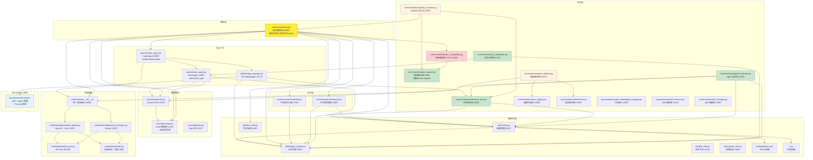

# Swarm-Ev2 项目架构概览

**Last Updated:** 2026-03-01 (Codemap 同步: 两阶段进化架构 + 4基因重设计 + Review纯文本JSON + gene_compatibility)
**项目版本:** 0.5.0
**当前阶段:** 两阶段进化 (Phase 1 Draft + Phase 2 GA) + P0 Bug 修复完成

---

## 1. 项目概述

Swarm-Ev2 是一个基于**双层群体智能**与**进化算法**的多 Agent 系统，用于自动化解决复杂代码问题（目标场景：MLE-Bench 刷榜）。

| 属性 | 值 |
|------|-----|
| 语言 | Python 3.10 (Conda: Swarm-Evo) |
| 架构 | 纯后端，asyncio + 多线程 |
| 配置 | OmegaConf + YAML |
| 日志 | 双通道（文本 + JSON）+ Review 调试记录 |
| 测试 | pytest + pytest-asyncio (39 测试文件, ~9600+ 行) |
| 代码行数 | ~11865 行核心代码（42 模块） + ~9600 行测试 |

---

## 2. 分层架构

```
+---------------------------------------------------------+
|                   入口层 (Entry)                          |
|   main.py (两阶段进化架构, 669行)                         |
|   run_mle_adapter.py (评测适配, 379行)                    |
|   - initialize_agents(config, prompt_manager)             |
|   - initialize_evolution_components(+skill_manager)       |
|   - SkillManager 三组件链: Embedding→Skill→Prompt        |
|   - generate_markdown_report() 生成测试报告                |
|   - print_evolution_statistics() 打印进化统计               |
+---------------------------------------------------------+
|                编排层 (Orchestration)                     |
|   Orchestrator (1835行, 两阶段进化+Metric校验+sanitize)   |
|   - run_epoch_draft(): Phase 1 初稿生成                   |
|   - run_epoch(): Phase 2 GA 进化                         |
|   - _sanitize_metric_value(): 入口校验                    |
+---------------------------------------------------------+
|                  Agent 层 (Agents)                        |
|   BaseAgent (148行) + CoderAgent (538行, +draft任务)     |
|   PromptManager (297行, Jinja2 模板)                     |
+---------------------------------------------------------+
|                进化层 (Evolution)                         |
|   GeneParser (202行, 4基因+sub-aspects)                  |
|   GeneCompatibility (141行, 框架互斥检测) NEW             |
|   ExperiencePool (319行)                                 |
|   TaskDispatcher (157行)                                 |
|   AgentEvolution (437行)                                 |
|   GeneRegistry (196行)                                   |
|   GeneSelector (448行, +退化检测+主父代推断)              |
|   Pheromone (104行)                                      |
|   SolutionEvolution (324行, 两阶段GA)                    |
|   CodeEmbeddingManager (130行)                           |
|   SkillExtractor (302行)                                 |
|   SkillManager (429行)                                   |
+---------------------------------------------------------+
|                  执行层 (Execution)                       |
|   Interpreter (472行, 精简重构+并行增强)                   |
|   WorkspaceManager (280行, +preprocess)                  |
+---------------------------------------------------------+
|                核心数据层 (State)                          |
|   Node (133行, +两阶段字段) +                             |
|   Journal (372行, Changelog支持) + Task (62行)           |
+---------------------------------------------------------+
|              基础设施层 (Infrastructure)                   |
|   config.py (620行) + logger_system.py (180行)           |
|   file_utils.py (222行) + text_utils.py (143行)          |
|   system_info.py (439行) + data_preview.py (390行)       |
|   proxy.py (202行) + metric.py (117行)                   |
|   code_validator.py (79行) + submission_validator.py (72行)|
|   workspace_builder.py (134行) + response.py (154行)     |
+---------------------------------------------------------+
|               Benchmark 资源                              |
|   benchmark/mle-bench/                                   |
|     - prompt_templates/ (Jinja2: draft/merge/mutate)     |
|     - skills/ (静态/动态 Skill)                           |
|     - agent_configs/ (Agent 角色+策略)                    |
+---------------------------------------------------------+
```

---

## 3. 模块依赖关系图


```mermaid
graph TD
    subgraph "基础设施"
        CFG[utils/config.py<br/>配置管理 620行]
        LOG[utils/logger_system.py<br/>日志系统 180行]
        FU[utils/file_utils.py<br/>文件工具 222行]
        TU[utils/text_utils.py<br/>文本压缩 143行]
        SYSINFO[utils/system_info.py<br/>系统信息 439行]
        YAML[config/default.yaml<br/>YAML 配置]
        ENV[.env<br/>环境变量]
    end

    subgraph "数据结构"
        NODE[core/state/node.py<br/>Node 数据类 133行<br/>+两阶段字段]
        JOURNAL[core/state/journal.py<br/>Journal DAG 372行]
        TASK[core/state/task.py<br/>Task 定义 62行]
    end

    subgraph "后端抽象"
        BACKEND[core/backend/__init__.py<br/>统一查询接口 168行]
        OPENAI[core/backend/backend_openai.py<br/>OpenAI + GLM 165行]
        ANTHRO[core/backend/backend_anthropic.py<br/>Claude 153行]
        KEYPOOL[core/backend/key_pool.py<br/>API Key 池 91行]
        BUTILS[core/backend/utils.py<br/>消息格式 + 重试 80行]
    end

    subgraph "执行层"
        INTERP[core/executor/interpreter.py<br/>代码执行沙箱 472行]
        WS[core/executor/workspace.py<br/>工作空间管理 280行]
    end

    subgraph "Agent 层"
        AGENT[agents/base_agent.py<br/>BaseAgent 148行<br/>+draft task_type]
        CODER[agents/coder_agent.py<br/>CoderAgent 538行<br/>+draft/merge/mutate]
        PM[utils/prompt_manager.py<br/>PromptManager 297行]
    end

    subgraph "编排层"
        ORCH[core/orchestrator.py<br/>任务编排器 1835行<br/>两阶段进化+纯文本Review]
    end

    subgraph "进化层"
        GENE[core/evolution/gene_parser.py<br/>基因解析器 202行<br/>4基因+sub-aspects]
        GCOMPAT[core/evolution/gene_compatibility.py<br/>基因兼容性 141行 NEW]
        EPOOL[core/evolution/experience_pool.py<br/>共享经验池 319行]
        TDISP[core/evolution/task_dispatcher.py<br/>任务分配器 157行]
        AEVO[core/evolution/agent_evolution.py<br/>Agent 层进化 437行]
        GREG[core/evolution/gene_registry.py<br/>基因注册表 196行]
        GSEL[core/evolution/gene_selector.py<br/>基因选择器 448行]
        PHER[core/evolution/pheromone.py<br/>信息素机制 104行]
        SEVO[core/evolution/solution_evolution.py<br/>Solution 层 GA 324行]
        CEMBED[core/evolution/code_embedding_manager.py<br/>代码嵌入 130行]
        SEXT[core/evolution/skill_extractor.py<br/>Skill 提取器 302行]
        SMGR[core/evolution/skill_manager.py<br/>Skill 管理器 429行]
    end

    subgraph "Benchmark 资源"
        BENCH[benchmark/mle-bench/<br/>Skill + Agent 配置<br/>+ Prompt 模板]
    end

    %% 依赖关系
    CFG --> YAML
    CFG --> ENV
    CFG --> LOG

    JOURNAL --> NODE

    AGENT --> CFG
    AGENT --> NODE
    AGENT --> JOURNAL
    CODER --> AGENT
    CODER --> BACKEND
    CODER --> PM

    PM --> EPOOL
    PM --> LOG
    PM --> BENCH

    ORCH --> CODER
    ORCH --> JOURNAL
    ORCH --> NODE
    ORCH --> INTERP
    ORCH --> WS
    ORCH --> CFG
    ORCH --> BACKEND
    ORCH --> LOG
    ORCH --> TU
    ORCH --> GCOMPAT

    INTERP --> LOG
    WS --> CFG
    WS --> LOG

    BACKEND --> OPENAI
    BACKEND --> ANTHRO
    OPENAI --> BUTILS
    OPENAI --> KEYPOOL
    ANTHRO --> BUTILS
    ANTHRO --> KEYPOOL

    %% 进化层依赖
    EPOOL --> CFG
    EPOOL --> LOG
    TDISP --> AGENT
    TDISP --> LOG
    AEVO --> EPOOL
    AEVO --> BACKEND
    AEVO --> CFG
    AEVO --> LOG
    SEVO --> GENE
    SEVO --> EPOOL
    SEVO --> ORCH
    GSEL --> GREG
    GSEL --> PHER
    GSEL --> JOURNAL
    GCOMPAT --> GENE

    style ORCH fill:#ffeb3b
    style GCOMPAT fill:#ffcdd2
    style GENE fill:#c8e6c9
    style EPOOL fill:#c8e6c9
    style TDISP fill:#c8e6c9
    style AEVO fill:#c8e6c9
    style BENCH fill:#e3f2fd
    style SEVO fill:#fff3e0
    style GSEL fill:#fff3e0
```

---

## 4. Phase 实施状态

| Phase | 名称 | 状态 | 核心交付物 |
|-------|------|------|-----------|
| **1** | 基础设施重构 | **完成** | config.py, logger_system.py, file_utils.py |
| **1** | 核心数据结构 | **完成** | Node (133行), Journal (372行), Task (62行) |
| **1** | 后端抽象层 | **完成** | Backend + query_with_config + key_pool |
| **2** | 执行层 | **完成** | Interpreter (472行), WorkspaceManager (280行) |
| **2** | Agent 抽象 | **完成** | BaseAgent (148行) + draft task_type |
| **2** | CoderAgent | **完成** | CoderAgent (538行, +draft/merge/mutate) |
| **2.4** | Orchestrator | **完成** | Orchestrator (1835行, 两阶段进化+纯文本Review) |
| **3.1** | 基因解析器 | **完成** | gene_parser.py (202行, 4基因+sub-aspects) |
| **3.1** | **基因兼容性** | **完成** | **gene_compatibility.py (141行) NEW** |
| **3.2** | 经验池 | **完成** | experience_pool.py (319行) |
| **3+** | PromptManager | **完成** | prompt_manager.py (297行) + benchmark/ |
| **3.3** | Agent 层群体智能 | **完成** | task_dispatcher.py (157行) + agent_evolution.py (437行) |
| **3.4** | Solution 层 GA | **完成** | solution_evolution.py (324行) + gene_selector.py (448行, +退化检测) + gene_registry.py (196行) + pheromone.py (104行) |
| **3.5** | Skill 进化 | **完成** | skill_extractor.py (302行) + skill_manager.py (429行) + code_embedding_manager.py (130行) |
| 4 | 扩展功能 | 待实现 | Memory, ToolRegistry |
| 5 | 测试与文档 | 进行中 | 80%+ 覆盖率 |

### 已完成模块明细

| 模块 | 文件 | 行数 | 状态 |
|------|------|------|------|
| **入口层** ||||
| 双层进化入口 | `main.py` | 669 | 完成 (两阶段架构) |
| 评测适配器 | `run_mle_adapter.py` | 379 | 完成 |
| **Phase 1: 基础设施** ||||
| 配置管理 | `utils/config.py` | 620 | 完成 (+两阶段EvolutionConfig) |
| 日志系统 | `utils/logger_system.py` | 180 | 完成 |
| 文件工具 | `utils/file_utils.py` | 222 | 完成 |
| 文本压缩工具 | `utils/text_utils.py` | 143 | 完成 (+Review压缩+截断策略) |
| 系统信息 | `utils/system_info.py` | 439 | 完成 |
| 数据预览 | `utils/data_preview.py` | 390 | 完成 |
| 代理设置 | `utils/proxy.py` | 202 | 完成 |
| 指标工具 | `utils/metric.py` | 117 | 完成 |
| 代码验证器 | `utils/code_validator.py` | 79 | 完成 |
| 提交验证器 | `utils/submission_validator.py` | 72 | 完成 |
| 工作空间构建 | `utils/workspace_builder.py` | 134 | 完成 |
| 响应解析 | `utils/response.py` | 154 | 完成 |
| **Phase 1: 数据结构** ||||
| Node 数据类 | `core/state/node.py` | 133 | 完成 (+两阶段字段) |
| Journal 数据类 | `core/state/journal.py` | 372 | 完成 |
| Task 数据类 | `core/state/task.py` | 62 | 完成 |
| **Phase 1: 后端抽象** ||||
| 后端抽象层 | `core/backend/__init__.py` | 168 | 完成 |
| OpenAI 后端 | `core/backend/backend_openai.py` | 165 | 完成 |
| Anthropic 后端 | `core/backend/backend_anthropic.py` | 153 | 完成 |
| 后端工具 | `core/backend/utils.py` | 80 | 完成 |
| API Key 池 | `core/backend/key_pool.py` | 91 | 完成 |
| **Phase 2: 执行层** ||||
| 代码执行器 | `core/executor/interpreter.py` | 472 | 完成 |
| 工作空间管理 | `core/executor/workspace.py` | 280 | 完成 |
| **Phase 2: Agent 层** ||||
| Agent 基类 | `agents/base_agent.py` | 148 | 完成 (+draft) |
| CoderAgent | `agents/coder_agent.py` | 538 | 完成 (+draft/merge/mutate) |
| **Phase 2.4: Orchestrator** ||||
| 任务编排器 | `core/orchestrator.py` | 1835 | 完成 (两阶段进化+纯文本Review+sanitize) |
| **Phase 3: 进化层** ||||
| 基因解析器 | `core/evolution/gene_parser.py` | 202 | 完成 (4基因+sub-aspects) |
| **基因兼容性** | **`core/evolution/gene_compatibility.py`** | **141** | **完成 (NEW)** |
| 共享经验池 | `core/evolution/experience_pool.py` | 319 | 完成 |
| 任务分配器 | `core/evolution/task_dispatcher.py` | 157 | 完成 |
| Agent 层进化 | `core/evolution/agent_evolution.py` | 437 | 完成 |
| 基因注册表 | `core/evolution/gene_registry.py` | 196 | 完成 |
| 基因选择器 | `core/evolution/gene_selector.py` | 448 | 完成 (+退化检测+主父代推断) |
| 信息素机制 | `core/evolution/pheromone.py` | 104 | 完成 |
| Solution 层 GA | `core/evolution/solution_evolution.py` | 324 | 完成 (两阶段GA) |
| **Phase 3.5: Skill 进化** ||||
| 代码嵌入管理器 | `core/evolution/code_embedding_manager.py` | 130 | 完成 |
| Skill 提取器 | `core/evolution/skill_extractor.py` | 302 | 完成 |
| Skill 管理器 | `core/evolution/skill_manager.py` | 429 | 完成 |
| **Phase 3+: Prompt 系统** ||||
| Prompt 管理器 | `utils/prompt_manager.py` | 297 | 完成 |
| Benchmark 资源 | `benchmark/mle-bench/` | - | 完成 |
| **配置文件** ||||
| YAML 配置 | `config/default.yaml` | ~130 | 完成 (+两阶段进化配置) |

**总计**: 42 个核心模块 | ~11865 行核心代码 + 39 个测试文件（~9600+ 行测试代码）

---

## 5. 目标架构（完整）

```
Swarm-Ev2/
├── main.py                        # 两阶段进化入口 (669行)
│   # 核心函数:
│   # - initialize_agents(config, prompt_manager)
│   # - initialize_evolution_components(+skill_manager)
│   # - SkillManager 三组件链: CodeEmbeddingManager→SkillManager→PromptManager
│   # - generate_markdown_report()
│   # - main() 两阶段进化主循环
├── run_mle_adapter.py             # MLE-Bench 评测适配 (379行)
├── config/
│   └── default.yaml               # 统一 YAML 配置 (~130行)
├── benchmark/                     # Benchmark 资源
│   └── mle-bench/
│       ├── prompt_templates/      # Jinja2 模板
│       │   ├── draft.j2           # 初稿任务模板 (原 explore.j2)
│       │   ├── merge.j2
│       │   └── mutate.j2
│       ├── skills/                # Skill 文件
│       │   ├── static/
│       │   ├── by_task_type/
│       │   └── meta/
│       └── agent_configs/         # Agent 配置 (agent_0~3)
├── agents/
│   ├── __init__.py
│   ├── base_agent.py              # Agent 抽象基类 (148行, +draft)
│   └── coder_agent.py             # 代码生成 Agent (538行)
├── core/
│   ├── state/
│   │   ├── node.py                # 解决方案节点 (133行, +两阶段字段)
│   │   ├── journal.py             # 解决方案日志 (372行)
│   │   └── task.py                # 任务定义 (62行)
│   ├── backend/
│   │   ├── __init__.py            # 统一查询接口 (168行)
│   │   ├── backend_openai.py      # OpenAI + GLM (165行)
│   │   ├── backend_anthropic.py   # Anthropic (153行)
│   │   ├── key_pool.py            # API Key 池 (91行)
│   │   └── utils.py               # 消息格式 + 重试 (80行)
│   ├── executor/
│   │   ├── interpreter.py         # 执行沙箱 (472行)
│   │   └── workspace.py           # 工作空间管理 (280行)
│   ├── orchestrator.py            # 编排器 (1835行, 两阶段进化+纯文本Review)
│   └── evolution/
│       ├── gene_parser.py         # 基因解析器 (202行, 4基因)
│       ├── gene_compatibility.py  # 基因兼容性 (141行) NEW
│       ├── experience_pool.py     # 共享经验池 (319行)
│       ├── task_dispatcher.py     # 任务分配器 (157行)
│       ├── agent_evolution.py     # Agent 层进化 (437行)
│       ├── gene_registry.py       # 基因注册表 (196行)
│       ├── gene_selector.py       # 基因选择器 (448行, +退化检测)
│       ├── pheromone.py           # 信息素机制 (104行)
│       ├── solution_evolution.py  # Solution 层 GA (324行)
│       ├── code_embedding_manager.py # 文本嵌入 (130行)
│       ├── skill_extractor.py     # Skill 提取器 (302行)
│       └── skill_manager.py       # Skill 管理器 (429行)
├── utils/
│   ├── config.py                  # 配置管理 (620行)
│   ├── logger_system.py           # 日志系统 (180行)
│   ├── file_utils.py              # 文件工具 (222行)
│   ├── text_utils.py              # 文本压缩+截断 (143行)
│   ├── data_preview.py            # 数据预览 (390行)
│   ├── metric.py                  # 评估指标工具 (117行)
│   ├── response.py                # LLM 响应解析 (154行)
│   ├── prompt_manager.py          # Prompt 管理器 (297行)
│   ├── system_info.py             # 系统信息收集 (439行)
│   ├── proxy.py                   # HTTP/HTTPS 代理 (202行)
│   ├── code_validator.py          # 代码静态验证 (79行)
│   ├── submission_validator.py    # 提交格式验证 (72行)
│   └── workspace_builder.py       # 工作空间构建器 (134行)
├── tests/
│   ├── unit/                      # 单元测试 (21+ 个测试文件)
│   ├── test_evolution/            # 进化模块测试 (12 个测试文件)
│   └── integration/               # 集成测试
└── docs/
    ├── CODEMAPS/                   # 架构图
    └── plans/                     # Phase 详细计划
```

---

## 6. 基因系统 (V6 标准: 4 基因 + Sub-Aspects)

### 6.1 基因解析器 (`core/evolution/gene_parser.py`, 202行)

**4 个必需基因块**:

```python
REQUIRED_GENES = ["DATA", "MODEL", "TRAIN", "POSTPROCESS"]

GENE_SUB_ASPECTS = {
    "DATA":        ["feature_engineering", "data_cleaning", "augmentation", "encoding"],
    "MODEL":       ["architecture", "loss_function", "optimizer", "regularization"],
    "TRAIN":       ["cv_strategy", "early_stopping", "lr_schedule", "epochs"],
    "POSTPROCESS": ["ensemble", "threshold", "tta"],
}
```

| 函数 | 签名 | 说明 |
|------|------|------|
| `parse_solution_genes` | `(code: str) -> Dict[str, str]` | 解析 `# [SECTION: NAME]` 标记 |
| `validate_genes` | `(genes: Dict) -> bool` | 验证 4 基因块完整性 |
| `merge_genes` | `(a, b, plan) -> str` | 按交叉计划合并基因 |

### 6.2 基因兼容性检查 (`core/evolution/gene_compatibility.py`, 141行) [NEW]

**职责**: merge 操作前检测框架互斥冲突，注入警告让 LLM 处理。

```python
FRAMEWORK_GROUPS = {
    "torch":      {"torch", "torchvision", "timm"},
    "sklearn":    {"sklearn", "xgboost", "lightgbm", "catboost"},
    "tensorflow": {"tensorflow", "keras", "tf"},
}

@dataclass
class CompatibilityResult:
    compatible: bool          # 是否兼容
    conflicts: List[str]      # 冲突描述列表
    action: str               # "proceed" | "inject_warning"
```

### 6.3 共享经验池 (`core/evolution/experience_pool.py`, 319行)

线程安全存储 Agent 执行记录，支持 Top-K 查询和 JSON 持久化。

```python
@dataclass
class TaskRecord:
    agent_id: str
    task_type: str          # "draft" | "merge" | "mutate"
    input_hash: str
    output_quality: float
    strategy_summary: str
    timestamp: float
```

### 6.4 任务分配器 (`core/evolution/task_dispatcher.py`, 157行)

基于 Epsilon-Greedy 策略选择最适合的 Agent 执行任务。

**EMA 更新公式**: `new_score = (1-α) × old_score + α × quality`

### 6.5 Agent 层进化器 (`core/evolution/agent_evolution.py`, 437行)

每 N 个 Epoch 评估所有 Agent 表现，对弱者进行 Role 和 Strategy 变异。

### 6.6 基因注册表 (`core/evolution/gene_registry.py`, 196行)

管理基因级信息素，支持基因哈希、归一化和信息素更新/衰减。

### 6.7 基因选择器 (`core/evolution/gene_selector.py`, 448行)

**职责**: 信息素驱动的基因选择 + 退化检测 + 主父代推断。

| 函数 | 签名 | 说明 |
|------|------|------|
| `select_gene_plan` | `(journal, gene_registry, ...) -> Dict` | 为每个位点选择 Top-1 基因 |
| `pheromone_with_degenerate_check` | `(...) -> Dict` | 退化检测后选择 |
| `get_primary_parent` | `(parent_a, parent_b, gene_plan) -> Node` | 推断主父代 |

**quality 计算**: `quality = node_weight × node_pheromone + gene_weight × gene_pheromone`

### 6.8 信息素机制 (`core/evolution/pheromone.py`, 104行)

节点级信息素: `pheromone = w1×score + w2×success_rate + w3×time_decay`

### 6.9 Solution 层进化器 (`core/evolution/solution_evolution.py`, 324行)

MVP 简化版，委托 Orchestrator 执行任务。

### 6.10 Skill 进化系统

| 模块 | 行数 | 职责 |
|------|------|------|
| `code_embedding_manager.py` | 130 | bge-m3 文本向量化（懒加载+缓存） |
| `skill_extractor.py` | 302 | HDBSCAN 聚类 + LLM 总结生成 Skill |
| `skill_manager.py` | 429 | Skill 池管理（质量评估/合并/淘汰） |

---

## 7. 两阶段进化架构

### 7.1 Phase 1: Draft 初始化

```
run_epoch_draft(steps)
|
+-- for step in range(steps):
|   +-- execute_draft_task(agent, parent_node=None)
|   +-- 生成全新方案（不依赖已有节点）
|   +-- 直到达到 phase1_target_nodes
|
+-- 输出: 初始种群
```

### 7.2 Phase 2: GA 进化

```
run_epoch(steps)
|
+-- for step in range(steps):
|   +-- 50% 概率: execute_merge_task()
|   |   +-- 选择 2 个父代（锦标赛+信息素）
|   |   +-- gene_compatibility 检查
|   |   +-- 基因交叉
|   |
|   +-- 50% 概率: execute_mutate_task()
|       +-- 选择 1 个父代
|       +-- 随机选择 gene + sub-aspect
|       +-- 精细化变异
|
+-- 输出: 优化后种群
```

### 7.3 main() 执行流程

```
main()
|
+-- [Phase 1] 环境准备
|   +-- load_config() + validate_dataset()
|
+-- [Phase 2] 工作空间构建
|   +-- build_workspace()
|
+-- [Phase 3] 组件初始化
|   +-- SkillManager 三组件链
|   +-- initialize_agents() -> 4 Agent
|   +-- initialize_evolution_components()
|   +-- Orchestrator + SolutionEvolution
|
+-- [Phase 4] 两阶段进化主循环
|   +-- orchestrator.run_epoch_draft()   # Phase 1
|   +-- for epoch in range(num_epochs):
|   |   +-- orchestrator.run_epoch()     # Phase 2
|   |   +-- solution_evolution.run_epoch()
|   |   +-- agent_evolution.evolve(epoch)
|   +-- 返回 best_node
|
+-- [Phase 5] 生成测试报告
|   +-- generate_markdown_report()
|
+-- [Phase 6] 结果展示
    +-- print_evolution_statistics()
    +-- experience_pool.save()
```

---

## 8. Orchestrator 编排器架构 (1835行)

### 8.1 核心职责

两阶段进化编排 + 代码执行 + 纯文本 JSON Review + Metric 校验。

### 8.2 Review 系统 (纯文本 JSON)

```
_review_node(node)
|
+-- 构建 review 消息（压缩任务描述 via text_utils）
+-- backend.query() -> 纯文本 JSON 响应
+-- 解析 JSON -> 更新 node 字段
+-- _sanitize_metric_value(): 入口校验（绝对值、范围检查）
```

**关键方法**:
- `_sanitize_metric_value(value)`: 确保 metric 为正数，处理 neg_RMSE 等
- `_check_metric_plausibility()`: 异常值检测
- `_validate_review_response()`: 响应一致性验证

### 8.3 Node 两阶段字段

```python
# 新增字段 (Node)
dead: bool                    # 是否已淘汰
debug_attempts: int           # debug 尝试次数
approach_tag: Optional[str]   # 方法标签
generation: Optional[int]     # 所属代次
```

---

## 9. 双层群体智能架构概览

```
+----------------------------------------------+
|              入口层 (Entry)                   |
|  main.py (669行) - 两阶段进化入口             |
|    Phase 1: Draft → Phase 2: GA              |
+----------------------------------------------+
|          Agent 层（群体智能）                  |
|  +-----+ +-----+ +-----+ +-----+             |
|  | A0  | | A1  | | A2  | | A3  |  4 个 Agent |
|  +--+--+ +--+--+ +--+--+ +--+--+             |
|     +-------+-------+-------+                |
|     TaskDispatcher (Epsilon-Greedy)          |
|     AgentEvolution (每 N Epoch 进化)          |
+----------------------------------------------+
|        Solution 层（遗传算法）                 |
|  种群: 12 个 Solution                         |
|  基因: DATA | MODEL | TRAIN | POSTPROCESS    |
|  Sub-aspects: 15 个精细化变异维度              |
|  操作: 精英保留(top-3) + 锦标赛(k=3) +       |
|        交叉(随机/信息素) + 变异(sub-aspect)   |
|  兼容性: gene_compatibility 框架互斥检测      |
+----------------------------------------------+
|      信息素系统 (Pheromone System)            |
|  - 节点级信息素 (pheromone.py, 104行)         |
|  - 基因级信息素 (gene_registry.py, 196行)     |
|  - 退化检测 + 主父代推断 (gene_selector, 448行)|
+----------------------------------------------+
|         Skill 进化系统                        |
|  - CodeEmbeddingManager (130行, bge-m3)      |
|  - SkillExtractor (302行, HDBSCAN + LLM)     |
|  - SkillManager (429行, 新增/合并/淘汰)       |
+----------------------------------------------+
|         共享经验池 (ExperiencePool, 319行)    |
+----------------------------------------------+
|         Prompt 系统                           |
|  - PromptManager (Jinja2, 297行)             |
|  - benchmark/mle-bench/ 资源文件             |
|  - 7 层结构化 Prompt                          |
|  - 模板: draft.j2, merge.j2, mutate.j2      |
+----------------------------------------------+
```

---

## 10. Benchmark 资源结构

```
benchmark/mle-bench/
+-- prompt_templates/           # Jinja2 模板
|   +-- draft.j2                # 初稿任务模板 (原 explore.j2)
|   +-- merge.j2
|   +-- mutate.j2
+-- skills/
|   +-- static/
|   +-- by_task_type/
|   +-- meta/
+-- agent_configs/              # 4 个差异化 Agent
    +-- agent_0~3/
        +-- role.md + strategy_*.md
```

---

## 11. 关联文档

| 文档 | 路径 | 说明 |
|------|------|------|
| 后端模块详情 | `docs/CODEMAPS/backend.md` | 已实现模块分析 |
| 数据流与配置 | `docs/CODEMAPS/data.md` | 配置与数据管理 |
| 两阶段进化方案 | `docs/plans/two_phase_ea_refactor.md` | 架构设计文档 |
| 开发规范 | `CLAUDE.md` | 编码/测试/日志规范 |
| 差异报告 | `.reports/codemap-diff.txt` | 版本差异分析 |
| V6 分析报告 | `docs/mle-bench-analysis-report-v6.md` | 实验分析 |
