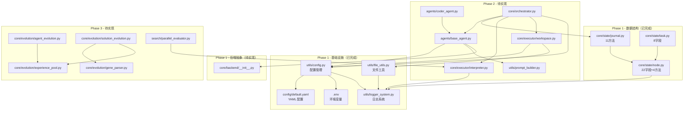

# Swarm-Ev2 项目架构概览

**Last Updated:** 2026-01-30
**项目版本:** 0.1.0
**当前阶段:** Phase 1 基础设施搭建（已完成）

---

## 1. 项目概述

Swarm-Ev2 是一个基于**双层群体智能**与**进化算法**的多 Agent 系统，用于自动化解决复杂代码问题（目标场景：MLE-Bench 刷榜）。

| 属性 | 值 |
|------|-----|
| 语言 | Python 3.10 (Conda: Swarm-Evo) |
| 架构 | 纯后端，asyncio |
| 配置 | OmegaConf + YAML |
| 日志 | 双通道（文本 + JSON） |
| 测试 | pytest + pytest-asyncio |

---

## 2. 分层架构

```
┌─────────────────────────────────────────────────┐
│                 入口层 (Entry)                    │
│   main.py (白盒调试)  mle_bench_adapter.py (评测) │  ← Phase 5
├─────────────────────────────────────────────────┤
│              编排层 (Orchestration)               │
│   Orchestrator · ParallelEvaluator               │  ← Phase 2-3
├─────────────────────────────────────────────────┤
│              Agent 层 (Agents)                    │
│   BaseAgent · CoderAgent · SwarmAgent            │  ← Phase 2-3
├─────────────────────────────────────────────────┤
│              进化层 (Evolution)                   │
│   AgentEvolution · SolutionEvolution             │
│   ExperiencePool · GeneParser                    │  ← Phase 3-4
├─────────────────────────────────────────────────┤
│              执行层 (Execution)                   │
│   Interpreter · WorkspaceManager                 │  ← Phase 2
├─────────────────────────────────────────────────┤
│              核心数据层 (State)                    │
│   Node · Journal · Task                          │  ← Phase 1 ★已完成★
├─────────────────────────────────────────────────┤
│            ★ 基础设施层 (Infrastructure) ★         │
│   config.py · logger_system.py · file_utils.py   │  ← Phase 1 (已完成)
└─────────────────────────────────────────────────┘
```

---

## 3. 模块依赖关系图



---

## 4. Phase 实施状态

| Phase | 名称 | 状态 | 核心交付物 |
|-------|------|------|-----------|
| **1** | 基础设施重构 | **已完成** | config.py, logger_system.py, file_utils.py |
| **1** | 核心数据结构 | **已完成** | Node, Journal, Task (测试覆盖率 97%) |
| 1 | 后端抽象层 | 待实现 | Backend (OpenAI, Anthropic) |
| 2 | 核心功能 | 待实现 | BaseAgent, Orchestrator, Interpreter |
| 3 | 双层群体智能 | 待实现 | GA, AgentEvolution, ParallelEvaluator |
| 4 | 扩展功能 | 待实现 | Memory, ToolRegistry, AgentRegistry |
| 5 | 测试与文档 | 进行中 | 80%+ 覆盖率, 端到端验证 |

### Phase 1 已完成模块明细

| 模块 | 文件 | 行数 | 状态 |
|------|------|------|------|
| 配置管理 | `utils/config.py` | 457 | 已完成 |
| 日志系统 | `utils/logger_system.py` | 181 | 已完成 |
| 文件工具 | `utils/file_utils.py` | 114 | 已完成 |
| **Node 数据类** | `core/state/node.py` | 119 | **已完成** |
| **Journal 数据类** | `core/state/journal.py` | 229 | **已完成** |
| **Task 数据类** | `core/state/task.py` | 63 | **已完成** |
| YAML 配置 | `config/default.yaml` | 77 | 已完成 |
| 环境变量模板 | `.env.example` | 36 | 已完成 |
| 依赖声明 | `requirements.txt` | 36 | 已完成 |

### Phase 1 已完成测试明细

| 测试文件 | 测试数 | 覆盖模块 |
|----------|--------|---------|
| `tests/unit/test_config.py` | 7 | config.py |
| `tests/unit/test_config_priority.py` | 4 | config.py (优先级) |
| `tests/unit/test_file_utils.py` | 5 | file_utils.py |
| **`tests/unit/test_node.py`** | 7 | **Node 数据类** |
| **`tests/unit/test_journal.py`** | 12 | **Journal + parse_solution_genes** |
| **`tests/unit/test_task.py`** | 5 | **Task 数据类** |
| **`tests/unit/test_state_integration.py`** | 1 | **State 模块集成** |

---

## 5. 目标架构（完整）

```
Swarm-Ev2/
├── main.py                        # 白盒入口（本地调试）
├── mle_bench_adapter.py           # 黑盒入口（MLE-Bench 评测）
├── config/
│   └── default.yaml               # 统一 YAML 配置        ★ 已完成
├── agents/                        # Agent 层
│   ├── base_agent.py              # Agent 抽象基类         Phase 2
│   ├── coder_agent.py             # 代码生成 Agent         Phase 2
│   ├── swarm_agent.py             # 群体 Agent             Phase 3
│   └── registry.py                # Agent 注册表           Phase 4
├── core/
│   ├── state/                     # 数据结构
│   │   ├── __init__.py            # 导出 Node, Journal, Task  ★ 已完成
│   │   ├── node.py                # 解决方案节点              ★ 已完成
│   │   ├── journal.py             # 解决方案日志              ★ 已完成
│   │   └── task.py                # 任务定义                  ★ 已完成
│   ├── backend/                   # LLM 后端抽象
│   │   ├── __init__.py            # 统一查询接口           Phase 1 待实现
│   │   ├── backend_openai.py      # OpenAI                Phase 1 待实现
│   │   └── backend_anthropic.py   # Anthropic             Phase 1 待实现
│   ├── executor/                  # 代码执行
│   │   ├── interpreter.py         # 执行沙箱              Phase 2
│   │   └── workspace.py           # 工作空间管理           Phase 2
│   ├── orchestrator.py            # 编排器                 Phase 2
│   └── evolution/                 # 进化机制
│       ├── agent_evolution.py     # Agent 层进化           Phase 3
│       ├── solution_evolution.py  # Solution 层 GA         Phase 3
│       ├── experience_pool.py     # 共享经验池             Phase 3
│       └── gene_parser.py         # 基因解析器             Phase 3
├── search/                        # 搜索与评估
│   ├── parallel_evaluator.py      # 并行评估器             Phase 3
│   └── fitness.py                 # 适应度计算             Phase 3
├── tools/                         # 工具注册表              Phase 4
├── utils/                         # 工具模块
│   ├── config.py                  # 配置管理               ★ 已完成
│   ├── logger_system.py           # 日志系统               ★ 已完成
│   ├── file_utils.py              # 文件工具               ★ 已完成
│   └── prompt_builder.py          # Prompt 构建器          Phase 2
├── tests/                         # 测试
│   ├── unit/                      # 单元测试               ★ 已完成 (部分)
│   └── integration/               # 集成测试               待实现
└── docs/                          # 文档
    ├── CODEMAPS/                   # 架构图                 ★ 本次创建
    ├── plans/                     # Phase 详细计划          已完成
    └── implementation_plan.md     # 总体实施计划            已完成
```

---

## 6. 双层群体智能架构概览

```
┌──────────────────────────────────────────────┐
│               Agent 层（群体智能）              │
│  ┌─────┐ ┌─────┐ ┌─────┐ ┌─────┐           │
│  │ A1  │ │ A2  │ │ A3  │ │ A4  │  4 个 Agent│
│  └──┬──┘ └──┬──┘ └──┬──┘ └──┬──┘           │
│     └───────┴───────┴───────┘               │
│              ↓ 生成 Solution                  │
├──────────────────────────────────────────────┤
│            Solution 层（遗传算法）              │
│  种群: 12 个 Solution                         │
│  基因: DATA | MODEL | LOSS | OPTIMIZER |      │
│        REGULARIZATION | INITIALIZATION |      │
│        TRAINING_TRICKS                        │
│  操作: 精英保留(top-3) + 锦标赛(k=3) +        │
│        交叉 + 变异(20%)                        │
├──────────────────────────────────────────────┤
│              共享经验池                         │
│  Agent 表现 ←→ Solution 评估结果               │
└──────────────────────────────────────────────┘
```

---

## 7. 关联文档

| 文档 | 路径 | 说明 |
|------|------|------|
| 总体实施计划 | `docs/implementation_plan.md` | 5 Phase 概览 |
| Phase 1 详细计划 | `docs/plans/phase1_infrastructure.md` | 基础设施设计 |
| Phase 2 详细计划 | `docs/plans/phase2_core.md` | 核心功能设计 |
| Phase 3 详细计划 | `docs/plans/phase3_search.md` | 搜索算法设计 |
| Phase 4 详细计划 | `docs/plans/phase4_extensions.md` | 扩展功能设计 |
| Phase 5 详细计划 | `docs/plans/phase5_testing.md` | 测试文档设计 |
| 后端模块详情 | `docs/CODEMAPS/backend.md` | 已实现模块分析 |
| 数据流与配置 | `docs/CODEMAPS/data.md` | 配置与数据管理 |
| 开发规范 | `CLAUDE.md` | 编码/测试/日志规范 |
