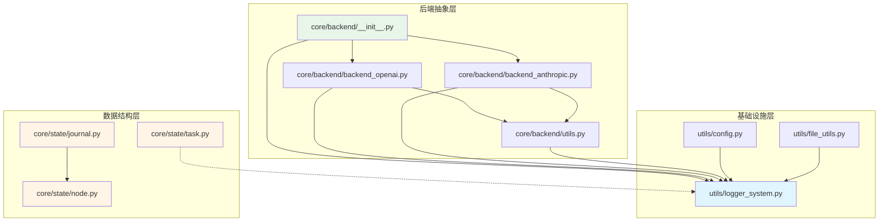

# 后端模块详细说明

**Last Updated:** 2026-01-30 22:00:00
**模块范围:** utils/, core/state/, config/, tests/

---

## 1. 模块概览

| 模块 | 文件 | 职责 | 状态 |
|------|------|------|------|
| 配置系统 | `utils/config.py` | OmegaConf 配置加载与验证 | 已完成 |
| 日志系统 | `utils/logger_system.py` | 双通道日志输出 | 已完成 |
| 文件工具 | `utils/file_utils.py` | 目录复制/链接 | 已完成 |
| **Node 数据类** | `core/state/node.py` | 解决方案 DAG 节点 | **已完成** |
| **Journal 数据类** | `core/state/journal.py` | DAG 容器与查询 | **已完成** |
| **Task 数据类** | `core/state/task.py` | Agent 任务定义 | **已完成** |
| **后端抽象层** | `core/backend/__init__.py` | 统一 LLM 查询接口 | **已完成** |
| **OpenAI 后端** | `core/backend/backend_openai.py` | OpenAI + GLM 支持 | **已完成** |
| **Anthropic 后端** | `core/backend/backend_anthropic.py` | Claude 系列支持 | **已完成** |
| **后端工具** | `core/backend/utils.py` | 消息格式化 + 重试机制 | **已完成** |
| YAML 配置 | `config/default.yaml` | 项目主配置 | 已完成 |
| 环境变量 | `.env.example` | API Keys 模板 | 已完成 |

---

## 2. 配置系统 (`utils/config.py`)

### 2.1 架构设计

```
┌─────────────────────────────────────────────────────┐
│                    load_config()                     │
│  ┌────────────┐   ┌────────────┐   ┌────────────┐  │
│  │  .env 文件  │ + │ YAML 配置  │ + │ CLI 参数   │  │
│  │  (低优先)   │   │  (中优先)   │   │  (高优先)   │  │
│  └─────┬──────┘   └─────┬──────┘   └─────┬──────┘  │
│        └────────────────┼────────────────┘          │
│                         ↓                            │
│                 validate_config()                    │
│                         ↓                            │
│                   Config 对象                        │
└─────────────────────────────────────────────────────┘
```

### 2.2 数据类结构

```python
@dataclass
class Config(Hashable):
    """顶层配置类"""
    project: ProjectConfig    # 项目基础配置
    data: DataConfig         # 数据配置
    llm: LLMConfig           # LLM 后端配置
    execution: ExecutionConfig # 执行配置
    agent: AgentConfig       # Agent 配置
    search: SearchConfig     # 搜索算法配置
    logging: LoggingConfig   # 日志配置
```

#### 子配置类

| 类名 | 字段 | 说明 |
|------|------|------|
| `ProjectConfig` | name, version, workspace_dir, log_dir, exp_name | 项目元信息 |
| `DataConfig` | data_dir, desc_file, goal, eval, preprocess_data, copy_data | 数据路径与选项 |
| `LLMStageConfig` | model, temperature, api_key | 单阶段 LLM 配置 |
| `LLMConfig` | code, feedback | 双阶段 LLM 配置 |
| `ExecutionConfig` | timeout, agent_file_name, format_tb_ipython | 执行选项 |
| `AgentConfig` | max_steps, time_limit, k_fold_validation, ... | Agent 行为参数 |
| `SearchConfig` | strategy, max_debug_depth, debug_prob, num_drafts, parallel_num | 搜索策略参数 |
| `LoggingConfig` | level, console_output, file_output | 日志输出控制 |

### 2.3 核心函数

| 函数 | 签名 | 说明 |
|------|------|------|
| `load_config` | `(config_path?, use_cli?, env_file?) -> Config` | 加载并验证配置 |
| `validate_config` | `(cfg: DictConfig) -> Config` | 验证配置完整性 |
| `generate_exp_name` | `() -> str` | 生成实验名称 `YYYYMMDD_HHMMSS_xxxx` |
| `print_config` | `(cfg: Config) -> None` | Rich 美观打印配置 |
| `setup_workspace` | `(cfg: Config) -> None` | 初始化工作空间目录 |

### 2.4 验证规则

```
必填字段:
├── data.data_dir 必须存在
└── data.desc_file 或 data.goal 至少提供一个

路径处理:
├── 相对路径 → 绝对路径 (Path.resolve())
├── 不存在的目录 → 自动创建
└── exp_name 为空 → 自动生成

API Key 检查:
└── ${env:VAR} 未解析 → 记录 WARNING
```

### 2.5 使用示例

```python
from utils.config import load_config, setup_workspace, print_config

# 基础用法
cfg = load_config()
print_config(cfg)

# 自定义配置文件
cfg = load_config(config_path=Path("custom.yaml"))

# 禁用 CLI 合并（用于测试）
cfg = load_config(use_cli=False)

# 指定 .env 文件
cfg = load_config(env_file=Path(".env.prod"))

# 初始化工作空间
setup_workspace(cfg)
```

---

## 3. 日志系统 (`utils/logger_system.py`)

### 3.1 双通道架构

```
┌─────────────────────────────────────────────────┐
│                 LoggerSystem                     │
│  ┌──────────────────┐  ┌──────────────────┐    │
│  │   text_log()     │  │   json_log()     │    │
│  │  ↓               │  │  ↓               │    │
│  │ logs/system.log  │  │ logs/metrics.json│    │
│  │  + 终端输出       │  │  (JSON 数组)     │    │
│  └──────────────────┘  └──────────────────┘    │
└─────────────────────────────────────────────────┘
```

### 3.2 核心函数

| 函数 | 签名 | 说明 |
|------|------|------|
| `init_logger` | `(log_dir: Path) -> LoggerSystem` | 初始化全局日志系统 |
| `log_msg` | `(level: str, message: str) -> None` | 记录文本日志 |
| `log_json` | `(data: Dict) -> None` | 记录 JSON 数据 |
| `ensure` | `(condition: bool, error_msg: str) -> None` | 断言工具 |
| `log_exception` | `(exc: Exception, context?: str) -> None` | 记录异常堆栈 |

### 3.3 日志级别

| 级别 | 用途 | 行为 |
|------|------|------|
| `DEBUG` | 调试信息 | 仅文件 |
| `INFO` | 一般信息 | 文件 + 终端 |
| `WARNING` | 警告 | 文件 + 终端 |
| `ERROR` | 错误 | 文件 + 终端（不自动 raise） |

### 3.4 Phase 1 重构要点

```python
# 旧版行为（已废弃）
log_msg("ERROR", "错误")  # 自动 raise Exception

# 新版行为
log_msg("ERROR", "错误")  # 仅记录，不抛出
raise ValueError("错误")  # 需显式抛出

# 推荐: 使用 ensure()
ensure(condition, "错误消息")  # 条件失败时 raise AssertionError
```

### 3.5 使用示例

```python
from utils.logger_system import init_logger, log_msg, log_json, ensure, log_exception

# 初始化
init_logger(Path("logs"))

# 文本日志
log_msg("INFO", "开始执行任务")
log_msg("WARNING", "检测到潜在问题")
log_msg("ERROR", "任务失败")  # 不抛出

# 断言
ensure(config.is_valid(), "配置无效")

# 异常记录
try:
    risky_operation()
except Exception as e:
    log_exception(e, "执行风险操作时")
    raise

# JSON 日志
log_json({
    "agent_name": "Agent1",
    "step": 3,
    "action": "tool_call",
    "metric": 0.85
})
```

---

## 4. 文件工具 (`utils/file_utils.py`)

### 4.1 核心函数

| 函数 | 签名 | 说明 |
|------|------|------|
| `copytree` | `(src, dst, use_symlinks=True) -> None` | 复制/链接目录树 |
| `_set_readonly_recursive` | `(path) -> None` | 递归设置只读权限 |

### 4.2 copytree 行为

```
use_symlinks=True (默认)
├── 创建符号链接指向源目录
├── 设置只读权限（平台支持时）
└── 失败时自动降级为复制

use_symlinks=False
├── 使用 shutil.copytree 复制
├── 支持 dirs_exist_ok=True 增量复制
└── 递归设置只读权限
```

### 4.3 跨平台兼容性

| 平台 | symlink 支持 | 回退方案 |
|------|-------------|---------|
| Linux | 完全支持 | - |
| macOS | 完全支持 | - |
| Windows | 需管理员权限 | 自动降级为复制 |

### 4.4 使用示例

```python
from utils.file_utils import copytree
from pathlib import Path

# 符号链接模式（推荐，节省空间）
copytree(src=Path("data"), dst=Path("workspace/input"), use_symlinks=True)

# 复制模式（完全隔离）
copytree(src=Path("data"), dst=Path("workspace/input"), use_symlinks=False)
```

---

## 5. 测试架构 (`tests/`)

### 5.1 目录结构

```
tests/
├── __init__.py
├── unit/                              # 单元测试
│   ├── __init__.py
│   ├── test_config.py                 # 配置系统测试 (7 个测试)
│   ├── test_config_priority.py        # 配置优先级测试 (4 个测试)
│   ├── test_file_utils.py             # 文件工具测试 (5 个测试)
│   ├── test_node.py                   # Node 数据类测试 (7 个测试)
│   ├── test_journal.py                # Journal 数据类测试 (12 个测试)
│   ├── test_task.py                   # Task 数据类测试 (5 个测试)
│   └── test_state_integration.py      # State 集成测试 (1 个测试)
└── integration/                       # 集成测试（待添加）
    └── __init__.py
```

### 5.2 测试类汇总

| 测试类 | 测试方法 | 覆盖功能 |
|--------|---------|---------|
| `TestLoadConfig` | 2 | 默认配置加载, CLI 覆盖 |
| `TestValidateConfig` | 2 | 必填字段检查 |
| `TestGenerateExpName` | 2 | 格式验证, 唯一性 |
| `TestSetupWorkspace` | 1 | 目录创建 |
| `TestConfigHashable` | 2 | dict key, set member |
| `TestConfigPriority` | 4 | .env 文件, 系统环境变量优先级, 完整链 |
| `TestCopytree` | 5 | symlink, copy, 异常, 只读, 替换 |
| **`TestNode`** | **7** | 创建, 序列化, 相等性, stage_name, has_exception, children_ids, metadata |
| **`TestJournal`** | **12** | append, get_node_by_id, get_children, get_siblings, draft_nodes, buggy/good_nodes, get_best_node, build_dag, 序列化, parse_solution_genes |
| **`TestTask`** | **5** | 创建, __str__, 序列化, 类型, dependencies |
| **`TestStateIntegration`** | **1** | 完整工作流：创建节点 -> 构建 DAG -> 查询 -> 序列化 |

### 5.3 运行测试

```bash
# 运行所有单元测试
pytest tests/unit/ -v

# 运行并查看覆盖率（utils + core）
pytest tests/unit/ --cov=utils --cov=core --cov-report=term-missing

# 运行特定测试文件
pytest tests/unit/test_config.py -v
pytest tests/unit/test_node.py -v
pytest tests/unit/test_journal.py -v
pytest tests/unit/test_task.py -v

# 运行特定测试类
pytest tests/unit/test_config.py::TestLoadConfig -v
pytest tests/unit/test_journal.py::TestJournal -v
```

---

## 6. 核心数据结构（Phase 1 已完成）

### 6.1 Node (`core/state/node.py`)

解决方案 DAG 中的单个节点，包含代码、执行结果、评估信息及 MCTS/GA 统计。

```python
@dataclass(eq=False)
class Node(DataClassJsonMixin):
    # ---- 代码 ----
    code: str                              # [必填] Python 代码
    plan: str = ""                         # 实现计划
    genes: Dict[str, str] = {}             # 基因组件（由 parse_solution_genes 解析）

    # ---- 通用属性 ----
    step: int = 0                          # Journal 中的序号
    id: str = uuid4().hex                  # 唯一 ID
    ctime: float = time()                  # 创建时间戳
    parent_id: Optional[str] = None        # 父节点 ID
    children_ids: list[str] = []           # 子节点 ID 列表（build_dag 构建）
    task_type: str = "draft"               # 任务类型
    metadata: Dict = {}                    # 额外元数据

    # ---- 执行信息 ----
    logs: str = ""                         # 执行日志
    term_out: str = ""                     # 终端输出
    exec_time: float = 0.0                 # 执行时间（秒）
    exc_type: Optional[str] = None         # 异常类型
    exc_info: Optional[Dict] = None        # 异常详情

    # ---- 评估 ----
    analysis: str = ""                     # LLM 分析结果
    metric_value: Optional[float] = None   # 评估指标值
    is_buggy: bool = False                 # 是否包含 bug
    is_valid: bool = True                  # 是否有效

    # ---- MCTS ----
    visits: int = 0                        # MCTS 访问次数
    total_reward: float = 0.0              # MCTS 累计奖励

    # ---- GA ----
    generation: Optional[int] = None       # GA 进化代数
    fitness: Optional[float] = None        # GA 适应度值
```

**方法:**

| 方法 | 返回类型 | 说明 |
|------|----------|------|
| `__eq__(other)` | `bool` | 基于 ID 比较相等性 |
| `__hash__()` | `int` | 基于 ID 生成哈希值 |
| `stage_name` (property) | `Literal["draft","debug","improve","unknown"]` | 推导节点阶段 |
| `has_exception` (property) | `bool` | 检查是否有执行异常 |

**使用示例:**

```python
from core.state import Node, parse_solution_genes

# 创建节点
node = Node(code="x = 1", plan="初始方案")

# 解析基因
node.genes = parse_solution_genes(node.code)

# 序列化
json_dict = node.to_dict()
restored = Node.from_dict(json_dict)
```

### 6.2 Journal (`core/state/journal.py`)

解决方案节点集合，表示搜索树/DAG，提供节点管理和树结构查询。

```python
@dataclass
class Journal(DataClassJsonMixin):
    nodes: list[Node] = []
```

**方法:**

| 方法 | 签名 | 说明 | 复杂度 |
|------|------|------|--------|
| `__len__` | `() -> int` | 返回节点数量 | O(1) |
| `__getitem__` | `(idx: int) -> Node` | 通过索引访问节点 | O(1) |
| `append` | `(node: Node) -> None` | 添加节点（自动设置 step） | O(1) |
| `get_node_by_id` | `(node_id: str) -> Optional[Node]` | 通过 ID 查找节点 | O(n) |
| `get_children` | `(node_id: str) -> list[Node]` | 获取子节点列表 | O(k) |
| `get_siblings` | `(node_id: str) -> list[Node]` | 获取兄弟节点（不含自身） | O(n) |
| `get_best_node` | `(only_good: bool = True) -> Optional[Node]` | 返回 metric_value 最高节点 | O(n) |
| `build_dag` | `() -> None` | 根据 parent_id 构建 children_ids | O(n) |
| `draft_nodes` (property) | `-> list[Node]` | 所有无父节点的节点 | O(n) |
| `buggy_nodes` (property) | `-> list[Node]` | 所有 is_buggy=True 的节点 | O(n) |
| `good_nodes` (property) | `-> list[Node]` | 所有 is_buggy=False 的节点 | O(n) |

**工具函数:**

| 函数 | 签名 | 说明 |
|------|------|------|
| `parse_solution_genes` | `(code: str) -> Dict[str, str]` | 解析 `# [SECTION: NAME]` 标记，分割代码为基因组件 |

**使用示例:**

```python
from core.state import Journal, Node, parse_solution_genes

journal = Journal()

# 添加节点
root = Node(code="# [SECTION: DATA]\nimport pandas as pd", plan="初始方案")
root.genes = parse_solution_genes(root.code)
journal.append(root)

child = Node(code="x = 2", parent_id=root.id, metric_value=0.85)
journal.append(child)

# 构建 DAG 并查询
journal.build_dag()
best = journal.get_best_node()
children = journal.get_children(root.id)
```

### 6.3 Task (`core/state/task.py`)

Agent 任务定义，用于任务队列和调度系统。

```python
TaskType = Literal["explore", "merge", "select", "review"]

@dataclass
class Task(DataClassJsonMixin):
    # ---- 核心字段 ----
    type: TaskType                              # [必填] 任务类型
    node_id: str                                # [必填] 关联节点 ID

    # ---- 元数据 ----
    description: str = ""                       # 任务描述
    id: str = uuid4().hex                       # 唯一标识符
    created_at: float = time()                  # 创建时间戳

    # ---- 调度信息 ----
    agent_name: Optional[str] = None            # 分配的 Agent 名称
    dependencies: Optional[Dict[str, str]] = None  # 任务依赖 {名称: 任务ID}
    payload: Dict = {}                          # 任务上下文数据
```

**Task 类型说明:**

| 类型 | 说明 |
|------|------|
| `explore` | 探索新方案，生成新的解决方案节点 |
| `merge` | 合并多个方案，融合不同节点的优点 |
| `select` | 选择最佳方案，从候选节点中筛选 |
| `review` | 审查方案质量，评估节点的有效性 |

**使用示例:**

```python
from core.state import Task

task = Task(
    type="explore",
    node_id="node_abc123",
    description="基于最佳节点探索新方案",
    agent_name="explorer_agent",
    payload={"parent_metric": 0.90},
)
print(task)  # Task(type=explore, node_id=node_abc...)
```

---

## 7. 外部依赖

| 包 | 版本 | 用途 |
|-----|------|------|
| `omegaconf` | >=2.3.0 | 配置管理 |
| `python-dotenv` | >=1.0.0 | .env 文件加载 |
| `rich` | >=13.0.0 | 终端美化输出 |
| `dataclasses-json` | >=0.6.0 | 数据类序列化 |
| `pydantic` | >=2.0.0 | 数据验证 |
| `pytest` | >=8.0.0 | 测试框架 |
| `pytest-asyncio` | >=0.23.0 | 异步测试 |
| `pytest-cov` | >=4.0.0 | 覆盖率报告 |
| `ruff` | >=0.3.0 | 代码格式化 |

---

## 8. 后端抽象层 (`core/backend/`)

### 8.1 架构设计

```
┌─────────────────────────────────────────────────────────┐
│                      query()                              │
│  ┌─────────────────────────────────────────────────────┐ │
│  │              determine_provider(model)              │ │
│  │  "gpt-*", "o1-*", "glm-*" → openai                  │ │
│  │  "claude-*" → anthropic                             │ │
│  └─────────────────────────────────────────────────────┘ │
│                         ↓                                 │
│  ┌──────────────────┐   ┌──────────────────────────────┐ │
│  │ backend_openai   │   │ backend_anthropic            │ │
│  │ - OpenAI GPT     │   │ - Claude 3.x                 │ │
│  │ - GLM 4.6/4.7    │   │ - 特殊消息处理               │ │
│  │ - 自定义 base_url │   │                              │ │
│  └──────────────────┘   └──────────────────────────────┘ │
│                         ↓                                 │
│  ┌─────────────────────────────────────────────────────┐ │
│  │                 utils.backoff_create()              │ │
│  │           指数退避重试: 1.5^n 秒, max 60s           │ │
│  └─────────────────────────────────────────────────────┘ │
└─────────────────────────────────────────────────────────┘
```

### 8.2 核心函数

| 函数 | 文件 | 签名 | 说明 |
|------|------|------|------|
| `query` | `__init__.py` | `(system_message, user_message, model, ...) -> str` | 统一 LLM 查询入口 |
| `determine_provider` | `__init__.py` | `(model: str) -> str` | 根据模型名判断提供商 |
| `backend_openai.query` | `backend_openai.py` | 同上 | OpenAI/GLM API 调用 |
| `backend_anthropic.query` | `backend_anthropic.py` | 同上 | Anthropic API 调用 |
| `opt_messages_to_list` | `utils.py` | `(system, user) -> list[dict]` | 消息格式转换 |
| `backoff_create` | `utils.py` | `(fn, exceptions, *args) -> Any` | 带重试的 API 调用 |

### 8.3 支持的模型

| 提供商 | 模型前缀 | 示例 | 特殊配置 |
|--------|----------|------|----------|
| OpenAI | `gpt-`, `o1-` | `gpt-4-turbo`, `o1-preview` | 标准 OpenAI API |
| GLM | `glm-` | `glm-4.6`, `glm-4.7` | 需要 `base_url` 参数 |
| Anthropic | `claude-` | `claude-3-opus-20240229` | system 消息单独传递 |

### 8.4 GLM 配置示例

```python
from core.backend import query

# GLM 4.7 调用示例
response = query(
    system_message="你是一个 Python 专家",
    user_message="解释装饰器",
    model="glm-4.7",
    api_key="your-glm-api-key",
    base_url="https://open.bigmodel.cn/api/paas/v4/",  # GLM API 端点
)
```

### 8.5 重试机制

```python
# 自动重试的异常类型:
# OpenAI: RateLimitError, APIConnectionError, APITimeoutError, InternalServerError
# Anthropic: 同上

# 重试策略: 指数退避
# 间隔: 1.5^n 秒 (n = 重试次数)
# 最大间隔: 60 秒
```

### 8.6 使用示例

```python
from core.backend import query, determine_provider

# 1. 判断提供商
provider = determine_provider("gpt-4-turbo")  # -> "openai"
provider = determine_provider("claude-3-opus-20240229")  # -> "anthropic"

# 2. 统一查询接口
response = query(
    system_message="You are a helpful assistant",
    user_message="Hello",
    model="gpt-4-turbo",
    temperature=0.7,
    api_key="sk-...",  # 从 Config 获取
)

# 3. 错误处理
try:
    response = query(...)
except ValueError as e:
    # 不支持的模型
    print(f"模型错误: {e}")
except Exception as e:
    # API 调用失败
    print(f"API 错误: {e}")
```

---

## 9. 模块依赖图



**依赖层级**:
1. 基础层: `logger_system.py` (0 依赖)
2. 配置层: `config.py`, `file_utils.py` (依赖基础层)
3. 数据层: `Node`, `Journal`, `Task` (自包含，轻量依赖)
4. 后端层: `backend/*` (依赖基础层)

**关键设计原则**:
- 单向依赖：下层不依赖上层
- 最小耦合：数据结构独立于配置和后端
- 易测试性：每层可独立测试

---

## 10. 关联文档

| 文档 | 路径 |
|------|------|
| 架构概览 | `docs/CODEMAPS/architecture.md` |
| 数据流与配置 | `docs/CODEMAPS/data.md` |
| Phase 1 详细计划 | `docs/plans/phase1_infrastructure.md` |
| 开发规范 | `CLAUDE.md` |
