# 后端模块详细说明

**Last Updated:** 2026-02-01
**模块范围:** utils/, core/state/, core/backend/, core/executor/, core/evolution/, agents/, search/, config/, tests/, benchmark/

---

## 1. 模块概览

| 模块 | 文件 | 行数 | 职责 | 状态 |
|------|------|------|------|------|
| **基础设施层** |||||
| 配置系统 | `utils/config.py` | 598 | OmegaConf 配置加载与验证 (+EvolutionConfig) | 完成 |
| 日志系统 | `utils/logger_system.py` | 180 | 双通道日志输出 | 完成 |
| 文件工具 | `utils/file_utils.py` | 113 | 目录复制/链接 | 完成 |
| **数据结构层** |||||
| Node 数据类 | `core/state/node.py` | 121 | 解决方案 DAG 节点 | 完成 |
| Journal 数据类 | `core/state/journal.py` | 283 | DAG 容器与查询 (+get_best_k) | 完成 |
| Task 数据类 | `core/state/task.py` | 62 | Agent 任务定义 | 完成 |
| **后端抽象层** |||||
| 后端抽象层 | `core/backend/__init__.py` | 137 | 统一 LLM 查询接口 (Function Calling) | 完成 |
| OpenAI 后端 | `core/backend/backend_openai.py` | 163 | OpenAI + GLM 支持 | 完成 |
| Anthropic 后端 | `core/backend/backend_anthropic.py` | 142 | Claude 系列支持 | 完成 |
| 后端工具 | `core/backend/utils.py` | 80 | 消息格式化 + 重试机制 | 完成 |
| **执行层** |||||
| 代码执行器 | `core/executor/interpreter.py` | 176 | 沙箱执行 + 超时控制 | 完成 |
| 工作空间管理 | `core/executor/workspace.py` | 181 | 目录管理 + 文件归档 | 完成 |
| **工具层** |||||
| 数据预览 | `utils/data_preview.py` | 269 | EDA 预览生成 | 完成 |
| 指标工具 | `utils/metric.py` | 117 | 评估指标容器 | 完成 |
| 响应解析 | `utils/response.py` | 89 | LLM 响应提取 | 完成 |
| Prompt 构建器 | `utils/prompt_builder.py` | 167 | 统一 Prompt 生成逻辑 | 完成 |
| **Prompt 系统 (NEW)** |||||
| **Prompt 管理器** | **`utils/prompt_manager.py`** | **252** | **Jinja2 模板 + 7 层 Prompt** | **完成** |
| 工作空间构建器 | `utils/workspace_builder.py` | 60 | 工作空间初始化 | 完成 |
| **Agent 层** |||||
| Agent 基类 | `agents/base_agent.py` | 119 | Agent 抽象基类 (+mutate task_type) | 完成 |
| CoderAgent | `agents/coder_agent.py` | 272 | 代码生成 Agent | 完成 |
| **编排层** |||||
| Orchestrator | `core/orchestrator.py` | 534 | 任务编排器 (三阶段选择+Function Calling Review) | 完成 |
| **进化层 (Phase 3)** |||||
| **基因解析器** | **`core/evolution/gene_parser.py`** | **163** | **解析 7 基因块，支持 GA 交叉** | **完成** |
| **共享经验池** | **`core/evolution/experience_pool.py`** | **320** | **线程安全存储 + Top-K 查询 + 扩展过滤** | **完成** |
| **适应度计算** | **`search/fitness.py`** | **82** | **归一化到 [0,1]，支持 lower_is_better** | **完成** |
| **任务分配器** | **`core/evolution/task_dispatcher.py`** | **158** | **Epsilon-Greedy 策略 + EMA 得分更新** | **完成 (P3.3)** |
| **Agent 层进化** | **`core/evolution/agent_evolution.py`** | **393** | **LLM 驱动的 Role/Strategy 变异** | **完成 (P3.3)** |
| **配置文件** |||||
| YAML 配置 | `config/default.yaml` | 111 | 项目主配置 (+agent进化配置) | 完成 |
| 环境变量 | `.env.example` | 36 | API Keys 模板 | 完成 |
| **Benchmark 资源 (NEW)** |||||
| Prompt 模板 | `benchmark/mle-bench/prompt_templates/` | - | Jinja2 模板 (explore/merge/mutate) | 完成 |
| Skill 文件 | `benchmark/mle-bench/skills/` | - | 静态/动态 Skill | 完成 |
| Agent 配置 | `benchmark/mle-bench/agent_configs/` | - | 4 个差异化 Agent 配置 | 完成 |

---

## 2. Orchestrator 编排器 (`core/orchestrator.py`)

### 2.1 核心职责

Orchestrator 是系统的中枢控制器，协调主循环、父节点选择、Agent 代码生成、代码执行、Review 评估、最佳节点更新。

### 2.2 类结构

```python
class Orchestrator:
    """任务编排器。

    Attributes:
        agent: BaseAgent - 代码生成 Agent
        config: Config - 全局配置
        journal: Journal - 历史节点记录
        task_desc: str - 任务描述
        start_time: float - 任务开始时间
        current_step: int - 当前步数
        best_node: Optional[Node] - 当前最佳节点
        workspace: WorkspaceManager - 工作空间管理器
        interpreter: Interpreter - 代码执行器
    """
```

### 2.3 核心方法

| 方法 | 签名 | 说明 |
|------|------|------|
| `run` | `(max_steps?: int) -> Optional[Node]` | 主循环入口，返回最佳节点 |
| `step` | `() -> None` | 单步执行（6 阶段流程） |
| `_select_parent_node` | `() -> Optional[Node]` | 三阶段父节点选择策略 |
| `_prepare_step` | `() -> None` | 清理 submission 目录 |
| `_execute_code` | `(code: str, node_id: str) -> ExecutionResult` | 执行代码（含路径重写） |
| `_review_node` | `(node: Node) -> None` | Function Calling Review |
| `_build_review_messages` | `(node: Node) -> str` | 构建 Review 消息 |
| `_get_review_tool_schema` | `() -> Dict` | 获取 submit_review schema |
| `_update_best_node` | `(node: Node) -> None` | 更新最佳节点（支持 lower_is_better） |
| `_save_best_solution` | `(node: Node) -> None` | 保存最佳方案到文件 |

### 2.4 三阶段父节点选择策略

```python
def _select_parent_node(self) -> Optional[Node]:
    """
    Phase 1: 初稿模式
        条件: len(journal.draft_nodes) < config.search.num_drafts
        结果: return None -> 生成全新方案

    Phase 2: 修复模式
        条件: random() < config.search.debug_prob
        操作: 构建 DAG，查找 buggy 叶子节点
        结果: return random_buggy_leaf -> 修复 bug

    Phase 3: 改进模式
        条件: 默认
        操作: journal.get_best_node(only_good=True)
        结果: return best_node -> 改进最佳方案
    """
```

### 2.5 Function Calling Review

```python
def _review_node(self, node: Node) -> None:
    """使用 Function Calling 评估节点。

    调用 LLM:
        model: config.llm.feedback.model (默认 glm-4.6)
        tools: [submit_review]
        tool_choice: {"type": "function", "function": {"name": "submit_review"}}

    submit_review schema:
        - is_bug: bool         是否有 bug
        - has_csv_submission: bool  是否生成 submission.csv
        - summary: string      2-3 句话摘要
        - metric: number|null  验证集指标值
        - lower_is_better: bool 指标方向

    更新节点字段:
        - node.analysis = summary
        - node.is_buggy = is_bug || exc_type != None
        - node.metric_value = metric
        - node.lower_is_better = lower_is_better
    """
```

### 2.6 双向指标比较

```python
def _update_best_node(self, node: Node) -> None:
    """更新最佳节点（支持 lower_is_better）。

    过滤: is_buggy=True 或 metric_value=None -> 跳过

    比较逻辑:
        lower_is_better=True  (RMSE, MAE):  new < current -> 更新
        lower_is_better=False (Accuracy, F1): new > current -> 更新
    """
```

### 2.7 依赖关系

```
Orchestrator
+-- agents.base_agent.BaseAgent, AgentContext
+-- core.state.Node, Journal
+-- core.executor.interpreter.Interpreter, ExecutionResult
+-- core.executor.workspace.WorkspaceManager
+-- core.backend.query (Function Calling)
+-- utils.config.Config
+-- utils.logger_system.log_msg, log_exception
```

---

## 3. Prompt 管理器 (`utils/prompt_manager.py`) [NEW]

### 3.1 核心职责

基于 Jinja2 的统一 Prompt 管理系统，支持静态/动态 Skill 加载和 7 层结构化 Prompt 构建。

### 3.2 类结构

```python
class PromptManager:
    """Prompt 管理器。

    Attributes:
        skills_dir: Path - Skill 文件根目录
        agent_configs_dir: Path - Agent 配置文件根目录
        env: Environment - Jinja2 环境实例
    """

    def __init__(
        self,
        template_dir: Path,      # Jinja2 模板目录
        skills_dir: Path,        # Skill 文件根目录
        agent_configs_dir: Path, # Agent 配置文件根目录
    ): ...
```

### 3.3 核心方法

| 方法 | 签名 | 说明 |
|------|------|------|
| `load_skill` | `(skill_path: str) -> str` | 加载静态 Skill 文件 (.md) |
| `load_agent_config` | `(agent_id: str, section: str) -> str` | 加载 Agent 配置文件 |
| `inject_top_k_skills` | `(task_type, k, pool) -> str` | 从经验池提取 Top-K 成功案例 |
| `build_prompt` | `(task_type, agent_id, context) -> str` | 构建完整 Prompt（主入口） |
| `_format_time` | `(seconds: int) -> str` | 格式化时间（秒 -> 人类可读） |

### 3.4 7 层 Prompt 结构

```
1. ROLE        - Agent 角色定位（可进化）
2. FORMAT      - 输出格式规范（静态）
3. TASK        - 任务描述
4. CONTEXT     - 上下文（parent_node、memory、data_preview）
5. STRATEGY    - 策略（静态 Skill + Agent 策略配置）
6. EXAMPLES    - Top-K 成功案例（动态，来自经验池）
7. GUIDELINES  - 工作空间规则 + 时间约束
```

### 3.5 与 ExperiencePool 集成

```python
def inject_top_k_skills(
    self,
    task_type: str,
    k: int = 5,
    experience_pool: Optional[ExperiencePool] = None,
) -> str:
    """从经验池提取 Top-K 成功案例。

    过滤条件: output_quality > 0.5
    返回格式: Markdown (# Top-K Success Examples)
    """
```

### 3.6 依赖关系

```
PromptManager
+-- jinja2.Environment, FileSystemLoader
+-- core.evolution.experience_pool.ExperiencePool
+-- utils.logger_system.log_msg
+-- benchmark/mle-bench/ (资源文件)
```

---

## 4. 配置系统 (`utils/config.py`)

### 4.1 架构设计

```
+-----------------------------------------------------+
|                    load_config()                     |
|  +------------+   +------------+   +------------+   |
|  |  .env 文件  | + | YAML 配置  | + | CLI 参数   |   |
|  |  (低优先)   |   |  (中优先)   |   |  (高优先)   |   |
|  +-----+------+   +-----+------+   +-----+------+   |
|        +----------------+----------------+           |
|                         |                            |
|                 validate_config()                    |
|                         |                            |
|                   Config 对象                        |
+-----------------------------------------------------+
```

### 4.2 数据类结构

```python
@dataclass
class Config(Hashable):
    """顶层配置类"""
    project: ProjectConfig    # 项目基础配置
    data: DataConfig         # 数据配置
    llm: LLMConfig           # LLM 后端配置
    execution: ExecutionConfig # 执行配置
    agent: AgentConfig       # Agent 配置（+time_limit=43200）
    search: SearchConfig     # 搜索算法配置
    logging: LoggingConfig   # 日志配置
    evolution: EvolutionConfig # Phase 3 进化算法
```

#### 子配置类

| 类名 | 字段 | 说明 |
|------|------|------|
| `ProjectConfig` | name, version, workspace_dir, log_dir, exp_name | 项目元信息 |
| `DataConfig` | data_dir, desc_file, goal, eval, preprocess_data, copy_data | 数据路径与选项 |
| `LLMStageConfig` | provider, model, temperature, api_key, base_url, max_tokens | 单阶段 LLM 配置 |
| `LLMConfig` | code, feedback | 双阶段 LLM 配置 |
| `ExecutionConfig` | timeout, agent_file_name, format_tb_ipython | 执行选项 |
| `AgentConfig` | max_steps, **time_limit=43200**, k_fold_validation, ... | Agent 行为参数 |
| `SearchConfig` | strategy, max_debug_depth, debug_prob, num_drafts, parallel_num | 搜索策略参数 |
| `LoggingConfig` | level, console_output, file_output | 日志输出控制 |
| **`EvolutionConfig`** | **experience_pool, solution, agent** | **Phase 3 进化算法配置** |

#### EvolutionConfig 子配置类 (Phase 3)

| 类名 | 字段 | 说明 |
|------|------|------|
| `ExperiencePoolConfig` | max_records, top_k, save_path | 经验池配置 |
| `SolutionEvolutionConfig` | population_size, elite_size, crossover_rate, mutation_rate, tournament_k, steps_per_epoch | GA 配置 |
| `AgentEvolutionConfig` | num_agents, evolution_interval, epsilon, learning_rate, configs_dir, min_records_for_evolution | Agent 层进化配置 [P3.3 扩展] |

### 4.3 核心函数

| 函数 | 签名 | 说明 |
|------|------|------|
| `load_config` | `(config_path?, use_cli?, env_file?) -> Config` | 加载并验证配置 |
| `validate_config` | `(cfg: DictConfig) -> Config` | 验证配置完整性 |
| `generate_exp_name` | `() -> str` | 生成实验名称 `YYYYMMDD_HHMMSS_xxxx` |
| `print_config` | `(cfg: Config) -> None` | Rich 美观打印配置 |
| `setup_workspace` | `(cfg: Config) -> None` | 初始化工作空间目录 |

---

## 5. 后端抽象层 (`core/backend/`)

### 5.1 架构设计（支持 Function Calling）

```
+-----------------------------------------------------------+
|                      query()                               |
|  +-----------------------------------------------------+  |
|  |              provider 参数（必填）                    |  |
|  |  "openai" -> backend_openai.query()                 |  |
|  |  "anthropic" -> backend_anthropic.query()           |  |
|  +-----------------------------------------------------+  |
|                         |                                  |
|  +----------------------+  +----------------------------+  |
|  | backend_openai       |  | backend_anthropic          |  |
|  | - OpenAI GPT         |  | - Claude 3.x               |  |
|  | - GLM (智谱)          |  | - 特殊消息处理             |  |
|  | - tools 参数          |  |                            |  |
|  | - tool_choice        |  |                            |  |
|  +----------------------+  +----------------------------+  |
|                         |                                  |
|  +-----------------------------------------------------+  |
|  |                 utils.backoff_create()              |  |
|  |           指数退避重试: 1.5^n 秒, max 60s           |  |
|  +-----------------------------------------------------+  |
+-----------------------------------------------------------+
```

### 5.2 query 函数签名

```python
def query(
    system_message: str | None,
    user_message: str | None,
    model: str,
    provider: str,                    # 必填: "openai" | "anthropic"
    temperature: float | None = None,
    max_tokens: int | None = None,
    api_key: str | None = None,
    tools: list[dict] | None = None,  # Function Calling 工具列表
    tool_choice: dict | str | None = None,  # 工具选择策略
    **kwargs: Any,
) -> str:
    """统一 LLM 查询接口，支持 Function Calling。

    Returns:
        - 无 tools: 返回 LLM 响应文本
        - 有 tools: 返回 tool call 的参数 JSON 字符串
    """
```

### 5.3 配置示例 (config/default.yaml)

```yaml
llm:
  code:
    provider: ${env:LLM_PROVIDER, "openai"}
    model: ${env:LLM_MODEL, "gpt-4-turbo"}
    temperature: 0.5
    api_key: ${env:OPENAI_API_KEY}
    base_url: ${env:OPENAI_BASE_URL, "https://api.openai.com/v1"}
    max_tokens: ${env:MAX_TOKENS, null}

  feedback:
    provider: ${env:LLM_PROVIDER, "openai"}
    model: ${env:LLM_MODEL, "glm-4.6"}  # 默认 GLM-4.6（支持 Function Calling）
    temperature: 0.5
    api_key: ${env:OPENAI_API_KEY}
    base_url: ${env:OPENAI_BASE_URL, "https://open.bigmodel.cn/api/coding/paas/v4"}
    max_tokens: ${env:MAX_TOKENS, null}
```

---

## 6. 核心数据结构

### 6.1 Node (`core/state/node.py`) - 121 行

解决方案 DAG 中的单个节点，包含代码、执行结果、评估信息及 MCTS/GA 统计。

```python
@dataclass(eq=False)
class Node(DataClassJsonMixin):
    # ---- 代码 ----
    code: str                              # [必填] Python 代码
    plan: str = ""                         # 实现计划
    genes: Dict[str, str] = {}             # 基因组件

    # ---- 通用属性 ----
    step: int = 0                          # Journal 中的序号
    id: str = uuid4().hex                  # 唯一 ID
    ctime: float = time()                  # 创建时间戳
    parent_id: Optional[str] = None        # 父节点 ID
    children_ids: list[str] = []           # 子节点 ID 列表
    task_type: str = "explore"             # 任务类型
    metadata: Dict = {}                    # 额外元数据

    # ---- 执行信息 ----
    logs: str = ""                         # 执行日志
    term_out: str = ""                     # 终端输出
    exec_time: float = 0.0                 # 执行时间（秒）
    exc_type: Optional[str] = None         # 异常类型
    exc_info: Optional[Dict] = None        # 异常详情

    # ---- 评估 ----
    analysis: str = ""                     # LLM 分析结果
    metric_value: Optional[float] = None   # 评估指标值
    is_buggy: bool = False                 # 是否包含 bug
    is_valid: bool = True                  # 是否有效
    lower_is_better: bool = False          # 指标方向

    # ---- MCTS ----
    visits: int = 0                        # MCTS 访问次数
    total_reward: float = 0.0              # MCTS 累计奖励

    # ---- GA ----
    generation: Optional[int] = None       # GA 进化代数
    fitness: Optional[float] = None        # GA 适应度值
```

### 6.2 Journal (`core/state/journal.py`) - 283 行

解决方案节点集合，表示搜索树/DAG，提供节点管理和树结构查询。

```python
@dataclass
class Journal(DataClassJsonMixin):
    nodes: list[Node] = []
```

**核心方法:**

| 方法 | 签名 | 说明 | 复杂度 |
|------|------|------|--------|
| `append` | `(node: Node) -> None` | 添加节点（自动设置 step） | O(1) |
| `get_node_by_id` | `(node_id: str) -> Optional[Node]` | 通过 ID 查找节点 | O(n) |
| `get_children` | `(node_id: str) -> list[Node]` | 获取子节点列表 | O(k) |
| `get_siblings` | `(node_id: str) -> list[Node]` | 获取兄弟节点 | O(n) |
| `get_best_node` | `(only_good: bool = True) -> Optional[Node]` | 返回 metric_value 最高节点 | O(n) |
| **`get_best_k`** | **`(k: int, only_good: bool = True) -> list[Node]`** | **返回 Top-K 节点** | **O(n log n)** |
| `build_dag` | `() -> None` | 根据 parent_id 构建 children_ids | O(n) |
| `draft_nodes` (property) | `-> list[Node]` | 所有无父节点的节点 | O(n) |
| `buggy_nodes` (property) | `-> list[Node]` | 所有 is_buggy=True 的节点 | O(n) |
| `good_nodes` (property) | `-> list[Node]` | 所有 is_buggy=False 的节点 | O(n) |
| `generate_summary` | `(include_code: bool = False) -> str` | 生成 Journal 摘要 | O(n) |

---

## 7. 执行层模块 (`core/executor/`)

### 7.1 Interpreter (`core/executor/interpreter.py`) - 176 行

Python 代码执行沙箱，使用独立的 subprocess 执行代码。

```python
@dataclass
class ExecutionResult:
    """代码执行结果容器。"""
    term_out: List[str]              # 终端输出（stdout + stderr）
    exec_time: float                 # 执行时间（秒）
    exc_type: Optional[str]          # 异常类型
    exc_info: Optional[str]          # 异常详情
    success: bool                    # 执行是否成功
    timeout: bool                    # 是否超时

class Interpreter:
    """Python 代码执行沙箱。"""
    def __init__(self, working_dir: Path, timeout: int = 300): ...
    def run(self, code: str, reset_session: bool = True) -> ExecutionResult: ...
```

### 7.2 WorkspaceManager (`core/executor/workspace.py`) - 181 行

工作空间管理器，负责目录结构管理和文件归档。

```
workspace/
+-- input/          # 输入数据（符号链接）
+-- working/        # 临时工作目录
+-- submission/     # 预测结果（submission_{node_id}.csv）
+-- archives/       # 归档文件（node_{node_id}.zip）
+-- evolution/      # 进化数据（experience_pool.json）[NEW]
+-- best_solution/  # 最佳解决方案
```

**核心方法:**

| 方法 | 签名 | 说明 |
|------|------|------|
| `setup()` | `() -> None` | 创建工作空间目录结构 |
| `link_input_data(source_dir)` | `(Path?) -> None` | 链接/复制输入数据 |
| `rewrite_submission_path(code, node_id)` | `(str, str) -> str` | 重写代码中的 submission 路径 |
| `archive_node_files(node_id, code)` | `(str, str) -> Path?` | 打包节点文件为 zip |
| `cleanup_submission()` | `() -> None` | 清空 submission 目录 |
| `cleanup_working()` | `() -> None` | 清空 working 目录 |

---

## 8. Agent 抽象层 (`agents/`, `utils/prompt_builder.py`, `utils/prompt_manager.py`)

### 8.1 BaseAgent (`agents/base_agent.py`) - 119 行

Agent 抽象基类，定义统一的 Agent 接口。

```python
class BaseAgent(ABC):
    def __init__(self, name: str, config: Config, prompt_builder: PromptBuilder): ...

    @abstractmethod
    def generate(self, context: AgentContext) -> AgentResult:
        """主入口：根据 task_type 分发到具体实现。"""

    @abstractmethod
    def _explore(self, context: AgentContext) -> Node:
        """探索新方案（统一方法）。"""
```

**数据类:**

| 类名 | 职责 | 字段 |
|------|------|------|
| `AgentContext` | Agent 执行上下文 | task_type ("explore"\|"merge"\|"mutate"), parent_node, journal, config, start_time, current_step, task_desc |
| `AgentResult` | Agent 执行结果 | node, success, error |

**task_type 说明 (Phase 3 更新):**
- `"explore"`: 探索新方案（初稿/改进/修复）
- `"merge"`: 合并两个方案（GA 交叉）
- `"mutate"`: 变异现有方案（GA 变异）

### 8.2 CoderAgent (`agents/coder_agent.py`) - 272 行

代码生成 Agent，继承 BaseAgent。

**核心方法:**

| 方法 | 签名 | 说明 |
|------|------|------|
| `generate` | `(context: AgentContext) -> AgentResult` | 主入口，分发到 `_explore` |
| `_explore` | `(context: AgentContext) -> Node` | 完整的代码生成->执行->评估流程 |
| `_call_llm_with_retry` | `(prompt: str, max_retries: int) -> str` | LLM 调用（5次重试，指数退避） |
| `_parse_response_with_retry` | `(response: str, max_retries: int) -> Tuple[str, str]` | 响应解析 |
| `_generate_data_preview` | `() -> Optional[str]` | 生成数据预览 |
| `_calculate_remaining` | `(context) -> Tuple[int, int]` | 计算剩余时间和步数 |

### 8.3 PromptBuilder vs PromptManager

| 特性 | PromptBuilder (167行) | PromptManager (252行) [NEW] |
|------|----------------------|---------------------------|
| 模板引擎 | 字符串拼接 | Jinja2 |
| Skill 加载 | 不支持 | 支持 (.md 文件) |
| Agent 配置 | 不支持 | 支持 (差异化 Agent) |
| 动态 Skill | 不支持 | 支持 (Top-K 经验池) |
| 7 层结构 | 部分支持 | 完整支持 |
| 使用场景 | 简单 Prompt | 复杂多 Agent 系统 |

---

## 9. 任务分配器 (`core/evolution/task_dispatcher.py`) [NEW - P3.3]

### 9.1 核心职责

基于 Epsilon-Greedy 策略动态选择最适合的 Agent 执行任务，通过指数移动平均（EMA）更新 Agent 的擅长度得分。

### 9.2 类结构

```python
class TaskDispatcher:
    """动态任务分配器（Epsilon-Greedy 策略）。

    Attributes:
        agents: Agent 列表
        epsilon: 探索率（0-1 之间）
        learning_rate: EMA 更新学习率（α）
        specialization_scores: 擅长度得分矩阵
            格式: {agent_id: {task_type: score}}
    """
```

### 9.3 核心方法

| 方法 | 签名 | 说明 |
|------|------|------|
| `select_agent` | `(task_type: str) -> BaseAgent` | Epsilon-Greedy 选择 Agent |
| `update_score` | `(agent_id, task_type, quality) -> None` | EMA 更新擅长度得分 |
| `get_specialization_matrix` | `() -> Dict[str, Dict[str, float]]` | 获取完整得分矩阵 |

### 9.4 Epsilon-Greedy 策略

```
select_agent(task_type)
|
+-- random() < epsilon?
|   |
|   +-- YES: 随机选择 Agent（探索）
|   +-- NO:  选择擅长度最高的 Agent（利用）
```

### 9.5 EMA 更新公式

```
new_score = (1 - α) × old_score + α × quality
```

**默认参数**:
- `epsilon = 0.3`: 30% 探索 + 70% 利用
- `learning_rate = 0.3`: EMA 学习率 α

### 9.6 依赖关系

```
TaskDispatcher
+-- agents.base_agent.BaseAgent
+-- utils.logger_system.log_msg, log_json
```

---

## 10. Agent 层进化器 (`core/evolution/agent_evolution.py`) [NEW - P3.3]

### 10.1 核心职责

每 N 个 Epoch 评估所有 Agent 的表现，识别精英和弱者，对弱者进行 Role 和 Strategy 变异（LLM 驱动）。

### 10.2 类结构

```python
class AgentEvolution:
    """Agent 层进化器（每 N Epoch 进化一次）。

    Attributes:
        agents: Agent 列表
        experience_pool: 共享经验池
        config: 全局配置
        configs_dir: Agent 配置文件根目录
        evolution_interval: 进化间隔（每 N 个 Epoch）
        min_records: 进化前最小经验池记录数
    """
```

### 10.3 核心方法

| 方法 | 签名 | 说明 |
|------|------|------|
| `evolve` | `(epoch: int) -> None` | 主入口：检查并执行进化 |
| `_evaluate_agents` | `() -> Dict[str, float]` | 评估所有 Agent（score = success_rate × avg_quality） |
| `_identify_elites_and_weak` | `(scores) -> Tuple[List, List]` | 识别精英（top-2）和弱者（bottom-2） |
| `_mutate_weak_agents` | `(weak_ids, elite_ids) -> None` | 对弱者执行变异 |
| `_mutate_role` | `(weak_id, elite_id) -> None` | LLM 驱动的 Role 变异 |
| `_mutate_strategy` | `(weak_id, task_type, elite_id) -> None` | LLM 驱动的 Strategy 变异 |
| `_get_performance_summary` | `(agent_id, task_type?) -> Dict` | 获取历史表现摘要 |
| `_build_mutation_prompt` | `(current, elite, stats, section) -> str` | 构建变异 Prompt |

### 10.4 进化流程

```
evolve(epoch)
|
+-- [1] 检查是否需要进化
|   条件: epoch % interval == 0 且 epoch != 0
|
+-- [2] 检查经验池记录数
|   条件: len(records) >= min_records
|
+-- [3] 评估所有 Agent
|   score = success_rate × avg_quality
|
+-- [4] 识别精英和弱者
|   精英: Top-2 保留
|   弱者: Bottom-2 变异
|
+-- [5] 对弱者进行变异
    +-- 变异 Role（LLM 驱动）
    +-- 变异 3 种 Strategy（explore/merge/mutate）
```

### 10.5 变异 Prompt 结构

```
**当前配置 (role/strategy)**:
[当前内容]

**精英配置（参考）**:
[精英内容]

**历史表现**:
- 成功率: XX%
- 平均质量: X.XXX
- Top-3 成功案例: ...
- Top-3 失败案例: ...

**任务**: 进化当前配置，针对失败模式增加规避建议，学习精英策略但保持差异性。
```

### 10.6 配置项（`config/default.yaml`）

```yaml
evolution:
  agent:
    num_agents: 4                    # Agent 数量
    evolution_interval: 3            # 每 N 个 Epoch 进化一次
    epsilon: 0.3                     # Epsilon-Greedy 探索率
    learning_rate: 0.3               # EMA 更新学习率
    configs_dir: "benchmark/mle-bench/agent_configs"  # 配置文件目录
    min_records_for_evolution: 20    # 进化前最小经验池记录数
```

### 10.7 依赖关系

```
AgentEvolution
+-- agents.base_agent.BaseAgent
+-- core.backend.query
+-- core.evolution.experience_pool.ExperiencePool
+-- utils.config.Config
+-- utils.logger_system.log_msg, log_json, log_exception
```

---

## 11. 测试架构 (`tests/`)

### 11.1 目录结构

```
tests/
+-- __init__.py
+-- unit/                              # 单元测试
|   +-- __init__.py
|   +-- test_config.py                 # 配置系统测试
|   +-- test_config_priority.py        # 配置优先级测试
|   +-- test_file_utils.py             # 文件工具测试
|   +-- test_node.py                   # Node 数据类测试
|   +-- test_journal.py                # Journal 数据类测试
|   +-- test_task.py                   # Task 数据类测试
|   +-- test_state_integration.py      # State 集成测试
|   +-- test_backend_provider.py       # Backend Provider 测试
|   +-- test_interpreter.py            # Interpreter 测试
|   +-- test_workspace.py              # WorkspaceManager 测试
|   +-- test_data_preview.py           # 数据预览测试
|   +-- test_response.py               # 响应解析测试
|   +-- test_metric.py                 # 指标工具测试
|   +-- test_prompt_builder.py         # PromptBuilder 测试
|   +-- test_agents.py                 # CoderAgent 测试
|   +-- test_orchestrator.py           # Orchestrator 测试
+-- test_evolution/                    # Phase 3 进化模块测试 (74 用例, 95% 覆盖率)
|   +-- __init__.py
|   +-- test_gene_parser.py            # 基因解析器测试
|   +-- test_experience_pool.py        # 经验池测试
|   +-- test_prompt_manager.py         # PromptManager 测试
|   +-- test_task_dispatcher.py        # 任务分配器测试 [P3.3]
|   +-- test_agent_evolution.py        # Agent 层进化测试 [P3.3]
+-- test_search/                       # Phase 3 搜索模块测试
|   +-- __init__.py
|   +-- test_fitness.py                # 适应度计算测试
+-- integration/                       # 集成测试
    +-- __init__.py
    +-- test_prompt_system_integration.py # Prompt 系统集成测试 [NEW]
```

### 11.2 运行测试

```bash
# 运行所有单元测试
conda run -n Swarm-Evo pytest tests/unit/ -v

# 运行并查看覆盖率
conda run -n Swarm-Evo pytest tests/unit/ --cov=utils --cov=core --cov=agents --cov-report=term-missing

# 运行特定测试文件
conda run -n Swarm-Evo pytest tests/unit/test_orchestrator.py -v

# 运行进化模块测试
conda run -n Swarm-Evo pytest tests/test_evolution/ -v

# 运行集成测试
conda run -n Swarm-Evo pytest tests/integration/ -v
```

---

## 12. 模块依赖图

```mermaid
graph TD
    subgraph "基础设施层"
        LOG[utils/logger_system.py]
        CFG[utils/config.py]
        FU[utils/file_utils.py]
    end

    subgraph "数据结构层"
        NODE[core/state/node.py<br/>+lower_is_better]
        JOURNAL[core/state/journal.py<br/>+generate_summary]
        TASK[core/state/task.py]
    end

    subgraph "后端抽象层"
        BACKEND[core/backend/__init__.py<br/>+Function Calling]
        OPENAI[core/backend/backend_openai.py<br/>+tools 参数]
        ANTHRO[core/backend/backend_anthropic.py]
        BUTILS[core/backend/utils.py]
    end

    subgraph "执行层"
        INTERP[core/executor/interpreter.py]
        WS[core/executor/workspace.py]
    end

    subgraph "工具层"
        DP[utils/data_preview.py]
        METRIC[utils/metric.py]
        RESP[utils/response.py]
        PB[utils/prompt_builder.py]
        PM[utils/prompt_manager.py<br/>Jinja2 NEW]
    end

    subgraph "Agent 层"
        AGENT[agents/base_agent.py]
        CODER[agents/coder_agent.py]
    end

    subgraph "编排层"
        ORCH[core/orchestrator.py<br/>534行]
    end

    subgraph "进化层"
        GENE[core/evolution/gene_parser.py]
        EPOOL[core/evolution/experience_pool.py]
        FITNESS[search/fitness.py]
        TDISP[core/evolution/task_dispatcher.py<br/>P3.3 NEW]
        AEVO[core/evolution/agent_evolution.py<br/>P3.3 NEW]
    end

    subgraph "Benchmark 资源"
        BENCH[benchmark/mle-bench/]
    end

    %% 依赖关系
    ORCH --> CODER
    ORCH --> AGENT
    ORCH --> JOURNAL
    ORCH --> NODE
    ORCH --> INTERP
    ORCH --> WS
    ORCH --> BACKEND
    ORCH --> CFG
    ORCH --> LOG

    CODER --> AGENT
    CODER --> BACKEND
    CODER --> INTERP
    CODER --> RESP

    AGENT --> CFG
    AGENT --> PB
    AGENT --> NODE
    AGENT --> JOURNAL

    PM --> EPOOL
    PM --> LOG
    PM --> BENCH

    PB --> NODE
    JOURNAL --> NODE
    TASK -.-> LOG

    INTERP --> LOG
    WS --> LOG
    WS --> CFG

    DP --> LOG
    METRIC -.-> LOG
    RESP -.-> LOG

    BACKEND --> LOG
    BACKEND --> OPENAI
    BACKEND --> ANTHRO

    OPENAI --> BUTILS
    OPENAI --> LOG

    ANTHRO --> BUTILS
    ANTHRO --> LOG

    BUTILS --> LOG

    CFG --> LOG
    FU --> LOG

    EPOOL --> CFG
    EPOOL --> LOG
    TDISP --> AGENT
    TDISP --> LOG
    AEVO --> EPOOL
    AEVO --> BACKEND
    AEVO --> CFG
    AEVO --> LOG

    style ORCH fill:#ffeb3b
    style TDISP fill:#c8e6c9
    style AEVO fill:#c8e6c9
    style PM fill:#c8e6c9
    style NODE fill:#fff4e6
    style JOURNAL fill:#fff4e6
    style BACKEND fill:#e8f5e9
    style OPENAI fill:#e8f5e9
    style BENCH fill:#e3f2fd
```



**依赖层级**:
1. 基础层: `logger_system.py` (0 依赖)
2. 配置层: `config.py`, `file_utils.py` (依赖基础层)
3. 数据层: `Node`, `Journal`, `Task` (自包含，轻量依赖)
4. 后端层: `backend/*` (依赖基础层，+Function Calling)
5. 执行层: `executor/*` (依赖基础层 + 配置层)
6. 工具层: `data_preview`, `metric`, `response`, `prompt_builder`, **`prompt_manager`** (依赖基础层 + 数据层)
7. Agent 层: `base_agent`, `coder_agent` (依赖配置层 + 数据层 + 工具层 + 执行层 + 后端层)
8. **编排层**: **`orchestrator`** (依赖 Agent 层 + 数据层 + 执行层 + 后端层)
9. **进化层**: `gene_parser`, `experience_pool`, `fitness`, **`task_dispatcher`**, **`agent_evolution`** (依赖配置层 + 基础层 + Agent层 + 后端层)

---

## 13. 关联文档

| 文档 | 路径 |
|------|------|
| 架构概览 | `docs/CODEMAPS/architecture.md` |
| 数据流与配置 | `docs/CODEMAPS/data.md` |
| Phase 1 详细计划 | `docs/plans/phase1_infrastructure.md` |
| 开发规范 | `CLAUDE.md` |
| 差异报告 | `.reports/codemap-diff.txt` |
