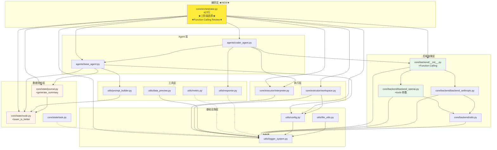

# 后端模块详细说明

**Last Updated:** 2026-01-31
**模块范围:** utils/, core/state/, core/backend/, core/executor/, core/evolution/, agents/, search/, config/, tests/

---

## 1. 模块概览

| 模块 | 文件 | 行数 | 职责 | 状态 |
|------|------|------|------|------|
| **基础设施层** |||||
| 配置系统 | `utils/config.py` | 554 | OmegaConf 配置加载与验证 (+EvolutionConfig) | 完成 |
| 日志系统 | `utils/logger_system.py` | 180 | 双通道日志输出 | 完成 |
| 文件工具 | `utils/file_utils.py` | 113 | 目录复制/链接 | 完成 |
| **数据结构层** |||||
| Node 数据类 | `core/state/node.py` | 121 | 解决方案 DAG 节点 | 完成 |
| Journal 数据类 | `core/state/journal.py` | 283 | DAG 容器与查询 (+get_best_k) | 完成 |
| Task 数据类 | `core/state/task.py` | 62 | Agent 任务定义 | 完成 |
| **后端抽象层** |||||
| 后端抽象层 | `core/backend/__init__.py` | 137 | 统一 LLM 查询接口 (Function Calling) | 完成 |
| OpenAI 后端 | `core/backend/backend_openai.py` | 163 | OpenAI + GLM 支持 | 完成 |
| Anthropic 后端 | `core/backend/backend_anthropic.py` | 142 | Claude 系列支持 | 完成 |
| 后端工具 | `core/backend/utils.py` | 80 | 消息格式化 + 重试机制 | 完成 |
| **执行层** |||||
| 代码执行器 | `core/executor/interpreter.py` | 176 | 沙箱执行 + 超时控制 | 完成 |
| 工作空间管理 | `core/executor/workspace.py` | 181 | 目录管理 + 文件归档 | 完成 |
| **工具层** |||||
| 数据预览 | `utils/data_preview.py` | 269 | EDA 预览生成 | 完成 |
| 指标工具 | `utils/metric.py` | 117 | 评估指标容器 | 完成 |
| 响应解析 | `utils/response.py` | 89 | LLM 响应提取 | 完成 |
| Prompt 构建器 | `utils/prompt_builder.py` | 167 | 统一 Prompt 生成逻辑 | 完成 |
| **Agent 层** |||||
| Agent 基类 | `agents/base_agent.py` | 119 | Agent 抽象基类 (+mutate task_type) | 完成 |
| CoderAgent | `agents/coder_agent.py` | 272 | 代码生成 Agent | 完成 |
| **编排层** |||||
| Orchestrator | `core/orchestrator.py` | 427 | 任务编排器 (三阶段选择+Function Calling Review) | 完成 |
| **进化层 (Phase 3 NEW)** |||||
| **基因解析器** | **`core/evolution/gene_parser.py`** | **162** | **解析 7 基因块，支持 GA 交叉** | **完成** |
| **共享经验池** | **`core/evolution/experience_pool.py`** | **312** | **线程安全存储 + Top-K 查询 + JSON 持久化** | **完成** |
| **适应度计算** | **`search/fitness.py`** | **81** | **归一化到 [0,1]，支持 lower_is_better** | **完成** |
| **配置文件** |||||
| YAML 配置 | `config/default.yaml` | 107 | 项目主配置 (+evolution 配置节) | 完成 |
| 环境变量 | `.env.example` | 36 | API Keys 模板 | 完成 |

---

## 2. Orchestrator 编排器 (`core/orchestrator.py`) ★Phase 2.4 完成★

### 2.1 核心职责

Orchestrator 是系统的中枢控制器，协调主循环、父节点选择、Agent 代码生成、代码执行、Review 评估、最佳节点更新。

### 2.2 类结构

```python
class Orchestrator:
    """任务编排器。

    Attributes:
        agent: BaseAgent - 代码生成 Agent
        config: Config - 全局配置
        journal: Journal - 历史节点记录
        task_desc: str - 任务描述
        start_time: float - 任务开始时间
        current_step: int - 当前步数
        best_node: Optional[Node] - 当前最佳节点
        workspace: WorkspaceManager - 工作空间管理器
        interpreter: Interpreter - 代码执行器
    """
```

### 2.3 核心方法

| 方法 | 签名 | 说明 |
|------|------|------|
| `run` | `(max_steps?: int) -> Optional[Node]` | 主循环入口，返回最佳节点 |
| `step` | `() -> None` | 单步执行（6 阶段流程） |
| `_select_parent_node` | `() -> Optional[Node]` | 三阶段父节点选择策略 |
| `_prepare_step` | `() -> None` | 清理 submission 目录 |
| `_execute_code` | `(code: str, node_id: str) -> ExecutionResult` | 执行代码（含路径重写） |
| `_review_node` | `(node: Node) -> None` | Function Calling Review |
| `_build_review_messages` | `(node: Node) -> str` | 构建 Review 消息 |
| `_get_review_tool_schema` | `() -> Dict` | 获取 submit_review schema |
| `_update_best_node` | `(node: Node) -> None` | 更新最佳节点（支持 lower_is_better） |
| `_save_best_solution` | `(node: Node) -> None` | 保存最佳方案到文件 |

### 2.4 三阶段父节点选择策略

```python
def _select_parent_node(self) -> Optional[Node]:
    """
    Phase 1: 初稿模式
        条件: len(journal.draft_nodes) < config.search.num_drafts
        结果: return None → 生成全新方案

    Phase 2: 修复模式
        条件: random() < config.search.debug_prob
        操作: 构建 DAG，查找 buggy 叶子节点
        结果: return random_buggy_leaf → 修复 bug

    Phase 3: 改进模式
        条件: 默认
        操作: journal.get_best_node(only_good=True)
        结果: return best_node → 改进最佳方案
    """
```

### 2.5 Function Calling Review

```python
def _review_node(self, node: Node) -> None:
    """使用 Function Calling 评估节点。

    调用 LLM:
        model: config.llm.feedback.model (默认 glm-4.6)
        tools: [submit_review]
        tool_choice: {"type": "function", "function": {"name": "submit_review"}}

    submit_review schema:
        - is_bug: bool         是否有 bug
        - has_csv_submission: bool  是否生成 submission.csv
        - summary: string      2-3 句话摘要
        - metric: number|null  验证集指标值
        - lower_is_better: bool 指标方向

    更新节点字段:
        - node.analysis = summary
        - node.is_buggy = is_bug || exc_type != None
        - node.metric_value = metric
        - node.lower_is_better = lower_is_better
    """
```

### 2.6 双向指标比较

```python
def _update_best_node(self, node: Node) -> None:
    """更新最佳节点（支持 lower_is_better）。

    过滤: is_buggy=True 或 metric_value=None → 跳过

    比较逻辑:
        lower_is_better=True  (RMSE, MAE):  new < current → 更新
        lower_is_better=False (Accuracy, F1): new > current → 更新
    """
```

### 2.7 依赖关系

```
Orchestrator
├── agents.base_agent.BaseAgent, AgentContext
├── core.state.Node, Journal
├── core.executor.interpreter.Interpreter, ExecutionResult
├── core.executor.workspace.WorkspaceManager
├── core.backend.query (Function Calling)
├── utils.config.Config
└── utils.logger_system.log_msg, log_exception
```

---

## 3. 配置系统 (`utils/config.py`)

### 3.1 架构设计

```
┌─────────────────────────────────────────────────────┐
│                    load_config()                     │
│  ┌────────────┐   ┌────────────┐   ┌────────────┐  │
│  │  .env 文件  │ + │ YAML 配置  │ + │ CLI 参数   │  │
│  │  (低优先)   │   │  (中优先)   │   │  (高优先)   │  │
│  └─────┬──────┘   └─────┬──────┘   └─────┬──────┘  │
│        └────────────────┼────────────────┘          │
│                         ↓                            │
│                 validate_config()                    │
│                         ↓                            │
│                   Config 对象                        │
└─────────────────────────────────────────────────────┘
```

### 3.2 数据类结构

```python
@dataclass
class Config(Hashable):
    """顶层配置类"""
    project: ProjectConfig    # 项目基础配置
    data: DataConfig         # 数据配置
    llm: LLMConfig           # LLM 后端配置
    execution: ExecutionConfig # 执行配置
    agent: AgentConfig       # Agent 配置（+time_limit=43200）
    search: SearchConfig     # 搜索算法配置
    logging: LoggingConfig   # 日志配置
    evolution: EvolutionConfig # ★ Phase 3 新增
```

#### 子配置类

| 类名 | 字段 | 说明 |
|------|------|------|
| `ProjectConfig` | name, version, workspace_dir, log_dir, exp_name | 项目元信息 |
| `DataConfig` | data_dir, desc_file, goal, eval, preprocess_data, copy_data | 数据路径与选项 |
| `LLMStageConfig` | provider, model, temperature, api_key, base_url, max_tokens | 单阶段 LLM 配置 |
| `LLMConfig` | code, feedback | 双阶段 LLM 配置 |
| `ExecutionConfig` | timeout, agent_file_name, format_tb_ipython | 执行选项 |
| `AgentConfig` | max_steps, **time_limit=43200**, k_fold_validation, ... | Agent 行为参数 |
| `SearchConfig` | strategy, max_debug_depth, debug_prob, num_drafts, parallel_num | 搜索策略参数 |
| `LoggingConfig` | level, console_output, file_output | 日志输出控制 |
| **`EvolutionConfig`** | **experience_pool, solution, agent** | **Phase 3 进化算法配置** |

#### EvolutionConfig 子配置类 (Phase 3 NEW)

| 类名 | 字段 | 说明 |
|------|------|------|
| `ExperiencePoolConfig` | max_records, top_k, save_path | 经验池配置 |
| `SolutionEvolutionConfig` | population_size, elite_size, crossover_rate, mutation_rate, tournament_k, steps_per_epoch | GA 配置 |
| `AgentEvolutionConfig` | num_agents, evolution_interval, epsilon | Agent 层进化配置 |

### 3.3 核心函数

| 函数 | 签名 | 说明 |
|------|------|------|
| `load_config` | `(config_path?, use_cli?, env_file?) -> Config` | 加载并验证配置 |
| `validate_config` | `(cfg: DictConfig) -> Config` | 验证配置完整性 |
| `generate_exp_name` | `() -> str` | 生成实验名称 `YYYYMMDD_HHMMSS_xxxx` |
| `print_config` | `(cfg: Config) -> None` | Rich 美观打印配置 |
| `setup_workspace` | `(cfg: Config) -> None` | 初始化工作空间目录 |

---

## 4. 后端抽象层 (`core/backend/`)

### 4.1 架构设计（支持 Function Calling）

```
┌─────────────────────────────────────────────────────────┐
│                      query()                              │
│  ┌─────────────────────────────────────────────────────┐ │
│  │              provider 参数（必填）                    │ │
│  │  "openai" → backend_openai.query()                  │ │
│  │  "anthropic" → backend_anthropic.query()            │ │
│  └─────────────────────────────────────────────────────┘ │
│                         ↓                                 │
│  ┌──────────────────────┐   ┌──────────────────────────┐ │
│  │ backend_openai       │   │ backend_anthropic        │ │
│  │ - OpenAI GPT         │   │ - Claude 3.x             │ │
│  │ - GLM (智谱)          │   │ - 特殊消息处理           │ │
│  │ - tools 参数          │   │                          │ │
│  │ - tool_choice        │   │                          │ │
│  └──────────────────────┘   └──────────────────────────┘ │
│                         ↓                                 │
│  ┌─────────────────────────────────────────────────────┐ │
│  │                 utils.backoff_create()              │ │
│  │           指数退避重试: 1.5^n 秒, max 60s           │ │
│  └─────────────────────────────────────────────────────┘ │
└─────────────────────────────────────────────────────────┘
```

### 4.2 query 函数签名

```python
def query(
    system_message: str | None,
    user_message: str | None,
    model: str,
    provider: str,                    # 必填: "openai" | "anthropic"
    temperature: float | None = None,
    max_tokens: int | None = None,
    api_key: str | None = None,
    tools: list[dict] | None = None,  # Function Calling 工具列表
    tool_choice: dict | str | None = None,  # 工具选择策略
    **kwargs: Any,
) -> str:
    """统一 LLM 查询接口，支持 Function Calling。

    Returns:
        - 无 tools: 返回 LLM 响应文本
        - 有 tools: 返回 tool call 的参数 JSON 字符串
    """
```

### 4.3 backend_openai.py Function Calling 支持

```python
def query(
    system_message: str | None,
    user_message: str | None,
    model: str,
    temperature: float | None = None,
    max_tokens: int | None = None,
    api_key: str | None = None,
    base_url: str | None = None,
    tools: list[dict] | None = None,      # ★ 新增
    tool_choice: dict | str | None = None, # ★ 新增
    **model_kwargs: Any,
) -> str:
    """调用 OpenAI API（或兼容的 API），支持 Function Calling。

    Returns:
        - 无 tools: 返回 LLM 响应文本
        - 有 tools: 返回 tool call 的参数 JSON 字符串

    示例 (Function Calling):
        >>> response = query(
        ...     user_message="Evaluate code",
        ...     model="glm-4.6",
        ...     api_key="sk-...",
        ...     tools=[{"type": "function", "function": {...}}],
        ...     tool_choice={"type": "function", "function": {"name": "submit_review"}}
        ... )
    """
```

### 4.4 配置示例 (config/default.yaml)

```yaml
llm:
  code:
    provider: ${env:LLM_PROVIDER, "openai"}
    model: ${env:LLM_MODEL, "gpt-4-turbo"}
    temperature: 0.5
    api_key: ${env:OPENAI_API_KEY}
    base_url: ${env:OPENAI_BASE_URL, "https://api.openai.com/v1"}
    max_tokens: ${env:MAX_TOKENS, null}

  feedback:
    provider: ${env:LLM_PROVIDER, "openai"}
    model: ${env:LLM_MODEL, "glm-4.6"}  # ★ 默认 GLM-4.6（支持 Function Calling）
    temperature: 0.5
    api_key: ${env:OPENAI_API_KEY}
    base_url: ${env:OPENAI_BASE_URL, "https://open.bigmodel.cn/api/coding/paas/v4"}
    max_tokens: ${env:MAX_TOKENS, null}
```

---

## 5. 核心数据结构

### 5.1 Node (`core/state/node.py`) - 121 行

解决方案 DAG 中的单个节点，包含代码、执行结果、评估信息及 MCTS/GA 统计。

```python
@dataclass(eq=False)
class Node(DataClassJsonMixin):
    # ---- 代码 ----
    code: str                              # [必填] Python 代码
    plan: str = ""                         # 实现计划
    genes: Dict[str, str] = {}             # 基因组件

    # ---- 通用属性 ----
    step: int = 0                          # Journal 中的序号
    id: str = uuid4().hex                  # 唯一 ID
    ctime: float = time()                  # 创建时间戳
    parent_id: Optional[str] = None        # 父节点 ID
    children_ids: list[str] = []           # 子节点 ID 列表
    task_type: str = "explore"             # 任务类型
    metadata: Dict = {}                    # 额外元数据

    # ---- 执行信息 ----
    logs: str = ""                         # 执行日志
    term_out: str = ""                     # 终端输出
    exec_time: float = 0.0                 # 执行时间（秒）
    exc_type: Optional[str] = None         # 异常类型
    exc_info: Optional[Dict] = None        # 异常详情

    # ---- 评估 ----
    analysis: str = ""                     # LLM 分析结果
    metric_value: Optional[float] = None   # 评估指标值
    is_buggy: bool = False                 # 是否包含 bug
    is_valid: bool = True                  # 是否有效
    lower_is_better: bool = False          # ★ 指标方向（RMSE=True, Accuracy=False）

    # ---- MCTS ----
    visits: int = 0                        # MCTS 访问次数
    total_reward: float = 0.0              # MCTS 累计奖励

    # ---- GA ----
    generation: Optional[int] = None       # GA 进化代数
    fitness: Optional[float] = None        # GA 适应度值
```

### 5.2 Journal (`core/state/journal.py`) - 283 行

解决方案节点集合，表示搜索树/DAG，提供节点管理和树结构查询。

```python
@dataclass
class Journal(DataClassJsonMixin):
    nodes: list[Node] = []
```

**核心方法:**

| 方法 | 签名 | 说明 | 复杂度 |
|------|------|------|--------|
| `append` | `(node: Node) -> None` | 添加节点（自动设置 step） | O(1) |
| `get_node_by_id` | `(node_id: str) -> Optional[Node]` | 通过 ID 查找节点 | O(n) |
| `get_children` | `(node_id: str) -> list[Node]` | 获取子节点列表 | O(k) |
| `get_siblings` | `(node_id: str) -> list[Node]` | 获取兄弟节点 | O(n) |
| `get_best_node` | `(only_good: bool = True) -> Optional[Node]` | 返回 metric_value 最高节点 | O(n) |
| **`get_best_k`** | **`(k: int, only_good: bool = True) -> list[Node]`** | **返回 Top-K 节点 (Phase 3 NEW)** | **O(n log n)** |
| `build_dag` | `() -> None` | 根据 parent_id 构建 children_ids | O(n) |
| `draft_nodes` (property) | `-> list[Node]` | 所有无父节点的节点 | O(n) |
| `buggy_nodes` (property) | `-> list[Node]` | 所有 is_buggy=True 的节点 | O(n) |
| `good_nodes` (property) | `-> list[Node]` | 所有 is_buggy=False 的节点 | O(n) |
| `generate_summary` | `(include_code: bool = False) -> str` | 生成 Journal 摘要用于 Memory 机制 | O(n) |

**generate_summary 示例输出:**

```
Design: Use RF
Results: Good
Validation Metric: 0.85

-------------------------------

[BUGGY] Design: Try NN
Results: NaN loss
Validation Metric: None
```

---

## 6. 执行层模块 (`core/executor/`)

### 6.1 Interpreter (`core/executor/interpreter.py`) - 176 行

Python 代码执行沙箱，使用独立的 subprocess 执行代码。

```python
@dataclass
class ExecutionResult:
    """代码执行结果容器。"""
    term_out: List[str]              # 终端输出（stdout + stderr）
    exec_time: float                 # 执行时间（秒）
    exc_type: Optional[str]          # 异常类型
    exc_info: Optional[str]          # 异常详情
    success: bool                    # 执行是否成功
    timeout: bool                    # 是否超时

class Interpreter:
    """Python 代码执行沙箱。"""
    def __init__(self, working_dir: Path, timeout: int = 300): ...
    def run(self, code: str, reset_session: bool = True) -> ExecutionResult: ...
```

### 6.2 WorkspaceManager (`core/executor/workspace.py`) - 181 行

工作空间管理器，负责目录结构管理和文件归档。

```
workspace/
├── input/          # 输入数据（符号链接）
├── working/        # 临时工作目录
├── submission/     # 预测结果（submission_{node_id}.csv）
├── archives/       # 归档文件（node_{node_id}.zip）
└── best_solution/  # 最佳解决方案
```

**核心方法:**

| 方法 | 签名 | 说明 |
|------|------|------|
| `setup()` | `() -> None` | 创建工作空间目录结构 |
| `link_input_data(source_dir)` | `(Path?) -> None` | 链接/复制输入数据 |
| `rewrite_submission_path(code, node_id)` | `(str, str) -> str` | 重写代码中的 submission 路径 |
| `archive_node_files(node_id, code)` | `(str, str) -> Path?` | 打包节点文件为 zip |
| `cleanup_submission()` | `() -> None` | 清空 submission 目录 |
| `cleanup_working()` | `() -> None` | 清空 working 目录 |

---

## 7. Agent 抽象层 (`agents/`, `utils/prompt_builder.py`)

### 7.1 BaseAgent (`agents/base_agent.py`) - 119 行

Agent 抽象基类，定义统一的 Agent 接口。

```python
class BaseAgent(ABC):
    def __init__(self, name: str, config: Config, prompt_builder: PromptBuilder): ...

    @abstractmethod
    def generate(self, context: AgentContext) -> AgentResult:
        """主入口：根据 task_type 分发到具体实现。"""

    @abstractmethod
    def _explore(self, context: AgentContext) -> Node:
        """探索新方案（统一方法）。"""
```

**数据类:**

| 类名 | 职责 | 字段 |
|------|------|------|
| `AgentContext` | Agent 执行上下文 | task_type ("explore"\|"merge"\|"mutate"), parent_node, journal, config, start_time, current_step, task_desc |
| `AgentResult` | Agent 执行结果 | node, success, error |

**task_type 说明 (Phase 3 更新):**
- `"explore"`: 探索新方案（初稿/改进/修复）
- `"merge"`: 合并两个方案（GA 交叉）
- `"mutate"`: 变异现有方案（GA 变异）- **Phase 3 新增**

### 7.2 CoderAgent (`agents/coder_agent.py`) - 272 行

代码生成 Agent，继承 BaseAgent。

**核心方法:**

| 方法 | 签名 | 说明 |
|------|------|------|
| `generate` | `(context: AgentContext) -> AgentResult` | 主入口，分发到 `_explore` |
| `_explore` | `(context: AgentContext) -> Node` | 完整的代码生成→执行→评估流程 |
| `_call_llm_with_retry` | `(prompt: str, max_retries: int) -> str` | LLM 调用（5次重试，指数退避） |
| `_parse_response_with_retry` | `(response: str, max_retries: int) -> Tuple[str, str]` | 响应解析 |
| `_generate_data_preview` | `() -> Optional[str]` | 生成数据预览 |
| `_calculate_remaining` | `(context) -> Tuple[int, int]` | 计算剩余时间和步数 |

### 7.3 PromptBuilder (`utils/prompt_builder.py`) - 167 行

统一 Prompt 构建逻辑，根据上下文动态调整。

**自适应 Prompt 逻辑:**

```python
# 场景 1: 初稿模式
parent_node = None
# → Prompt 不包含 "Previous Attempt"

# 场景 2: 修复模式
parent_node.is_buggy = True
# → Prompt 包含 "Previous Attempt + 错误输出"

# 场景 3: 改进模式
parent_node.is_buggy = False
# → Prompt 包含 "Previous Attempt + 正常输出"
```

---

## 8. 测试架构 (`tests/`)

### 8.1 目录结构

```
tests/
├── __init__.py
├── unit/                              # 单元测试
│   ├── __init__.py
│   ├── test_config.py                 # 配置系统测试
│   ├── test_config_priority.py        # 配置优先级测试
│   ├── test_file_utils.py             # 文件工具测试
│   ├── test_node.py                   # Node 数据类测试
│   ├── test_journal.py                # Journal 数据类测试
│   ├── test_task.py                   # Task 数据类测试
│   ├── test_state_integration.py      # State 集成测试
│   ├── test_backend_provider.py       # Backend Provider 测试
│   ├── test_interpreter.py            # Interpreter 测试
│   ├── test_workspace.py              # WorkspaceManager 测试
│   ├── test_data_preview.py           # 数据预览测试
│   ├── test_response.py               # 响应解析测试
│   ├── test_metric.py                 # 指标工具测试
│   ├── test_prompt_builder.py         # PromptBuilder 测试
│   ├── test_agents.py                 # CoderAgent 测试
│   └── test_orchestrator.py           # Orchestrator 测试
├── test_evolution/                    # ★ Phase 3 进化模块测试 (NEW)
│   ├── __init__.py
│   ├── test_gene_parser.py            # 基因解析器测试
│   └── test_experience_pool.py        # 经验池测试
├── test_search/                       # ★ Phase 3 搜索模块测试 (NEW)
│   ├── __init__.py
│   └── test_fitness.py                # 适应度计算测试
└── integration/                       # 集成测试
    └── __init__.py
```

### 8.2 运行测试

```bash
# 运行所有单元测试
conda run -n Swarm-Evo pytest tests/unit/ -v

# 运行并查看覆盖率
conda run -n Swarm-Evo pytest tests/unit/ --cov=utils --cov=core --cov=agents --cov-report=term-missing

# 运行特定测试文件
conda run -n Swarm-Evo pytest tests/unit/test_orchestrator.py -v
```

---

## 9. 模块依赖图



**依赖层级**:
1. 基础层: `logger_system.py` (0 依赖)
2. 配置层: `config.py`, `file_utils.py` (依赖基础层)
3. 数据层: `Node`, `Journal`, `Task` (自包含，轻量依赖)
4. 后端层: `backend/*` (依赖基础层，+Function Calling)
5. 执行层: `executor/*` (依赖基础层 + 配置层)
6. 工具层: `data_preview`, `metric`, `response`, `prompt_builder` (依赖基础层 + 数据层)
7. Agent 层: `base_agent`, `coder_agent` (依赖配置层 + 数据层 + 工具层 + 执行层 + 后端层)
8. **编排层**: **`orchestrator`** (依赖 Agent 层 + 数据层 + 执行层 + 后端层)

---

## 10. 关联文档

| 文档 | 路径 |
|------|------|
| 架构概览 | `docs/CODEMAPS/architecture.md` |
| 数据流与配置 | `docs/CODEMAPS/data.md` |
| Phase 1 详细计划 | `docs/plans/phase1_infrastructure.md` |
| 开发规范 | `CLAUDE.md` |
