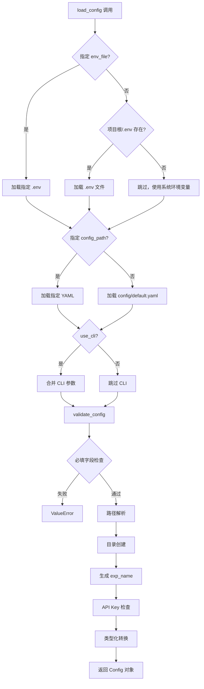

# 数据流与配置管理

**Last Updated:** 2026-01-31
**模块范围:** config/, .env, utils/config.py, utils/logger_system.py, core/executor/, core/orchestrator.py, core/evolution/, search/

---

## 1. 配置优先级

```
高 ────────────────────────────── 低

  CLI 参数          环境变量            YAML 配置
  --key=value       export VAR=val     config/default.yaml
       │               │                    │
       │    ┌──────────┤                    │
       │    │ 系统环境变量                    │
       │    │ (export VAR=val)              │
       │    │    ↑                          │
       │    │  .env 文件                     │
       │    │  (override=False)             │
       │    └──────────┘                    │
       │               │                    │
       └───────────────┼────────────────────┘
                       ↓
                OmegaConf.merge()
                       ↓
                Config 对象
```

### 优先级规则

| 优先级 | 来源 | 机制 | 示例 |
|--------|------|------|------|
| 1 (最高) | CLI 参数 | `OmegaConf.from_cli()` | `--llm.code.model=gpt-4` |
| 2 | 系统环境变量 | `os.environ` | `export OPENAI_API_KEY=sk-...` |
| 3 | .env 文件 | `load_dotenv(override=False)` | `OPENAI_API_KEY=sk-...` |
| 4 (最低) | YAML 配置 | `OmegaConf.load()` | `model: "gpt-4-turbo"` |

**关键细节**: `load_dotenv(override=False)` 表示 .env 文件不会覆盖已存在的系统环境变量，确保系统环境变量优先。

---

## 2. 配置加载流程



---

## 3. 配置文件结构

### 3.1 `config/default.yaml` 完整结构

```yaml
project:
  name: "Swarm-Ev2"           # 项目名称
  version: "0.1.0"            # 版本号
  workspace_dir: "./workspace" # 工作空间目录
  log_dir: "./logs"           # 日志目录
  exp_name: null              # 实验名称 (null -> 自动生成)

data:
  data_dir: null              # [必填] 数据目录
  desc_file: null             # 数据描述文件 (与 goal 二选一)
  goal: null                  # 任务目标 (与 desc_file 二选一)
  eval: null                  # 评估指标
  preprocess_data: true       # 是否预处理数据
  copy_data: false            # false=symlink, true=复制

llm:
  code:                       # Code Agent 的 LLM
    provider: ${env:LLM_PROVIDER, "openai"}  # [必填] openai | anthropic
    model: ${env:LLM_MODEL, "gpt-4-turbo"}
    temperature: 0.5
    api_key: ${env:OPENAI_API_KEY}
    base_url: ${env:OPENAI_BASE_URL, "https://api.openai.com/v1"}
    max_tokens: ${env:MAX_TOKENS, null}
  feedback:                   # ★ Feedback Agent 的 LLM（Review 评估）
    provider: ${env:LLM_PROVIDER, "openai"}
    model: ${env:LLM_MODEL, "glm-4.6"}  # ★ 默认 GLM-4.6（支持 Function Calling）
    temperature: 0.5
    api_key: ${env:OPENAI_API_KEY}
    base_url: ${env:OPENAI_BASE_URL, "https://open.bigmodel.cn/api/coding/paas/v4"}  # ★ 智谱 API
    max_tokens: ${env:MAX_TOKENS, null}

execution:
  timeout: 3600               # 单次超时 (秒)
  agent_file_name: "runfile.py"
  format_tb_ipython: false

agent:
  max_steps: 50               # 最大迭代步数
  time_limit: 43200           # ★ 总时间限制 (秒, 12 小时)
  k_fold_validation: 5        # K-fold 折数
  expose_prediction: false
  data_preview: true
  convert_system_to_user: false

search:                       # Orchestrator 使用
  strategy: "mcts"            # mcts | genetic
  max_debug_depth: 3
  debug_prob: 0.5             # ★ 修复模式触发概率
  num_drafts: 5               # ★ 初稿数量
  parallel_num: 3             # 并行执行数量

logging:
  level: "INFO"               # DEBUG | INFO | WARNING | ERROR
  console_output: true
  file_output: true

# ★ Phase 3 新增: 进化算法配置
evolution:
  experience_pool:
    max_records: 10000        # 最大记录数
    top_k: 5                  # Top-K 查询默认值
    save_path: "workspace/evolution/experience_pool.json"

  solution:                   # Solution 层 GA 配置
    population_size: 12       # 种群大小
    elite_size: 3             # 精英保留数量
    crossover_rate: 0.8       # 交叉概率
    mutation_rate: 0.2        # 变异概率
    tournament_k: 3           # 锦标赛选择 k 值
    steps_per_epoch: 10       # 每 Epoch 步数

  agent:                      # Agent 层进化配置
    num_agents: 4             # Agent 数量
    evolution_interval: 3     # 每 N 个 Epoch 进化一次
    epsilon: 0.3              # Epsilon-Greedy 探索率
```

### 3.2 `.env.example` 模板

```bash
# LLM 配置
LLM_PROVIDER=openai                                # [必填] openai | anthropic
# LLM_MODEL=gpt-4-turbo                           # [可选] 模型名称
OPENAI_API_KEY=sk-your-openai-api-key-here        # [必填] API 密钥

# API 端点配置（第三方 API 时覆盖）
# OPENAI_BASE_URL=https://api.openai.com/v1       # 默认 OpenAI
# MAX_TOKENS=4096                                 # 最大生成 token 数

# 第三方 OpenAI 兼容 API 配置示例
# GLM (智谱):     OPENAI_BASE_URL=https://open.bigmodel.cn/api/coding/paas/v4
# Moonshot:       OPENAI_BASE_URL=https://api.moonshot.cn/v1
# DeepSeek:       OPENAI_BASE_URL=https://api.deepseek.com/v1

# 可选覆盖
# LOG_LEVEL=INFO
# WORKSPACE_DIR=./workspace
# EXP_NAME=my_experiment
```

### 3.3 环境变量插值

```yaml
# YAML 中使用 ${env:VAR} 或 ${env:VAR, default} 引用环境变量
api_key: ${env:OPENAI_API_KEY}
model: ${env:LLM_MODEL, "gpt-4-turbo"}

# OmegaConf 注册的解析器
OmegaConf.register_new_resolver("env", lambda var: os.getenv(var, ""))
```

---

## 4. 工作空间目录结构

### 4.1 运行时目录

```
workspace/                    # project.workspace_dir
├── input/                    # 输入数据（只读）
│   ├── train.csv            # symlink -> data_dir/train.csv
│   ├── test.csv             # symlink -> data_dir/test.csv
│   └── ...
├── working/                  # Agent 临时工作目录
│   └── _temp_script.py      # 临时执行文件（Interpreter 自动创建）
├── submission/               # 提交文件目录
│   ├── submission_{node_id}.csv  # 各节点的提交文件
│   └── ...
├── archives/                 # 归档文件目录
│   ├── node_{node_id}.zip   # 每个节点的归档文件（solution.py + submission.csv）
│   └── ...
├── evolution/                # ★ Phase 3 新增: 进化数据目录
│   └── experience_pool.json # ExperiencePool JSON 持久化文件
└── best_solution/            # 最佳解决方案（Orchestrator 维护）
    ├── solution.py           # 最佳方案代码
    └── submission.csv        # 最佳方案的提交文件
```

### 4.2 数据准备模式

```
copy_data: false (默认)
─────────────────────────────
workspace/input/ -> symlink -> data_dir/
  - 节省磁盘空间
  - 只读保护（防止误修改源数据）
  - macOS/Linux 完全支持

copy_data: true
─────────────────────────────
workspace/input/ <- shutil.copytree <- data_dir/
  - 完全隔离，不影响原数据
  - 占用额外磁盘空间
  - 复制后递归设置只读权限
  - Windows 环境推荐
```

---

## 5. 日志文件组织

### 5.1 输出路径

```
logs/                        # project.log_dir
├── system.log               # 文本日志（追加写入）
└── metrics.json             # 结构化 JSON 日志（完整重写）
```

### 5.2 system.log 格式

```
[2026-01-30 20:30:00] [INFO] 加载环境变量文件: .env
[2026-01-30 20:30:00] [INFO] 加载配置文件: config/default.yaml
[2026-01-30 20:30:00] [INFO] 配置加载并验证成功
[2026-01-30 20:30:01] [INFO] Orchestrator 初始化完成: task=..., max_steps=50
[2026-01-30 20:30:01] [INFO] === Step 1/50 ===
[2026-01-30 20:30:01] [INFO] [search_policy] 初稿模式
[2026-01-30 20:30:02] [INFO] 查询 LLM: model=gpt-4-turbo, provider=openai
[2026-01-30 20:30:10] [INFO] Function Calling 响应: submit_review, 234 字符
[2026-01-30 20:30:10] [INFO] Review 完成: 节点 abc12345, metric=0.85, lower_is_better=false
[2026-01-30 20:30:10] [INFO] 新的最佳节点: abc12345, metric=0.85 ↑
```

### 5.3 metrics.json 格式

```json
[
    {
        "agent_name": "Agent1",
        "step": 1,
        "action": "draft",
        "metric": 0.72,
        "exec_time": 45.2
    },
    {
        "agent_name": "Agent2",
        "step": 2,
        "action": "improve",
        "metric": 0.85,
        "exec_time": 38.7
    }
]
```

---

## 6. 数据流概览

### 6.1 完整数据流（Phase 2.4 Orchestrator 已实现）

```
用户输入                       系统输出
───────                       ───────
data_dir/ ──→ workspace/input/    (只读数据，symlink)
                    ↓
config.yaml ──→ Config 对象 ──→ Agent 配置
                    ↓
.env ──→ API Keys ──→ LLM Backend
                    ↓
        ┌── Orchestrator.run() ───────────────────┐
        │                                          │
        │  _select_parent_node()                   │
        │       ↓                                  │
        │  AgentContext → CoderAgent.generate()     │
        │       ↓                                  │
        │  PromptBuilder → LLM → 代码              │
        │       ↓                                  │
        │  WorkspaceManager 重写路径               │
        │       ↓                                  │
        │  Interpreter 执行代码 (subprocess)       │
        │       ↓                                  │
        │  workspace/submission/ → submission_{id}  │
        │       ↓                                  │
        │  _review_node() (Function Calling)       │
        │       ↓                                  │
        │  _update_best_node() (lower_is_better)   │
        │       ↓                                  │
        │  Journal.append(node)                    │
        │                                          │
        └──────────────────────────────────────────┘
                    ↓
    workspace/best_solution/ ──→ 最终结果
                    ↓
    logs/system.log ──→ 文本日志
    logs/metrics.json ──→ 结构化日志
```

### 6.2 配置系统数据流

```
.env 文件
    ↓ load_dotenv(override=False)
os.environ
    ↓ OmegaConf resolver: ${env:VAR} / ${env:VAR, default}
config/default.yaml
    ↓ OmegaConf.load()
DictConfig (base)
    ↓ OmegaConf.merge(base, cli)
DictConfig (merged)
    ↓ validate_config()
    ├── 必填字段检查 (data_dir, desc/goal)
    ├── Provider 验证 (llm.*.provider ∈ {openai, anthropic})
    ├── 路径解析 (resolve)
    ├── 目录创建 (mkdir)
    ├── exp_name 生成
    └── API Key 检查
    ↓ OmegaConf.to_container()
Config(@dataclass)
```

### 6.3 Orchestrator 单步数据流

```
Step N 开始
    ↓
_prepare_step()
    清空 submission/ 目录
    ↓
_select_parent_node()
    ├── draft 不足 → None (初稿)
    ├── random < debug_prob → buggy_leaf (修复)
    └── 默认 → best_node (改进)
    ↓
AgentContext(task_type, parent_node, journal, ...)
    ↓
agent.generate(context) → AgentResult(node)
    ↓
_execute_code(node.code, node.id)
    ├── workspace.rewrite_submission_path()
    └── interpreter.run()
    ↓
_review_node(node) ← Function Calling (GLM-4.6)
    ├── 构建 review 消息
    ├── backend.query(tools=[submit_review])
    └── 解析 JSON → 更新 node 字段
    ↓
journal.append(node)
    ↓
_update_best_node(node)
    ├── lower_is_better=True:  new < old → 更新
    └── lower_is_better=False: new > old → 更新
    ↓
_save_best_solution() → workspace/best_solution/
```

---

## 7. 配置验证规则详细

| 规则 | 检查内容 | 失败行为 |
|------|---------|---------|
| 必填: data_dir | `cfg.data.data_dir is None` | `ValueError` |
| 必填: desc/goal | 两者均为 None | `ValueError` |
| **必填: provider** | `cfg.llm.*.provider not in {"openai", "anthropic"}` | `ValueError` |
| 路径: data_dir | 目录不存在 | `ValueError` |
| 路径: desc_file | 文件不存在 | `ValueError` |
| 目录: workspace | 不存在 | 自动创建 |
| 目录: log_dir | 不存在 | 自动创建 |
| 名称: exp_name | 为 None | 自动生成 `YYYYMMDD_HHMMSS_xxxx` |
| 密钥: api_key | 未解析的 `${env:}` | 记录 WARNING |

---

## 8. 配置关键值说明

### 8.1 Orchestrator 相关配置

| 配置项 | 值 | 说明 |
|--------|-----|------|
| `agent.max_steps` | 50 | 主循环最大步数 |
| `agent.time_limit` | **43200** | **总时间限制 12 小时** |
| `search.num_drafts` | 5 | 初稿数量（达到后切换到改进/修复模式） |
| `search.debug_prob` | 0.5 | 修复模式触发概率 |
| `llm.feedback.model` | **"glm-4.6"** | **Review 使用的模型（支持 Function Calling）** |
| `llm.feedback.base_url` | `open.bigmodel.cn/...` | **智谱 AI API 端点** |
| `execution.timeout` | 3600 | 单次代码执行超时 |

### 8.2 双阶段 LLM 配置

```
llm.code: 代码生成 Agent (CoderAgent)
├── model: gpt-4-turbo (默认)
├── 用途: 生成 ML 代码
└── 调用方: CoderAgent._call_llm_with_retry()

llm.feedback: Review 评估 (Orchestrator)
├── model: glm-4.6 (默认)  ★ 支持 Function Calling
├── 用途: 评估代码执行结果
├── 调用方: Orchestrator._review_node()
└── base_url: https://open.bigmodel.cn/api/coding/paas/v4
```

### 8.3 进化算法配置 (Phase 3 NEW)

| 配置项 | 默认值 | 说明 |
|--------|--------|------|
| **经验池配置** |||
| `evolution.experience_pool.max_records` | 10000 | 最大记录数（FIFO 淘汰） |
| `evolution.experience_pool.top_k` | 5 | Top-K 查询默认值 |
| `evolution.experience_pool.save_path` | `workspace/evolution/experience_pool.json` | JSON 持久化路径 |
| **Solution 层 GA 配置** |||
| `evolution.solution.population_size` | 12 | 种群大小 |
| `evolution.solution.elite_size` | 3 | 精英保留数量 |
| `evolution.solution.crossover_rate` | 0.8 | 交叉概率 |
| `evolution.solution.mutation_rate` | 0.2 | 变异概率 |
| `evolution.solution.tournament_k` | 3 | 锦标赛选择 k 值 |
| `evolution.solution.steps_per_epoch` | 10 | 每 Epoch 步数 |
| **Agent 层进化配置** |||
| `evolution.agent.num_agents` | 4 | Agent 数量 |
| `evolution.agent.evolution_interval` | 3 | 每 N 个 Epoch 进化一次 |
| `evolution.agent.epsilon` | 0.3 | Epsilon-Greedy 探索率 |

---

## 9. 实际使用示例

### 9.1 完整初始化流程

```python
from pathlib import Path
from utils.config import load_config, setup_workspace, print_config
from utils.logger_system import init_logger, log_msg
from agents.coder_agent import CoderAgent
from core.state import Journal
from core.executor.interpreter import Interpreter
from core.orchestrator import Orchestrator
from utils.prompt_builder import PromptBuilder

# 1. 加载配置
cfg = load_config(use_cli=True)
print_config(cfg)

# 2. 初始化日志
init_logger(cfg.project.log_dir)

# 3. 设置工作空间
setup_workspace(cfg)

# 4. 初始化 Agent
prompt_builder = PromptBuilder()
interpreter = Interpreter(
    working_dir=cfg.project.workspace_dir / "working",
    timeout=cfg.execution.timeout,
)
agent = CoderAgent(
    name="coder",
    config=cfg,
    prompt_builder=prompt_builder,
    interpreter=interpreter,
)

# 5. 初始化 Orchestrator
journal = Journal()
task_desc = open(cfg.data.desc_file).read()

orchestrator = Orchestrator(
    agent=agent,
    config=cfg,
    journal=journal,
    task_desc=task_desc,
)

# 6. 运行主循环
best_node = orchestrator.run()
if best_node:
    print(f"最佳方案: metric={best_node.metric_value}")
```

### 9.2 CLI 参数覆盖示例

```bash
# 基础用法
conda run -n Swarm-Evo python main.py --data.data_dir=./datasets/titanic

# 完整覆盖示例
conda run -n Swarm-Evo python main.py \
  --data.data_dir=./datasets/house-prices \
  --data.goal="预测房价" \
  --llm.code.provider=openai \
  --llm.code.model=gpt-3.5-turbo \
  --llm.feedback.model=glm-4.6 \
  --agent.max_steps=30 \
  --agent.time_limit=7200 \
  --search.num_drafts=3 \
  --search.debug_prob=0.3
```

---

## 10. 关联文档

| 文档 | 路径 |
|------|------|
| 架构概览 | `docs/CODEMAPS/architecture.md` |
| 后端模块详情 | `docs/CODEMAPS/backend.md` |
| Phase 1 详细计划 | `docs/plans/phase1_infrastructure.md` |
| 配置管理规范 | `CLAUDE.md` 4.2 节 |
