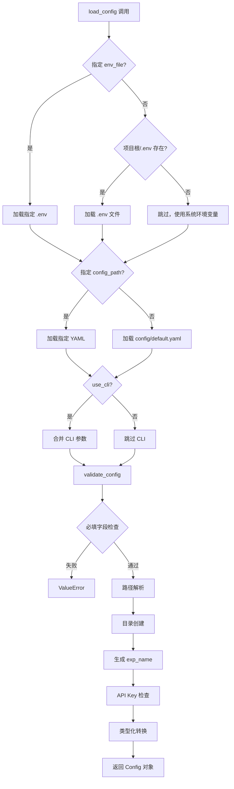

# 数据流与配置管理

**Last Updated:** 2026-01-31 15:30:00
**模块范围:** config/, .env, utils/config.py, utils/logger_system.py, core/executor/

---

## 1. 配置优先级

```
高 ────────────────────────────── 低

  CLI 参数          环境变量            YAML 配置
  --key=value       export VAR=val     config/default.yaml
       │               │                    │
       │    ┌──────────┤                    │
       │    │ 系统环境变量                    │
       │    │ (export VAR=val)              │
       │    │    ↑                          │
       │    │  .env 文件                     │
       │    │  (override=False)             │
       │    └──────────┘                    │
       │               │                    │
       └───────────────┼────────────────────┘
                       ↓
                OmegaConf.merge()
                       ↓
                Config 对象
```

### 优先级规则

| 优先级 | 来源 | 机制 | 示例 |
|--------|------|------|------|
| 1 (最高) | CLI 参数 | `OmegaConf.from_cli()` | `--llm.code.model=gpt-4` |
| 2 | 系统环境变量 | `os.environ` | `export OPENAI_API_KEY=sk-...` |
| 3 | .env 文件 | `load_dotenv(override=False)` | `OPENAI_API_KEY=sk-...` |
| 4 (最低) | YAML 配置 | `OmegaConf.load()` | `model: "gpt-4-turbo"` |

**关键细节**: `load_dotenv(override=False)` 表示 .env 文件不会覆盖已存在的系统环境变量，确保系统环境变量优先。

---

## 2. 配置加载流程



---

## 3. 配置文件结构

### 3.1 `config/default.yaml` 完整结构

```yaml
project:
  name: "Swarm-Ev2"           # 项目名称
  version: "0.1.0"            # 版本号
  workspace_dir: "./workspace" # 工作空间目录
  log_dir: "./logs"           # 日志目录
  exp_name: null              # 实验名称 (null → 自动生成)

data:
  data_dir: null              # [必填] 数据目录
  desc_file: null             # 数据描述文件 (与 goal 二选一)
  goal: null                  # 任务目标 (与 desc_file 二选一)
  eval: null                  # 评估指标
  preprocess_data: true       # 是否预处理数据
  copy_data: false            # false=symlink, true=复制

llm:
  code:                       # Code Agent 的 LLM
    provider: ${env:LLM_PROVIDER, "openai"}  # [必填] openai | anthropic
    model: ${env:LLM_MODEL, "gpt-4-turbo"}
    temperature: 0.5
    api_key: ${env:OPENAI_API_KEY}
    base_url: ${env:OPENAI_BASE_URL, "https://api.openai.com/v1"}  # API 端点
    max_tokens: ${env:MAX_TOKENS, null}  # 最大生成 token 数
  feedback:                   # Feedback Agent 的 LLM
    provider: ${env:LLM_PROVIDER, "openai"}
    model: ${env:LLM_MODEL, "gpt-4-turbo"}
    temperature: 0.5
    api_key: ${env:OPENAI_API_KEY}
    base_url: ${env:OPENAI_BASE_URL, "https://api.openai.com/v1"}
    max_tokens: ${env:MAX_TOKENS, null}

execution:
  timeout: 3600               # 单次超时 (秒)
  agent_file_name: "runfile.py"
  format_tb_ipython: false

agent:
  max_steps: 50               # 最大迭代步数
  time_limit: 86400           # 总时间限制 (秒, 24h)
  k_fold_validation: 5        # K-fold 折数
  expose_prediction: false
  data_preview: true
  convert_system_to_user: false

search:                       # Phase 3 使用
  strategy: "mcts"            # mcts | genetic
  max_debug_depth: 3
  debug_prob: 0.5
  num_drafts: 5
  parallel_num: 3

logging:
  level: "INFO"               # DEBUG | INFO | WARNING | ERROR
  console_output: true
  file_output: true
```

### 3.2 `.env.example` 模板

```bash
# LLM 配置
LLM_PROVIDER=openai                                # [必填] openai | anthropic
# LLM_MODEL=gpt-4-turbo                           # [可选] 模型名称
OPENAI_API_KEY=sk-your-openai-api-key-here        # [必填] API 密钥

# API 端点配置（第三方 API 时覆盖）
# OPENAI_BASE_URL=https://api.openai.com/v1       # 默认 OpenAI
# MAX_TOKENS=4096                                 # 最大生成 token 数

# 第三方 OpenAI 兼容 API 配置示例
# GLM (智谱):     OPENAI_BASE_URL=https://open.bigmodel.cn/api/paas/v4/
# Moonshot:       OPENAI_BASE_URL=https://api.moonshot.cn/v1
# DeepSeek:       OPENAI_BASE_URL=https://api.deepseek.com/v1

# 可选覆盖
# LOG_LEVEL=INFO
# WORKSPACE_DIR=./workspace
# EXP_NAME=my_experiment
```

### 3.3 环境变量插值

```yaml
# YAML 中使用 ${env:VAR} 引用环境变量
api_key: ${env:OPENAI_API_KEY}

# OmegaConf 注册的解析器
OmegaConf.register_new_resolver("env", lambda var: os.getenv(var, ""))
```

---

## 4. 工作空间目录结构

### 4.1 运行时目录

```
workspace/                    # project.workspace_dir
├── input/                    # 输入数据（只读）
│   ├── train.csv            # symlink → data_dir/train.csv
│   ├── test.csv             # symlink → data_dir/test.csv
│   └── ...
├── working/                  # Agent 临时工作目录
│   └── _temp_script.py      # 临时执行文件（Interpreter 自动创建）
├── submission/               # 提交文件目录
│   ├── submission_{node_id}.csv  # 各节点的提交文件
│   └── ...
├── archives/                 # 归档文件目录 (Phase 2 新增)
│   ├── node_{node_id}.zip   # 每个节点的归档文件（solution.py + submission.csv）
│   └── ...
└── best_solution/            # 最佳解决方案
    ├── solution.py
    ├── submission.csv
    └── node_id.txt
```

### 4.2 数据准备模式

```
copy_data: false (默认)
─────────────────────────────
workspace/input/ → symlink → data_dir/
  - 节省磁盘空间
  - 只读保护（防止误修改源数据）
  - macOS/Linux 完全支持

copy_data: true
─────────────────────────────
workspace/input/ ← shutil.copytree ← data_dir/
  - 完全隔离，不影响原数据
  - 占用额外磁盘空间
  - 复制后递归设置只读权限
  - Windows 环境推荐
```

### 4.3 归档文件管理 (Phase 2)

每个 Node 执行完成后，WorkspaceManager 会自动打包为 zip 归档：

```
archives/node_abc123.zip
├── solution.py         # 代码内容
└── submission.csv      # 预测结果（如果存在）
```

**归档时机：**
- Node 执行完成且有 submission 文件时
- 用于后续分析和审查
- 节省磁盘空间（相比保留原始文件）

---

## 5. 日志文件组织

### 5.1 输出路径

```
logs/                        # project.log_dir
├── system.log               # 文本日志（追加写入）
└── metrics.json             # 结构化 JSON 日志（完整重写）
```

### 5.2 system.log 格式

```
[2026-01-30 20:30:00] [INFO] 加载环境变量文件: .env
[2026-01-30 20:30:00] [INFO] 加载配置文件: config/default.yaml
[2026-01-30 20:30:00] [INFO] 配置加载并验证成功
[2026-01-30 20:30:01] [WARNING] LLM API Key 未设置
[2026-01-30 20:30:02] [ERROR] 执行失败: FileNotFoundError
```

### 5.3 metrics.json 格式

```json
[
    {
        "agent_name": "Agent1",
        "step": 1,
        "action": "draft",
        "metric": 0.72,
        "exec_time": 45.2
    },
    {
        "agent_name": "Agent2",
        "step": 2,
        "action": "improve",
        "metric": 0.85,
        "exec_time": 38.7
    }
]
```

---

## 6. 数据流概览

### 6.1 完整数据流（Phase 1-3）

```
用户输入                       系统输出
───────                       ───────
data_dir/ ──→ workspace/input/    (只读数据，symlink)
                    ↓
config.yaml ──→ Config 对象 ──→ Agent 配置
                    ↓
.env ──→ API Keys ──→ LLM Backend
                    ↓
            Agent 生成代码
                    ↓
        WorkspaceManager 重写路径
                    ↓
        Interpreter 执行代码 (subprocess)
                    ↓
    workspace/submission/ ──→ submission_{node_id}.csv
                    ↓
        WorkspaceManager 归档 ──→ archives/node_{id}.zip
                    ↓
        评估 metric_value
                    ↓
    Journal (内存) ──→ 下一轮迭代
                    ↓
    logs/system.log ──→ 文本日志
    logs/metrics.json ──→ 结构化日志
                    ↓
    workspace/best_solution/ ──→ 最终结果
```

### 6.2 配置系统数据流

```
.env 文件
    ↓ load_dotenv(override=False)
os.environ
    ↓ OmegaConf resolver: ${env:VAR} / ${env:VAR, default}
config/default.yaml
    ↓ OmegaConf.load()
DictConfig (base)
    ↓ OmegaConf.merge(base, cli)
DictConfig (merged)
    ↓ validate_config()
    ├── 必填字段检查 (data_dir, desc/goal)
    ├── Provider 验证 (llm.*.provider ∈ {openai, anthropic})
    ├── 路径解析 (resolve)
    ├── 目录创建 (mkdir)
    ├── exp_name 生成
    └── API Key 检查
    ↓ OmegaConf.to_container()
Config(@dataclass)
```

---

## 7. 配置验证规则详细

| 规则 | 检查内容 | 失败行为 |
|------|---------|---------|
| 必填: data_dir | `cfg.data.data_dir is None` | `ValueError` |
| 必填: desc/goal | 两者均为 None | `ValueError` |
| **必填: provider** | `cfg.llm.*.provider not in {"openai", "anthropic"}` | `ValueError` |
| 路径: data_dir | 目录不存在 | `ValueError` |
| 路径: desc_file | 文件不存在 | `ValueError` |
| 目录: workspace | 不存在 | 自动创建 |
| 目录: log_dir | 不存在 | 自动创建 |
| 名称: exp_name | 为 None | 自动生成 `YYYYMMDD_HHMMSS_xxxx` |
| 密钥: api_key | 未解析的 `${env:}` | 记录 WARNING |

---

## 8. 实际使用示例

### 8.1 完整初始化流程

```python
from pathlib import Path
from utils.config import load_config, setup_workspace, print_config
from utils.logger_system import init_logger, log_msg

# 1. 加载配置（优先级: CLI > 环境变量 > .env > YAML）
cfg = load_config(
    config_path=Path("config/default.yaml"),  # 可选
    use_cli=True,  # 合并 CLI 参数
    env_file=Path(".env")  # 可选
)

# 2. 打印配置概览
print_config(cfg)

# 3. 初始化日志系统
logger = init_logger(cfg.project.log_dir)
log_msg("INFO", "系统初始化完成")

# 4. 设置工作空间
setup_workspace(cfg)
log_msg("INFO", f"工作空间已创建: {cfg.project.workspace_dir}")

# 5. 使用配置
print(f"实验名称: {cfg.project.exp_name}")
print(f"数据目录: {cfg.data.data_dir}")
print(f"LLM 模型: {cfg.llm.code.model}")
```

### 8.2 CLI 参数覆盖示例

```bash
# 基础用法
python main.py --data.data_dir=./datasets/titanic

# 完整覆盖示例
python main.py \
  --data.data_dir=./datasets/house-prices \
  --data.goal="预测房价" \
  --llm.code.provider=openai \
  --llm.code.model=gpt-3.5-turbo \
  --llm.code.temperature=0.3 \
  --llm.code.base_url=https://api.openai.com/v1 \
  --llm.code.max_tokens=4096 \
  --agent.max_steps=30 \
  --search.strategy=genetic \
  --project.exp_name=house_prices_exp1

# 使用第三方 API (Moonshot)
python main.py \
  --data.data_dir=./datasets/titanic \
  --llm.code.provider=openai \
  --llm.code.model=moonshot-v1-8k \
  --llm.code.base_url=https://api.moonshot.cn/v1
```

### 8.3 环境变量优先级测试

```bash
# 场景 1: 仅 .env 文件
# .env: OPENAI_API_KEY=sk-from-dotenv
echo $OPENAI_API_KEY  # 输出: sk-from-dotenv

# 场景 2: .env + 系统环境变量
export OPENAI_API_KEY=sk-from-shell
# .env: OPENAI_API_KEY=sk-from-dotenv
echo $OPENAI_API_KEY  # 输出: sk-from-shell (系统优先)

# 场景 3: .env + 系统环境变量 + CLI
export OPENAI_API_KEY=sk-from-shell
python main.py --llm.code.api_key=sk-from-cli
# 最终使用: sk-from-cli (CLI 最高优先级)

# 场景 4: Provider 和 base_url 覆盖
# .env: LLM_PROVIDER=openai, OPENAI_BASE_URL=https://api.openai.com/v1
export LLM_PROVIDER=openai
export OPENAI_BASE_URL=https://api.moonshot.cn/v1
# 最终使用: base_url=https://api.moonshot.cn/v1 (系统环境变量优先)
```

---

## 9. 关联文档

| 文档 | 路径 |
|------|------|
| 架构概览 | `docs/CODEMAPS/architecture.md` |
| 后端模块详情 | `docs/CODEMAPS/backend.md` |
| Phase 1 详细计划 | `docs/plans/phase1_infrastructure.md` |
| 配置管理规范 | `CLAUDE.md` 4.2 节 |
