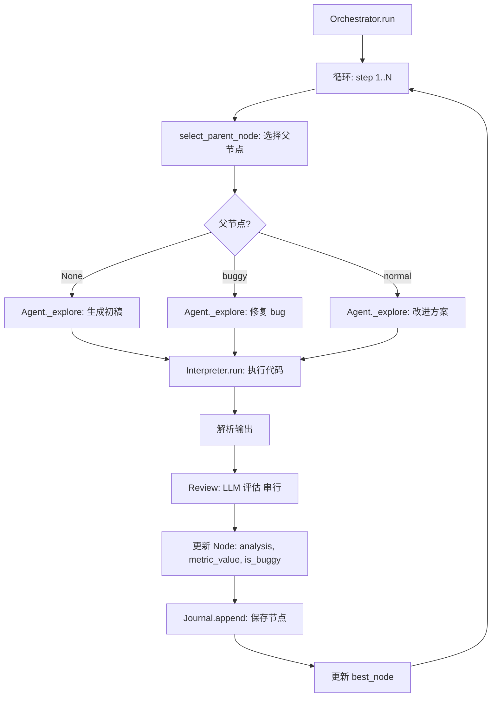

# Phase 2: 核心功能实现

**版本**: Phase2-v3.0
**更新日期**: 2026-01-30
**状态**: 待审查

---

## 1. 目标

实现 Swarm-Ev2 的执行引擎层，完成端到端的"代码生成 → 执行 → 评估"流程。

| 模块 | 职责 |
|------|------|
| **BaseAgent** | Agent 抽象接口 |
| **CoderAgent** | 代码生成 Agent 实现 |
| **Orchestrator** | 任务编排器（替代旧版 IterationController） |
| **Interpreter** | 代码执行沙箱（超时控制 + 输出捕获） |
| **WorkspaceManager** | 工作空间管理（文件隔离） |
| **PromptBuilder** | Prompt 模板构建 |

**核心设计原则**:
- 纯 Python + asyncio（不使用 LangGraph）
- 借鉴 AIDE 的简洁设计（单一 Agent + 串行 Review）
- 任务类型统一为 **explore/merge**（Phase 3 可扩展）
- **统一 Prompt 设计**：让 LLM 根据上下文自动判断任务模式
- Phase 2 串行实现，Phase 3 升级为 Task 系统

---

## 2. 文件清单

### 2.1 新建文件 [NEW]

| 文件 | 职责 | 关键函数/类 |
|------|------|------------|
| `agents/__init__.py` | Agent 模块入口 | `CoderAgent` 导出 |
| `agents/base_agent.py` | Agent 抽象基类 | `BaseAgent`, `AgentContext`, `AgentResult` |
| `agents/coder_agent.py` | 代码生成 Agent | `CoderAgent._explore()` |
| `core/orchestrator.py` | 任务编排器 | `Orchestrator.step()`, `run()` |
| `core/executor/__init__.py` | 执行器模块入口 | `Interpreter`, `WorkspaceManager` |
| `core/executor/interpreter.py` | 代码执行沙箱 | `Interpreter.run()`, `ExecutionResult` |
| `core/executor/workspace.py` | 工作空间管理 | `WorkspaceManager.rewrite_submission_path()` |
| `utils/prompt_builder.py` | Prompt 构建器 | `build_explore_prompt()` |
| `utils/response.py` | LLM 响应解析 | `extract_code()`, `extract_text_up_to_code()`, `trim_long_string()` |
| `utils/data_preview.py` | 数据预览生成 | `generate()` |
| `utils/metric.py` | 评估指标工具 | `MetricValue`, `WorstMetricValue` |

### 2.2 修改文件 [MODIFY]

| 文件 | 修改内容 |
|------|---------|
| `core/state/task.py` | TaskType 改为 `Literal["explore", "merge"]` |
| `core/state/node.py` | task_type 默认值改为 `"explore"` |
| `core/state/journal.py` | 新增 `generate_summary()` 方法用于 Memory 机制 |

### 2.3 测试文件 [NEW]

| 文件 | 测试模块 | 测试数量 |
|------|---------|---------|
| `tests/unit/test_agents.py` | BaseAgent, CoderAgent | ~5 |
| `tests/unit/test_orchestrator.py` | Orchestrator | ~4 |
| `tests/unit/test_interpreter.py` | Interpreter | ~3 |
| `tests/unit/test_workspace.py` | WorkspaceManager | ~3 |
| `tests/integration/test_phase2.py` | 完整流程 | ~1 |

---

## 3. 核心设计

### 3.1 执行流程图



### 3.2 任务类型（统一命名）

**Phase 2 任务类型**：
```python
TaskType = Literal["explore", "merge"]
```

| 任务类型 | 说明 | Phase 2 状态 | Node.task_type |
|---------|------|-------------|----------------|
| **explore** | 探索新方案（初稿/改进/修复） | ✅ 实现 | `"explore"` |
| **merge** | 合并多个方案的优点 | ⏳ Phase 3 | `"merge"` |

**关键设计**：
- `Node.task_type == Task.type`（完全一致）
- Review 不是独立任务，是 explore 后的内部步骤
- LLM 根据 `parent_node` 自动判断是初稿/改进/修复

---

### 3.3 BaseAgent 抽象类

**文件**: `agents/base_agent.py`

**核心接口**:
```python
@dataclass
class AgentContext:
    """Agent 执行上下文"""
    task_type: Literal["explore", "merge"]  # ← 统一类型
    parent_node: Optional[Node]  # ← None=初稿, buggy=修复, normal=改进
    journal: Journal
    config: Config
    start_time: float
    current_step: int

@dataclass
class AgentResult:
    """Agent 执行结果"""
    node: Optional[Node]
    success: bool
    error: Optional[str] = None

class BaseAgent(ABC):
    def __init__(self, name: str, config: Config, prompt_builder: PromptBuilder):
        self.name = name
        self.config = config
        self.prompt_builder = prompt_builder

    @abstractmethod
    def generate(self, context: AgentContext) -> AgentResult:
        """主入口: 根据 task_type 分发"""
        pass

    @abstractmethod
    def _explore(self, context: AgentContext) -> Node:
        """探索新方案（统一方法）"""
        pass
```

**关键设计**:
- 只有 `_explore()` 方法（移除 `_draft/_improve/_debug`）
- 通过 `parent_node` 判断模式，而非显式方法名

---

### 3.4 CoderAgent 实现

**文件**: `agents/coder_agent.py`

**核心逻辑**:
```python
class CoderAgent(BaseAgent):
    def generate(self, context: AgentContext) -> AgentResult:
        try:
            if context.task_type == "explore":
                node = self._explore(context)
            elif context.task_type == "merge":
                node = self._merge(context)  # Phase 3 实现
            else:
                raise ValueError(f"未知任务类型: {context.task_type}")

            return AgentResult(node=node, success=True)
        except Exception as e:
            log_msg("ERROR", f"Agent {self.name} 执行失败: {e}")
            return AgentResult(node=None, success=False, error=str(e))

    def _explore(self, context: AgentContext) -> Node:
        """探索新方案（统一方法）

        根据 parent_node 自动适配：
        - None: 生成初稿
        - is_buggy: 修复 bug
        - 正常: 改进方案
        """
        from core.backend import query
        from utils.response import extract_code, extract_text_up_to_code

        log_msg("INFO", f"Agent {self.name} 开始 explore")

        # 构建统一 prompt
        prompt = self.prompt_builder.build_explore_prompt(
            task_desc=context.config.data.goal or "",
            parent_node=context.parent_node,  # ← 关键：可能为 None
            memory=context.journal.generate_summary(),
            data_preview=self.data_preview,
            time_remaining=self._calc_time_remaining(context),
            steps_remaining=self._calc_steps_remaining(context)
        )

        # 调用 LLM（带重试）
        plan, code = self._plan_and_code_query(prompt)

        # 创建 Node
        node = Node(
            code=code,
            plan=plan,
            task_type="explore",
            parent_id=context.parent_node.id if context.parent_node else None
        )

        log_msg("INFO", f"Agent {self.name} 生成节点 {node.id}")
        return node

    def _plan_and_code_query(self, prompt: str, retries: int = 3) -> Tuple[str, str]:
        """调用 LLM 并解析响应（带重试）"""
        from core.backend import query

        for attempt in range(retries):
            try:
                response = query(
                    system_message=prompt,
                    user_message=None,
                    model=self.config.llm.code.model,
                    temperature=self.config.llm.code.temperature,
                    api_key=self.config.llm.code.api_key
                )

                code = extract_code(response)
                plan = extract_text_up_to_code(response)

                if code and plan:
                    return plan, code

                log_msg("WARNING", f"解析失败，重试 {attempt + 1}/{retries}")
            except Exception as e:
                log_msg("WARNING", f"LLM 调用失败: {e}，重试 {attempt + 1}/{retries}")

        log_msg("ERROR", "LLM 调用和解析全部失败")
        return "", response if 'response' in locals() else ""

    def _calc_time_remaining(self, context: AgentContext) -> int:
        """计算剩余时间（秒）"""
        import time
        elapsed = time.time() - context.start_time
        return max(0, int(context.config.agent.time_limit - elapsed))

    def _calc_steps_remaining(self, context: AgentContext) -> int:
        """计算剩余步数"""
        return max(0, context.config.agent.max_steps - context.current_step)

    def update_data_preview(self, workspace_dir) -> None:
        """更新数据预览"""
        from utils.data_preview import generate
        self.data_preview = generate(workspace_dir)
```

**日志系统**:
```python
from utils.logger_system import log_msg, log_json, ensure, log_exception

log_msg("INFO", "Agent 开始执行")
log_msg("ERROR", "执行失败")  # 仅记录，不抛出
raise ValueError("错误")  # 需显式 raise
```

---

### 3.5 Orchestrator 任务编排器

**文件**: `core/orchestrator.py`

**核心逻辑**:
```python
class Orchestrator:
    def __init__(self, agent: BaseAgent, config: Config, journal: Journal, task_desc: str):
        self.agent = agent
        self.config = config
        self.journal = journal
        self.task_desc = task_desc

        self.start_time = time.time()
        self.current_step = 0
        self.best_node: Optional[Node] = None

        # 初始化执行器
        self.workspace = WorkspaceManager(config)
        self.interpreter = Interpreter(
            working_dir=config.project.workspace_dir,
            timeout=config.execution.timeout
        )

    def run(self, max_steps: Optional[int] = None) -> Optional[Node]:
        """主循环"""
        steps = max_steps or self.config.agent.max_steps

        for step in range(steps):
            self.current_step = step

            # 检查时间限制
            if time.time() - self.start_time >= self.config.agent.time_limit:
                log_msg("INFO", f"已达时间限制 {self.config.agent.time_limit}s")
                break

            log_msg("INFO", f"=== Step {step + 1}/{steps} ===")
            self.step()

        return self.best_node

    def step(self) -> None:
        """单步执行流程"""
        # Phase 1: 清理 submission 目录
        self._prepare_step()

        # Phase 2: 选择父节点
        parent_node = self._select_parent_node()

        # Phase 3: 生成代码（统一用 explore）
        context = AgentContext(
            task_type="explore",  # ← 统一类型
            parent_node=parent_node,  # ← 可能为 None
            journal=self.journal,
            config=self.config,
            start_time=self.start_time,
            current_step=self.current_step
        )
        result = self.agent.generate(context)

        if not result.success or result.node is None:
            log_msg("WARNING", f"Agent 生成失败: {result.error}")
            return

        node = result.node

        # Phase 4: 执行代码
        exec_result = self._execute_code(node.code, node.id)
        node.term_out = "".join(exec_result.term_out)
        node.exec_time = exec_result.exec_time
        node.exc_type = exec_result.exc_type
        node.exc_info = exec_result.exc_info

        # Phase 5: Review 评估（串行，AIDE 方式）
        self._review_node(node)

        # Phase 6: 更新状态
        self.journal.append(node)
        self._update_best_node(node)

    def _select_parent_node(self) -> Optional[Node]:
        """选择父节点（简化搜索策略）

        Returns:
            - None: 生成初稿
            - buggy node: 修复
            - best node: 改进
        """
        search_cfg = self.config.search

        # 初始 drafting
        if len(self.journal.draft_nodes) < search_cfg.num_drafts:
            log_msg("INFO", "[search_policy] 初稿模式")
            return None

        # debugging (概率触发)
        import random
        if random.random() < search_cfg.debug_prob:
            buggy_leaves = [n for n in self.journal.buggy_nodes if not n.children_ids]
            if buggy_leaves:
                node = random.choice(buggy_leaves)
                log_msg("INFO", f"[search_policy] 修复模式: 节点 {node.id}")
                return node

        # improving
        best = self.journal.get_best_node()
        if best:
            log_msg("INFO", f"[search_policy] 改进模式: 节点 {best.id}")
        else:
            log_msg("INFO", "[search_policy] 初稿模式（无可用节点）")
        return best

    def _execute_code(self, code: str, node_id: str) -> ExecutionResult:
        """执行代码"""
        modified_code = self.workspace.rewrite_submission_path(code, node_id)
        return self.interpreter.run(modified_code, reset_session=True)

    def _review_node(self, node: Node) -> None:
        """Review 评估节点（AIDE 方式: 串行执行）"""
        from core.backend import query

        review_prompt = self._build_review_prompt(node)

        try:
            response = query(
                system_message=review_prompt,
                user_message=None,
                model=self.config.llm.feedback.model,
                temperature=self.config.llm.feedback.temperature,
                api_key=self.config.llm.feedback.api_key
            )

            review_data = self._parse_review_response(response)

            node.analysis = review_data.get("summary", "")
            node.is_buggy = review_data.get("is_bug", False) or node.exc_type is not None
            node.metric_value = review_data.get("metric")

            log_msg("INFO", f"Review 完成: 节点 {node.id}, metric={node.metric_value}")

        except Exception as e:
            log_exception(e, "Review 评估失败")
            node.analysis = f"Review 失败: {str(e)}"
            node.is_buggy = True
            node.metric_value = None

    def _build_review_prompt(self, node: Node) -> str:
        """构建 Review Prompt"""
        return f"""You are evaluating a machine learning solution.

**Code:**
```python
{node.code}
```

**Execution Output:**
```
{node.term_out}
```

**Task:** Analyze the execution results and provide a structured response in JSON format:

```json
{{
  "is_bug": false,
  "has_csv_submission": true,
  "summary": "2-3 sentences summarizing the findings",
  "metric": 0.85,
  "lower_is_better": false
}}
```

**Fields:**
- is_bug: Does the code have bugs or fail to execute?
- has_csv_submission: Did the code save predictions to ./submission/?
- summary: Brief description of results or issues
- metric: Validation metric value (null if failed)
- lower_is_better: Should metric be minimized (true) or maximized (false)?
"""

    def _parse_review_response(self, response: str) -> Dict:
        """解析 Review 响应（简化版: 正则提取 JSON）"""
        import re
        import json

        json_match = re.search(r'```json\s*(\{.*?\})\s*```', response, re.DOTALL)
        if json_match:
            try:
                return json.loads(json_match.group(1))
            except json.JSONDecodeError:
                pass

        is_bug = bool(re.search(r'"is_bug":\s*true', response, re.IGNORECASE))
        metric_match = re.search(r'"metric":\s*([\d.]+)', response)
        metric = float(metric_match.group(1)) if metric_match else None

        return {
            "is_bug": is_bug,
            "has_csv_submission": True,
            "summary": "Review 解析失败，使用默认摘要",
            "metric": metric,
            "lower_is_better": False
        }

    def _update_best_node(self, node: Node) -> None:
        """更新最佳节点"""
        if node.is_buggy or node.metric_value is None:
            return

        if self.best_node is None or node.metric_value > self.best_node.metric_value:
            log_msg("INFO", f"新的最佳节点: {node.id}")
            self.best_node = node
            self._save_best_solution(node)

    def _save_best_solution(self, node: Node) -> None:
        """保存最佳解决方案"""
        import shutil
        best_dir = self.config.project.workspace_dir / "best_solution"
        best_dir.mkdir(exist_ok=True, parents=True)

        submission_src = (
            self.config.project.workspace_dir /
            "submission" /
            f"submission_{node.id}.csv"
        )
        if submission_src.exists():
            shutil.copy(submission_src, best_dir / "submission.csv")

        with open(best_dir / "solution.py", "w") as f:
            f.write(node.code)
```

⚠️ **Phase 2 限制**:
- `n.children_ids` 在 Phase 1 中未自动维护（需手动调用 `journal.build_dag()`）
- Phase 3 升级为完整的 DAG 遍历

---

### 3.6 PromptBuilder 统一设计

**文件**: `utils/prompt_builder.py`

**核心功能**: 统一 Prompt，让 LLM 根据上下文自动判断任务模式

```python
class PromptBuilder:
    def __init__(self, obfuscate: bool = False):
        self.obfuscate = obfuscate

    def build_explore_prompt(
        self,
        task_desc: str,
        parent_node: Optional[Node] = None,  # ← 关键：根据是否有父节点动态调整
        memory: str = "",
        data_preview: Optional[str] = None,
        time_remaining: int = 0,
        steps_remaining: int = 0
    ) -> str:
        """统一的 explore prompt

        根据 parent_node 自动适配：
        - None: 初稿模式（LLM 自动判断）
        - is_buggy: 修复模式（LLM 看到错误输出会自动修复）
        - 正常: 改进模式（LLM 看到正常输出会自动改进）
        """
        sections = [
            f"# Introduction\n{self._get_role_intro()}",
            f"# Task Description\n{task_desc}",
        ]

        # 动态部分：提供上下文，让 LLM 自动判断
        if parent_node is not None:
            sections.append(f"# Previous Attempt\n```python\n{parent_node.code}\n```")
            sections.append(f"# Execution Result\n```\n{parent_node.term_out}\n```")

        if memory:
            sections.append(f"# Memory\n{memory}")

        if data_preview:
            sections.append(f"# Data Overview\n{data_preview}")

        sections.extend([
            f"# Guidelines\n{self._get_guidelines(time_remaining, steps_remaining)}",
            f"# Response Format\n{self._get_response_format()}",
        ])

        return "\n\n".join(sections)

    def _get_role_intro(self) -> str:
        """获取角色介绍"""
        if self.obfuscate:
            return "You are an expert machine learning engineer attempting a task."
        return "You are a Kaggle grandmaster attending a competition."

    def _get_guidelines(self, time_remaining: int, steps_remaining: int) -> str:
        """获取实现指南"""
        import humanize
        return f"""**Implementation Guidelines**:
- <TOTAL_TIME_REMAINING: {humanize.naturaldelta(time_remaining)}>
- <TOTAL_STEPS_REMAINING: {steps_remaining}>
- The code should **implement the proposed solution**
- **PRINT the validation metric value**
- **SAVE predictions to `./submission/submission.csv`**
- The code should be a single-file Python program
- All input data is in `./input/` directory
- Use `./working/` for temporary files"""

    def _get_response_format(self) -> str:
        """获取响应格式说明"""
        return """**Response Format**:
Your response should contain:
1. A brief outline (3-5 sentences) of your proposed solution
2. A single markdown code block (```python...```) implementing this solution

DO NOT include additional headings or explanations outside the code block."""
```

**关键设计**：
- ✅ 统一方法，只有 `build_explore_prompt()`
- ✅ 根据 `parent_node` 动态插入上下文
- ✅ **不显式告诉 LLM 任务类型**，让 LLM 根据上下文判断：
  - 没有 Previous Attempt → LLM 知道要生成初稿
  - 有 Previous Attempt + 错误输出 → LLM 知道要修复
  - 有 Previous Attempt + 正常输出 → LLM 知道要改进

---

### 3.7 Journal 修改

**文件**: `core/state/journal.py`

**新增方法**:
```python
def generate_summary(self, include_code: bool = False) -> str:
    """生成 Journal 摘要用于 Memory 机制

    Args:
        include_code: 是否包含代码

    Returns:
        摘要字符串（用于插入 prompt）
    """
    if not self.good_nodes:
        return "No previous successful solutions."

    summaries = []
    for node in self.good_nodes:
        parts = [f"Design: {node.plan}"]

        if include_code:
            parts.append(f"Code: {node.code}")

        parts.append(f"Results: {node.analysis}")  # ★ 使用 Review 生成的 analysis

        if node.metric_value is not None:
            parts.append(f"Validation Metric: {node.metric_value}")

        summaries.append("\n".join(parts))

    return "\n\n-------------------------------\n\n".join(summaries)
```

**数据流**:
```
Review (LLM) → node.analysis → Journal.generate_summary() → 下一轮 Prompt
```

---

## 4. 验证计划

### 4.1 单元测试

| 测试类 | 测试方法 | 覆盖功能 |
|--------|---------|---------|
| `TestCoderAgent` | 3 | Agent 初始化, explore 生成（Mock LLM）, LLM 调用重试 |
| `TestOrchestrator` | 4 | 初始化, 父节点选择, 单步执行, 最佳节点更新 |
| `TestInterpreter` | 3 | 简单执行, 超时处理, 异常捕获 |
| `TestWorkspaceManager` | 3 | setup, rewrite_submission_path, 输入数据链接 |
| `TestJournal` | 1 | generate_summary (新增方法) |

**运行命令**:
```bash
pytest tests/unit/ -v
pytest tests/unit/ --cov=agents --cov=core --cov-report=term-missing
```

### 4.2 集成测试

**测试文件**: `tests/integration/test_phase2.py`

```python
def test_full_step_cycle(tmp_path, mock_llm):
    """测试完整流程: 生成 → 执行 → Review → 更新"""
    cfg = load_config()
    cfg.project.workspace_dir = tmp_path

    journal = Journal()
    builder = PromptBuilder()
    agent = CoderAgent("test", cfg, builder)
    orch = Orchestrator(agent, cfg, journal, "test task")

    orch.step()

    assert len(journal) == 1
    node = journal[0]
    assert node.code is not None
    assert node.term_out is not None
    assert node.analysis is not None
    assert node.task_type == "explore"
```

---

## 5. 风险与成功标准

### 5.1 关键风险

| 风险 | 影响 | 缓解措施 |
|------|------|---------|
| Interpreter 进程管理复杂 | 高 | 复用 AIDE 成熟实现 |
| 统一 Prompt 效果未知 | 中 | Phase 3 可根据实验结果优化 |
| Review 解析失败 | 中 | 正则回退 + Phase 3 升级 Function Calling |

⚠️ **Phase 2 已知限制**:
1. **Review 串行**: 阻塞 step() 执行（Phase 3 升级为异步 Task）
2. **搜索策略简化**: 基于概率的简单策略（Phase 3 升级为 MCTS/GA）
3. **无并行执行**: 单 Agent 串行（Phase 3 启用 ThreadPoolExecutor）
4. **统一 Prompt**: 效果需实验验证（Phase 3 可回退到显式区分）

### 5.2 成功标准

**功能完整性**:
- [ ] Orchestrator 可成功执行单步搜索
- [ ] CoderAgent 可生成 explore 节点
- [ ] Interpreter 可执行代码并捕获输出
- [ ] Review 可评估节点并填充 `node.analysis`
- [ ] Journal.generate_summary() 可生成 Memory
- [ ] Node.task_type 和 Task.type 完全一致

**测试覆盖率**:
- [ ] 单元测试覆盖率 >= 80%
- [ ] 集成测试通过

**代码质量**:
- [ ] Ruff 格式化通过
- [ ] 所有函数包含中文 Docstring
- [ ] 使用 `utils.logger_system`（不使用 print() 或 logging）

---

## 6. 后端抽象层说明

**重要**: `core.backend` 是一个包（Phase 1 已实现，共 500+ 行），提供统一的 `query()` 接口。

**结构**:
```
core/backend/
├── __init__.py         # 统一查询接口（147 行）
├── backend_openai.py   # OpenAI + GLM（133 行）
├── backend_anthropic.py # Claude（143 行）
└── utils.py            # 消息格式 + 重试（81 行）
```

**使用示例**:
```python
from core.backend import query

response = query(
    system_message="You are a helpful assistant",
    user_message="Hello",
    model="gpt-4-turbo",  # 或 "claude-3-opus-20240229", "glm-4.7"
    temperature=0.7,
    api_key=config.llm.code.api_key
)
```

---

## 7. Phase 3 升级路径

Phase 2 的串行实现为 Phase 3 预留了扩展接口：

| Phase 2 | Phase 3 升级 |
|---------|-------------|
| Review 串行（Orchestrator 内部） | Review 作为独立 Task（异步） |
| 简单搜索策略 | MCTS/GA 搜索算法 |
| 单 Agent 执行 | 多 Agent 并行（ThreadPoolExecutor） |
| 统一 Prompt | 根据实验结果优化（可显式区分或保持统一） |
| 正则解析 Review | Function Calling |
| 任务类型：explore/merge | 可扩展：select/review 等 |

**迁移策略**: 保持接口不变，替换内部实现。

---

**计划状态**: 待用户审查批准后进入编码阶段。
