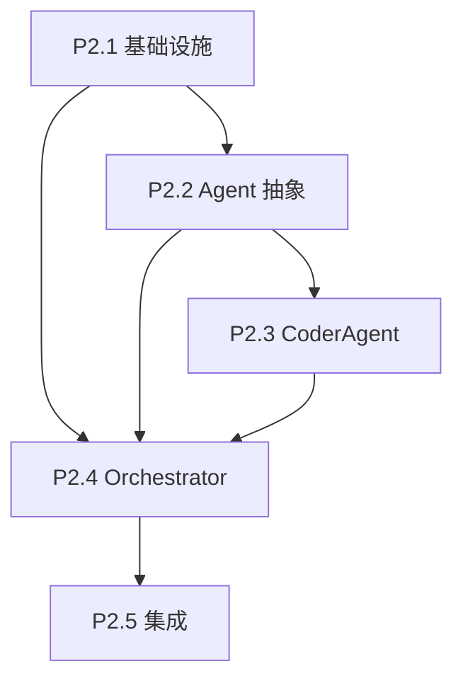

# Phase 2 拆分方案

## 推荐拆分方案

| 子阶段 | 核心模块 | 文件数 | 工作量 | 验证难度 |
|--------|---------|--------|--------|---------|
| P2.1 基础设施 | 工具函数 + 执行器 | 5 个文件 | ⭐⭐ | 低 |
| P2.2 Agent 抽象 | BaseAgent + PromptBuilder | 3 个文件 | ⭐⭐ | 低 |
| P2.3 CoderAgent | 代码生成实现 | 2 个文件 | ⭐⭐⭐ | 中 |
| P2.4 Orchestrator | 任务编排器 | 1 个文件 | ⭐⭐⭐⭐ | 高 |
| P2.5 集成与收尾 | 集成测试 + 文档 | 3 个文件 | ⭐⭐ | 中 |

---

## 详细拆分

### P2.1 基础设施层 (最底层,无依赖)

**实现内容:**
```
utils/response.py         # 解析 LLM 响应
utils/data_preview.py     # 生成数据预览
utils/metric.py           # 评估指标工具
core/executor/interpreter.py  # 代码执行沙箱
core/executor/workspace.py    # 工作空间管理
tests/unit/test_interpreter.py
tests/unit/test_workspace.py
```

**验证标准:**
- Interpreter 可执行简单 Python 代码
- 超时控制生效
- WorkspaceManager 可正确重写 submission 路径
- 单元测试覆盖率 >= 80%

---

### P2.2 Agent 抽象层 (依赖 P2.1 + journal)

**实现内容:**
```
agents/base_agent.py      # 抽象基类 + 数据类
utils/prompt_builder.py   # Prompt 模板
core/state/journal.py [MODIFY]  # 新增 generate_summary()
tests/unit/test_prompt_builder.py
```

**验证标准:**
- BaseAgent 接口定义清晰
- PromptBuilder 可生成统一 prompt
- Journal.generate_summary() 输出符合预期
- Mock 测试通过

---

### P2.3 CoderAgent 实现 (依赖 P2.1 + P2.2)

**实现内容:**
```
agents/coder_agent.py     # CoderAgent._explore()
tests/unit/test_agents.py
```

**验证标准:**
- 可调用 backend.query() (Mock LLM)
- 可解析 LLM 响应并生成 Node
- 重试机制生效
- 单元测试覆盖率 >= 80%

---

### P2.4 Orchestrator 编排器 (依赖 P2.1 + P2.2 + P2.3)

**实现内容:**
```
core/orchestrator.py      # 主循环 + Review + 搜索策略
tests/unit/test_orchestrator.py
```

**验证标准:**
- step() 可完成单步流程
- 父节点选择策略正确 (初稿/修复/改进)
- Review 评估正常 (Mock LLM)
- best_node 更新逻辑正确
- 单元测试覆盖率 >= 80%

⚠️ **注意**: 这是最复杂的部分,建议优先实现核心流程,Review 解析可暂时简化

---

### P2.5 集成与收尾 (依赖所有前置阶段)

**实现内容:**
```
core/state/task.py [MODIFY]   # TaskType 改为 "explore"|"merge"
core/state/node.py [MODIFY]   # task_type 默认值改为 "explore"
tests/integration/test_phase2.py  # 端到端测试
文档更新 (使用 doc-updater agent)
```

**验证标准:**
- 完整流程可运行 (Orchestrator.run())
- 集成测试通过
- 文档与代码一致

---

## 依赖关系图



---
