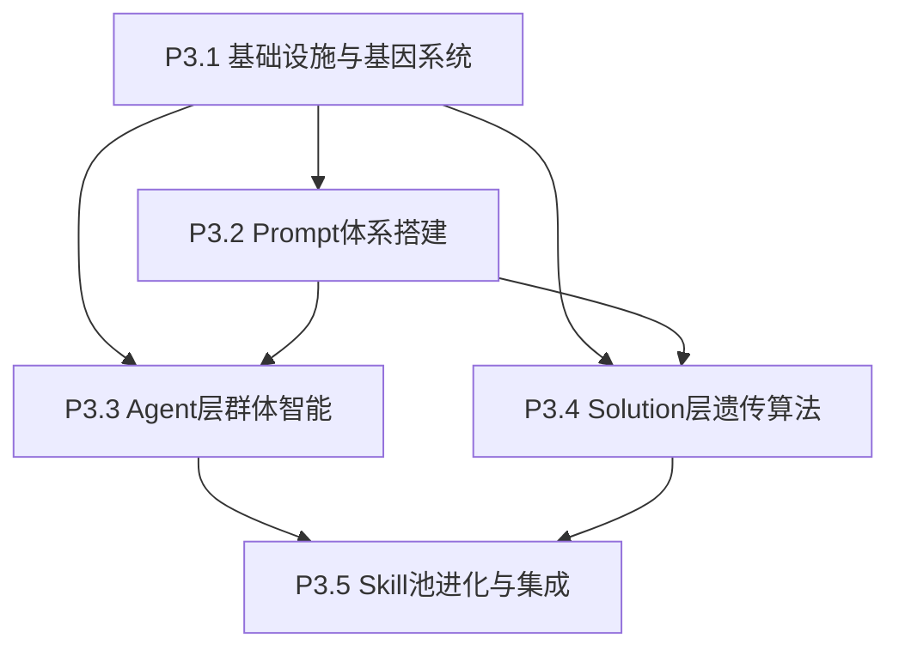

# Phase 3 拆分方案

## 推荐拆分方案

| 子阶段 | 核心模块 | 文件数 | 工作量 | 验证难度 | 预计工时 |
|--------|---------|--------|--------|---------|---------|
| P3.1 基础设施与基因系统 | 基因解析 + 经验池 + 适应度 | 6 个文件 | ⭐⭐ | 低 | 12h |
| P3.2 Prompt体系搭建 | Prompt管理器 + 模板 + Skill | 15 个文件 | ⭐⭐⭐ | 中 | 18h |
| P3.3 Agent层群体智能 | 任务分配 + Agent进化(Role) | 4 个文件 | ⭐⭐⭐ | 中 | 14h |
| P3.4 Solution层遗传算法 | 遗传算法 + 并行评估 | 4 个文件 | ⭐⭐⭐⭐ | 高 | 20h |
| P3.5 Skill池进化与集成 | Skill提取/管理 + 集成 | 6 个文件 | ⭐⭐⭐⭐ | 高 | 22h |

**总计**: 约 86 小时（~11 工作日，单人）

---

## 详细拆分

### P3.1 基础设施与基因系统 (最底层,无依赖)

**实现内容:**
```
core/evolution/__init__.py                    # 进化机制子系统入口
core/evolution/gene_parser.py                 # 基因解析器（7个基因块提取）
core/evolution/experience_pool.py             # 共享经验池（TaskRecord 存储与查询）
search/fitness.py                             # 适应度计算与单调化
config/default.yaml [MODIFY]                  # 新增 evolution 配置区
agents/base_agent.py [MODIFY]                 # task_type 改为 Literal["explore", "merge", "mutate"]
core/state/journal.py [MODIFY]                # 新增 get_best_k() 方法

tests/test_evolution/test_gene_parser.py      # 基因解析器单元测试
tests/test_evolution/test_experience_pool.py  # 经验池单元测试
tests/test_search/test_fitness.py             # 适应度计算单元测试
```

**核心数据结构:**
```python
# 1. 基因解析器
def parse_solution_genes(code: str) -> Dict[str, str]:
    """提取 7 个基因块"""

# 2. 经验池
@dataclass
class TaskRecord:
    agent_id: str
    task_type: str  # "explore" | "merge" | "mutate"
    input_hash: str
    output_quality: float
    strategy_summary: str
    timestamp: float

class ExperiencePool:
    def add(self, record: TaskRecord) -> None
    def query(self, task_type: str, k: int) -> List[TaskRecord]
    def get_agent_stats(self, agent_id: str) -> Dict

# 3. 适应度计算
def normalize_fitness(metric_value: float, lower_is_better: bool) -> float:
    """统一转换为"越大越好"的适应度值"""
```

**验证标准:**
- [ ] `parse_solution_genes()` 可正确提取 7 个基因块
- [ ] ExperiencePool 可写入和查询 TaskRecord
- [ ] ExperiencePool 线程安全（多线程写入测试）
- [ ] `fitness.normalize_fitness()` 正确单调化
- [ ] 配置文件正确加载 evolution 配置区
- [ ] `AgentContext.task_type` 支持 3 种任务类型
- [ ] `Journal.get_best_k()` 返回正确的 Top-K 节点
- [ ] 单元测试覆盖率 >= 80%

**里程碑 M1**: 基础设施完成（Day 3）

---

### P3.2 Prompt体系搭建 (依赖 P3.1)

**实现内容:**
```
utils/prompt_manager.py                       # Prompt 管理器（核心类）
utils/prompt_builder.py [MODIFY]              # 改为调用 PromptManager.build_prompt()

# Jinja2 模板（3个）
benchmark/mle-bench/prompt_templates/explore.j2
benchmark/mle-bench/prompt_templates/merge.j2
benchmark/mle-bench/prompt_templates/mutate.j2

# 静态 Skill（4个）
benchmark/mle-bench/skills/static/output_format.md
benchmark/mle-bench/skills/static/workspace_rules.md
benchmark/mle-bench/skills/static/ml_best_practices.md
benchmark/mle-bench/skills/static/code_style.md

# 任务特定 Skill（4个）
benchmark/mle-bench/skills/by_task_type/merge/crossover_strategies.md
benchmark/mle-bench/skills/by_task_type/merge/conflict_resolution.md
benchmark/mle-bench/skills/by_task_type/mutate/mutation_strategies.md
benchmark/mle-bench/skills/by_task_type/mutate/local_optimization.md

# Agent 配置（4个Agent × 4个文件）
benchmark/mle-bench/agent_configs/agent_0/role.md
benchmark/mle-bench/agent_configs/agent_0/strategy_explore.md
benchmark/mle-bench/agent_configs/agent_0/strategy_merge.md
benchmark/mle-bench/agent_configs/agent_0/strategy_mutate.md
benchmark/mle-bench/agent_configs/agent_1/... (同上)
benchmark/mle-bench/agent_configs/agent_2/... (同上)
benchmark/mle-bench/agent_configs/agent_3/... (同上)

# Skill 元数据（初始化空文件）
benchmark/mle-bench/skills/meta/skill_index.json
benchmark/mle-bench/skills/meta/skill_lineage.json
benchmark/mle-bench/skills/meta/update_history.json

tests/test_evolution/test_prompt_manager.py   # Prompt 管理器单元测试
```

**核心接口:**
```python
class PromptManager:
    def __init__(self, template_dir: Path, skills_dir: Path):
        """初始化 Jinja2 环境"""

    def load_skill(self, skill_path: str) -> str:
        """加载 Skill 文件"""

    def load_agent_config(self, agent_id: str, section: str) -> str:
        """加载 Agent 配置"""

    def inject_top_k_skills(
        self,
        task_type: str,
        k: int = 5,
        **filters
    ) -> str:
        """注入 Top-K 动态 Skill（从经验池提取）"""

    def build_prompt(
        self,
        task_type: str,
        agent_id: str,
        context: Dict,
    ) -> str:
        """渲染完整 Prompt"""
```

**Prompt 7层结构（模板示例）:**
```jinja2
<!-- SECTION: ROLE [EVOLVABLE] -->
{{ load_agent_config(agent_id, "role") }}
<!-- END SECTION: ROLE -->

<!-- SECTION: FORMAT [STATIC_SKILL] -->
{{ load_skill("static/output_format") }}
<!-- END SECTION: FORMAT -->

<!-- SECTION: STRATEGY [HYBRID] -->
{{ load_skill("static/ml_best_practices") }}
{{ load_agent_config(agent_id, "strategy_" + task_type) }}
<!-- END SECTION: STRATEGY -->

<!-- SECTION: EXAMPLES [DYNAMIC_SKILL] -->
{{ inject_top_k_skills(task_type=task_type, k=5) }}
<!-- END SECTION: EXAMPLES -->
```

**验证标准:**
- [ ] PromptManager 可加载静态 Skill
- [ ] PromptManager 可加载 Agent 配置
- [ ] PromptManager 可渲染 3 种任务的完整 Prompt
- [ ] Jinja2 模板语法正确（无渲染错误）
- [ ] 静态 Skill 内容完整（基于 AIDE/ML-Master 提取）
- [ ] Agent 配置初始化（4个Agent，每个4个配置文件）
- [ ] `inject_top_k_skills()` 可从经验池提取（Mock 测试）
- [ ] Prompt 包含类 XML 分隔标记（可追踪性）
- [ ] 单元测试覆盖率 >= 80%

**里程碑 M2**: Prompt 体系完成（Day 6）

---

### P3.3 Agent层群体智能 (依赖 P3.1 + P3.2)

**实现内容:**
```
core/evolution/task_dispatcher.py             # 动态任务分配（Epsilon-Greedy）
core/evolution/agent_evolution.py             # Agent 进化（仅 Role 变异，暂不含 Skill 池）

tests/test_evolution/test_task_dispatcher.py  # 任务分配单元测试
tests/test_evolution/test_agent_evolution.py  # Agent 进化单元测试
```

**核心逻辑:**

```python
# 1. 动态任务分配
class TaskDispatcher:
    def __init__(self, agents: List[BaseAgent], epsilon: float = 0.3):
        self.agents = agents
        self.epsilon = epsilon
        # 每个 Agent 对每种任务类型的擅长度得分
        self.specialization_scores: Dict[str, Dict[str, float]] = {}

    def select_agent(self, task_type: str) -> BaseAgent:
        """Epsilon-Greedy 选择 Agent"""
        if random.random() < self.epsilon:
            return random.choice(self.agents)  # 探索
        else:
            return self._select_best(task_type)  # 利用

    def update_score(self, agent_id: str, task_type: str, quality: float):
        """指数移动平均更新擅长度得分"""
        alpha = 0.3
        old_score = self.specialization_scores[agent_id][task_type]
        new_score = (1 - alpha) * old_score + alpha * quality
        self.specialization_scores[agent_id][task_type] = new_score

# 2. Agent 进化（Role 变异）
class AgentEvolution:
    def __init__(self, agents: List[BaseAgent], experience_pool: ExperiencePool):
        self.agents = agents
        self.experience_pool = experience_pool

    def evolve(self, epoch: int) -> None:
        """每 3 个 Epoch 进化一次"""
        if epoch % 3 != 0:
            return

        # 评估所有 Agent
        scores = self._evaluate_agents()

        # 排序：top-2 精英，bottom-2 弱者
        ranked = sorted(scores.items(), key=lambda x: x[1], reverse=True)
        elites = [agent_id for agent_id, _ in ranked[:2]]
        weak = [agent_id for agent_id, _ in ranked[2:]]

        # 精英保留（Role 不变）
        log_msg("INFO", f"精英 Agent: {elites}")

        # 弱者变异（Role 变异）
        for weak_agent_id in weak:
            self._mutate_role(weak_agent_id, elite_id=random.choice(elites))
            # 同时变异 3 种 Strategy（explore, merge, mutate）
            for task_type in ["explore", "merge", "mutate"]:
                self._mutate_strategy(weak_agent_id, task_type, elite_id=random.choice(elites))

    def _evaluate_agents(self) -> Dict[str, float]:
        """评估所有 Agent（成功率 × 平均质量）"""
        scores = {}
        for agent_id in self.agents:
            stats = self.experience_pool.get_agent_stats(agent_id)
            success_rate = stats["success_count"] / max(1, stats["total_count"])
            avg_quality = stats["avg_quality"]
            scores[agent_id] = success_rate * avg_quality
        return scores

    def _mutate_role(self, weak_agent_id: str, elite_id: str):
        """Role 变异（LLM 生成新角色定位）"""
        # 读取当前 Role
        current_role = load_agent_config(weak_agent_id, "role")
        elite_role = load_agent_config(elite_id, "role")

        # 构建变异 Prompt
        stats = self.experience_pool.get_agent_stats(weak_agent_id)
        mutation_prompt = f"""
        你是一个 Agent 角色进化器。

        **当前角色**:
        {current_role}

        **精英角色（参考）**:
        {elite_role}

        **历史表现**:
        - 成功率: {stats['success_rate']:.2%}
        - 平均质量: {stats['avg_quality']:.3f}
        - Top-3 成功案例: {stats['top_successes']}
        - Top-5 失败案例: {stats['top_failures']}

        **任务**: 进化当前角色，针对失败模式增加规避建议，学习精英策略但保持差异性。

        **约束**:
        1. 保持 Markdown 格式
        2. 保留成功策略要素
        3. 输出完整的 role.md 内容
        """

        # LLM 生成新 Role
        new_role = query(system_message=mutation_prompt, ...)

        # 写入文件
        save_agent_config(weak_agent_id, "role", new_role)

    def _mutate_strategy(self, weak_agent_id: str, task_type: str, elite_id: str):
        """Strategy 变异（分任务类型独立变异）"""
        # 类似 _mutate_role，但针对 strategy_explore/merge/mutate
        ...
```

**验证标准:**
- [ ] TaskDispatcher 可正确选择 Agent（epsilon-greedy 逻辑）
- [ ] `update_score()` 正确更新擅长度得分（指数移动平均）
- [ ] AgentEvolution 可评估所有 Agent
- [ ] AgentEvolution 可识别精英和弱者（top-2, bottom-2）
- [ ] Role 变异可生成新的 role.md（LLM Mock 测试）
- [ ] Strategy 变异可独立处理 3 种任务类型
- [ ] 变异后的配置文件格式正确（Markdown）
- [ ] 单元测试覆盖率 >= 80%

**⚠️ 注意**: 本阶段暂不实现 Skill 池更新（留到 P3.5）

**里程碑 M3**: Agent 层群体智能完成（Day 9）

---

### P3.4 Solution层遗传算法 (依赖 P3.1 + P3.2)

**实现内容:**
```
core/evolution/solution_evolution.py          # 遗传算法（选择/交叉/变异/精英）
search/parallel_evaluator.py                  # 并行评估器（ThreadPoolExecutor）

tests/test_evolution/test_solution_evolution.py  # 遗传算法单元测试
tests/test_search/test_parallel_evaluator.py     # 并行评估器单元测试
```

**核心逻辑:**

```python
# 1. Solution 层遗传算法
class SolutionEvolution:
    def __init__(
        self,
        agents: List[BaseAgent],
        task_dispatcher: TaskDispatcher,
        evaluator: ParallelEvaluator,
        config: Config
    ):
        self.agents = agents
        self.task_dispatcher = task_dispatcher
        self.evaluator = evaluator
        self.config = config

        self.population: List[Node] = []  # 当前种群（12个）
        self.elite_size = config.evolution.solution.elite_size  # 3
        self.mutation_rate = config.evolution.solution.mutation_rate  # 0.2
        self.tournament_k = config.evolution.solution.tournament_k  # 3

    def initialize_population(self) -> None:
        """初始化种群（explore Agent 并行生成）"""
        tasks = []
        for i in range(self.config.evolution.solution.population_size):
            agent = self.task_dispatcher.select_agent("explore")
            context = AgentContext(
                task_type="explore",
                parent_node=None,  # 从零生成
                journal=...,
                config=...,
            )
            tasks.append((agent, context))

        # 并行生成
        results = self.evaluator.batch_generate(tasks)
        self.population = [r.node for r in results if r.success]

        # 并行评估
        self.evaluator.batch_evaluate(self.population)

    def step(self) -> None:
        """单步进化"""
        # [1] 精英保留
        elites = self._select_elites()

        # [2] 锦标赛选择父代对
        parent_pairs = self._select_parent_pairs()

        # [3] 基因交叉（Merge Agent）
        offspring = []
        for parent_a, parent_b in parent_pairs:
            if random.random() < self.config.evolution.solution.crossover_rate:
                child = self._crossover(parent_a, parent_b)
                offspring.append(child)

        # [4] 基因变异（Mutate Agent）
        for node in offspring:
            if random.random() < self.mutation_rate:
                self._mutate(node)

        # [5] 并行评估新个体
        self.evaluator.batch_evaluate(offspring)

        # [6] 合并精英 + 新个体，截断到种群大小
        combined = elites + offspring
        combined.sort(key=lambda n: n.metric_value or -1e9, reverse=True)
        self.population = combined[:self.config.evolution.solution.population_size]

    def _select_elites(self) -> List[Node]:
        """精英保留（top-3）"""
        return sorted(
            self.population,
            key=lambda n: n.metric_value or -1e9,
            reverse=True
        )[:self.elite_size]

    def _select_parent_pairs(self) -> List[Tuple[Node, Node]]:
        """锦标赛选择父代对"""
        num_offspring = self.config.evolution.solution.population_size - self.elite_size
        pairs = []
        for _ in range(num_offspring):
            parent_a = self._tournament_select()
            parent_b = self._tournament_select()
            pairs.append((parent_a, parent_b))
        return pairs

    def _tournament_select(self) -> Node:
        """锦标赛选择（随机抽 k 个，返回最优者）"""
        candidates = random.sample(self.population, self.tournament_k)
        return max(candidates, key=lambda n: n.metric_value or -1e9)

    def _crossover(self, parent_a: Node, parent_b: Node) -> Node:
        """基因交叉（Merge Agent 执行）"""
        # 生成 gene_plan（随机选择每个基因块来自 A 或 B）
        gene_plan = {
            gene: random.choice(["A", "B"])
            for gene in ["DATA", "MODEL", "LOSS", "OPTIMIZER", "REGULARIZATION", "INITIALIZATION", "TRAINING_TRICKS"]
        }

        # 选择 Merge Agent
        agent = self.task_dispatcher.select_agent("merge")

        # 构建上下文
        context = AgentContext(
            task_type="merge",
            parent_node=parent_a,  # 传递给 agent
            journal=...,
            config=...,
            # 额外信息通过 config 传递
            merge_info={
                "parent_b": parent_b,
                "gene_plan": gene_plan
            }
        )

        # Agent 生成子代
        result = agent.generate(context)
        return result.node

    def _mutate(self, node: Node) -> None:
        """基因变异（Mutate Agent 执行）"""
        # 随机选择一个基因块
        target_gene = random.choice(["MODEL", "LOSS", "OPTIMIZER", "REGULARIZATION", "INITIALIZATION", "TRAINING_TRICKS"])
        # 注意：DATA 一般不变异，保持数据划分一致

        # 选择 Mutate Agent
        agent = self.task_dispatcher.select_agent("mutate")

        # 构建上下文
        context = AgentContext(
            task_type="mutate",
            parent_node=node,
            journal=...,
            config=...,
            mutate_info={"target_gene": target_gene}
        )

        # Agent 生成变异后的代码
        result = agent.generate(context)
        # 原地更新（变异是对 node 的修改）
        node.code = result.node.code
        node.plan = result.node.plan

# 2. 并行评估器
class ParallelEvaluator:
    def __init__(self, max_workers: int, workspace: WorkspaceManager, interpreter: Interpreter):
        self.executor = ThreadPoolExecutor(max_workers=max_workers)
        self.workspace = workspace
        self.interpreter = interpreter

    def batch_evaluate(self, nodes: List[Node]) -> None:
        """并行评估所有节点（执行代码 + 解析 metric）"""
        futures = []
        for node in nodes:
            future = self.executor.submit(self._evaluate_one, node)
            futures.append(future)

        # 等待所有完成
        for future, node in zip(futures, nodes):
            try:
                metric_value = future.result(timeout=300)
                node.metric_value = metric_value
            except Exception as e:
                log_msg("ERROR", f"节点 {node.id} 评估失败: {e}")
                node.is_buggy = True
                node.metric_value = -1e9

    def _evaluate_one(self, node: Node) -> float:
        """评估单个节点"""
        # 执行代码
        modified_code = self.workspace.rewrite_submission_path(node.code, node.id)
        exec_result = self.interpreter.run(modified_code, reset_session=True)

        # 更新节点信息
        node.term_out = "".join(exec_result.term_out)
        node.exec_time = exec_result.exec_time
        node.exc_type = exec_result.exc_type

        # 解析 metric（从输出中提取）
        if exec_result.exc_type is not None:
            return -1e9  # buggy

        metric_value = self._parse_metric(node.term_out)
        return metric_value

    def _parse_metric(self, term_out: str) -> float:
        """从执行输出中解析 metric"""
        # 简单实现：正则提取
        import re
        match = re.search(r'Validation metric:\s*([\d.]+)', term_out)
        if match:
            return float(match.group(1))
        return 0.0
```

**验证标准:**
- [ ] `initialize_population()` 可并行生成 12 个初始 solution
- [ ] `_select_elites()` 正确返回 top-3
- [ ] `_tournament_select()` 逻辑正确（锦标赛选择）
- [ ] `_crossover()` 可调用 Merge Agent 生成子代
- [ ] `_mutate()` 可调用 Mutate Agent 变异节点
- [ ] ParallelEvaluator 可并行评估多个节点
- [ ] `_parse_metric()` 可从输出中提取 metric
- [ ] 并发安全（submission 文件不冲突）
- [ ] buggy 个体被正确标记（fitness = -1e9）
- [ ] 单元测试覆盖率 >= 80%

**⚠️ 注意**: 这是最复杂的部分,建议优先实现核心流程,边界情况可后续优化

**里程碑 M4**: Solution 层遗传算法完成（Day 12）

---

### P3.5 Skill池进化与集成 (依赖所有前置阶段)

**实现内容:**
```
core/evolution/skill_extractor.py             # Skill 提取器（经验池聚类 + LLM生成）
core/evolution/skill_manager.py               # Skill 池管理器（质量评估 + 演化）
core/evolution/agent_evolution.py [MODIFY]    # 补充 Skill 池更新逻辑
core/orchestrator.py [MODIFY]                 # 接入双层进化调度
utils/prompt_manager.py [MODIFY]              # 补充 update_skill_pool() 和评估方法

tests/test_evolution/test_skill_extractor.py  # Skill 提取器单元测试
tests/test_evolution/test_skill_manager.py    # Skill 管理器单元测试
tests/integration/test_phase3.py              # 双层进化端到端测试
```

**核心逻辑:**

```python
# 1. Skill 提取器
class SkillExtractor:
    def __init__(self, experience_pool: ExperiencePool):
        self.experience_pool = experience_pool

    def extract_skills(self, task_type: str, min_cluster_size: int = 5) -> List[Dict]:
        """从经验池提取 Skill"""
        # [1] 获取成功案例
        records = self.experience_pool.query(
            task_type=task_type,
            filters={"output_quality": (">", 0.5)}
        )

        if len(records) < min_cluster_size:
            return []

        # [2] 提取 strategy_summary 并向量化
        strategies = [r.strategy_summary for r in records]
        embeddings = self._embed_texts(strategies)

        # [3] HDBSCAN 聚类
        clusters = self._cluster(embeddings, min_cluster_size)

        # [4] LLM 总结每个簇
        skills = []
        for cluster_id, indices in clusters.items():
            cluster_strategies = [strategies[i] for i in indices]
            skill_content = self._summarize_cluster(cluster_strategies, task_type)

            skills.append({
                "id": f"skill_{task_type}_{cluster_id}_{int(time.time())}",
                "task_type": task_type,
                "content": skill_content,
                "coverage": len(indices),
                "success_rate": self._calc_success_rate(indices, records),
                "avg_quality": self._calc_avg_quality(indices, records),
                "status": "candidate"  # 初始状态
            })

        return skills

    def _embed_texts(self, texts: List[str]) -> np.ndarray:
        """文本向量化（使用 OpenAI Embedding 或本地模型）"""
        # 简化实现：调用 OpenAI API
        from openai import OpenAI
        client = OpenAI(api_key=...)
        embeddings = []
        for text in texts:
            response = client.embeddings.create(
                model="text-embedding-3-small",
                input=text
            )
            embeddings.append(response.data[0].embedding)
        return np.array(embeddings)

    def _cluster(self, embeddings: np.ndarray, min_cluster_size: int) -> Dict[int, List[int]]:
        """HDBSCAN 聚类"""
        import hdbscan
        clusterer = hdbscan.HDBSCAN(min_cluster_size=min_cluster_size)
        labels = clusterer.fit_predict(embeddings)

        # 组织结果
        clusters = {}
        for i, label in enumerate(labels):
            if label == -1:  # 噪声点
                continue
            if label not in clusters:
                clusters[label] = []
            clusters[label].append(i)

        return clusters

    def _summarize_cluster(self, strategies: List[str], task_type: str) -> str:
        """LLM 总结策略簇"""
        prompt = f"""
        你是一个 Skill 生成器。以下是多个成功的 {task_type} 策略：

        {chr(10).join(f"{i+1}. {s}" for i, s in enumerate(strategies))}

        **任务**: 总结这些策略的共性，生成一个可复用的 Skill。

        **输出格式**（Markdown）:
        ```markdown
        ## {task_type.capitalize()} Skill: <简短标题>

        ### 核心策略
        - ...

        ### 示例
        - ...

        ### 注意事项
        - ...
        ```
        """

        response = query(system_message=prompt, ...)
        return response

# 2. Skill 管理器
class SkillManager:
    def __init__(self, skills_dir: Path, meta_dir: Path):
        self.skills_dir = skills_dir
        self.meta_dir = meta_dir
        self.skill_index = self._load_index()  # skill_id -> 元数据

    def add_skill(self, skill: Dict) -> None:
        """添加新 Skill"""
        # 检查重复（语义相似度）
        if self._is_duplicate(skill):
            log_msg("WARNING", f"Skill {skill['id']} 重复，跳过")
            return

        # 写入文件
        skill_path = self.skills_dir / "by_task_type" / skill["task_type"] / "success_patterns" / f"{skill['id']}.md"
        skill_path.parent.mkdir(parents=True, exist_ok=True)
        skill_path.write_text(skill["content"])

        # 更新索引
        self.skill_index[skill["id"]] = {
            "task_type": skill["task_type"],
            "coverage": skill["coverage"],
            "success_rate": skill["success_rate"],
            "avg_quality": skill["avg_quality"],
            "status": "active",
            "created_at": time.time(),
            "last_used": None,
            "usage_count": 0
        }
        self._save_index()

    def evaluate_skill(self, skill_id: str, experience_pool: ExperiencePool) -> float:
        """计算 Skill 综合评分"""
        meta = self.skill_index[skill_id]

        # 新鲜度（指数衰减）
        days_since_creation = (time.time() - meta["created_at"]) / 86400
        freshness = np.exp(-0.1 * days_since_creation)

        # 综合评分
        score = (
            0.4 * meta["success_rate"]
            + 0.3 * np.log(1 + meta["coverage"]) / np.log(10)
            + 0.2 * meta["avg_quality"]
            + 0.1 * freshness
        )

        return score

    def evolve_skills(self, experience_pool: ExperiencePool) -> None:
        """Skill 池演化（新增/合并/淘汰）"""
        # [1] 新增：提取新 Skill
        extractor = SkillExtractor(experience_pool)
        for task_type in ["explore", "merge", "mutate"]:
            new_skills = extractor.extract_skills(task_type)
            for skill in new_skills:
                # 质量过滤
                if skill["success_rate"] >= 0.5:
                    self.add_skill(skill)

        # [2] 合并：检测相似 Skill
        self._merge_similar_skills()

        # [3] 淘汰：移除低效 Skill
        self._deprecate_low_quality_skills(experience_pool)

    def _is_duplicate(self, skill: Dict, threshold: float = 0.85) -> bool:
        """检测 Skill 是否重复（语义相似度）"""
        # 向量化新 Skill
        new_embedding = self._embed_text(skill["content"])

        # 与现有 Skill 比较
        for existing_id, meta in self.skill_index.items():
            if meta["task_type"] != skill["task_type"]:
                continue

            existing_content = self._load_skill_content(existing_id)
            existing_embedding = self._embed_text(existing_content)

            similarity = cosine_similarity(new_embedding, existing_embedding)
            if similarity > threshold:
                return True

        return False

    def _merge_similar_skills(self, threshold: float = 0.85):
        """合并相似 Skill"""
        # 计算所有 Skill 的相似度矩阵
        # 识别相似对
        # LLM 合并为更通用的 Skill
        # 保留 lineage（记录合并历史）
        ...

    def _deprecate_low_quality_skills(self, experience_pool: ExperiencePool):
        """淘汰低质量 Skill"""
        for skill_id, meta in self.skill_index.items():
            # 连续 5 Epoch 未使用
            if meta["usage_count"] == 0 and self._epochs_since_creation(skill_id) >= 5:
                self._move_to_deprecated(skill_id)

            # 成功率过低
            if meta["success_rate"] < 0.4:
                self._move_to_deprecated(skill_id)

# 3. AgentEvolution 补充 Skill 池更新
class AgentEvolution:
    def evolve(self, epoch: int) -> None:
        """每 3 个 Epoch 进化一次"""
        if epoch % 3 != 0:
            return

        # [1] Role 变异（已在 P3.3 实现）
        ...

        # [2] Skill 池更新（新增）
        log_msg("INFO", "开始 Skill 池更新")
        self.skill_manager.evolve_skills(self.experience_pool)
        log_msg("INFO", "Skill 池更新完成")

        # [3] 所有 Agent 重新加载 Skill 池
        self.prompt_manager.reload_skills()

# 4. Orchestrator 集成
class Orchestrator:
    def run(self, num_epochs: int) -> Optional[Node]:
        """主循环（双层进化）"""
        # 初始化 Solution 种群
        self.solution_evolution.initialize_population()

        for epoch in range(num_epochs):
            log_msg("INFO", f"===== Epoch {epoch} 开始 =====")

            # Solution 层进化
            for step in range(self.config.evolution.steps_per_epoch):
                self.solution_evolution.step()

            # Agent 层进化（每 3 Epoch）
            self.agent_evolution.evolve(epoch)

            # 日志记录
            best = self.journal.get_best_node()
            log_msg("INFO", f"Epoch {epoch} 最佳 fitness: {best.metric_value if best else 'N/A'}")

        return self.best_node
```

**验证标准:**
- [ ] SkillExtractor 可从经验池提取 Skill（HDBSCAN 聚类）
- [ ] SkillExtractor 可调用 LLM 总结策略簇
- [ ] SkillManager 可添加新 Skill（检测重复）
- [ ] SkillManager 可评估 Skill 质量（综合评分公式）
- [ ] SkillManager 可演化 Skill 池（新增/合并/淘汰）
- [ ] AgentEvolution 可触发 Skill 池更新
- [ ] Orchestrator 可运行完整双层进化流程
- [ ] 集成测试通过（6 个 epoch，观察 fitness 提升）
- [ ] Journal 持续累积，不重置
- [ ] `orchestrator.best_node` 追踪全局最优
- [ ] 单元测试覆盖率 >= 80%

**特别验证（Skill 池）:**
- [ ] Skill 池正确生成和更新
- [ ] Skill 质量评估有效（评分公式计算正确）
- [ ] Skill 注入 Prompt 后效果提升（对比实验）
- [ ] 演化机制正确（新增/合并/淘汰/升级）
- [ ] Top-K 注入策略有效（高质量 Skill 优先）

**里程碑 M5**: Phase 3 完整实现（Day 14）

---

## 依赖关系图



---

## 关键约束

| 约束 | 原因 | 实现方式 |
|------|------|---------|
| P3.2 必须先于 P3.3/P3.4 | Prompt 系统是 Agent 和 Solution 层的基础 | 严格按顺序开发 |
| P3.3 和 P3.4 可并行 | Agent 层和 Solution 层相对独立 | 可双人并行开发 |
| P3.5 必须最后 | Skill 池依赖完整的经验池数据 | 确保前 4 个阶段完成 |
| 经验池线程安全 | 并行写入场景 | 使用 threading.Lock |
| Skill 池增量更新 | 降低计算成本 | 每 3 Epoch 批量更新 |
| Journal 永不重置 | 追踪全局最优 | Orchestrator 全局管理 |

---

## 成功标准

### 功能完整性
- [ ] 基因解析器可正确提取 7 个基因块
- [ ] 经验池可线程安全地写入和查询
- [ ] Prompt 管理器可渲染 3 种任务的 Prompt
- [ ] 任务分配器可动态选择 Agent（epsilon-greedy）
- [ ] Agent 进化可变异 Role 和 Strategy
- [ ] Solution 遗传算法可执行选择/交叉/变异
- [ ] 并行评估器可并发评估多个 solution
- [ ] Skill 提取器可从经验池生成 Skill
- [ ] Skill 管理器可演化 Skill 池
- [ ] Orchestrator 可运行完整双层进化流程
- [ ] Journal 持续累积，追踪全局最优

### 测试覆盖率
- [ ] 所有单元测试通过（覆盖率 >= 80%）
- [ ] 集成测试通过（6 个 epoch，fitness 提升）

### 代码质量
- [ ] Ruff 格式化通过
- [ ] 所有函数包含中文 Docstring
- [ ] 使用 `utils.logger_system`（不使用 print()）

---

## 风险缓解

| 风险 | 等级 | 缓解措施 |
|------|------|---------|
| Skill 提取质量不高 | 中 | 人工审核样本 + 调整聚类参数 |
| Skill 池过度膨胀 | 中 | 定期清理 + 严格淘汰标准 |
| LLM 生成 Skill 不稳定 | 中 | 多样本生成取 consensus + 格式验证 |
| 并行评估 submission 冲突 | 高 | WorkspaceManager 强制 node_id 后缀 |
| 经验池并发写入竞争 | 中 | 线程安全数据结构 (threading.Lock) |
| Agent 涌现分工不收敛 | 中 | 30% 随机探索 + 最小分化阈值 |
| 种群多样性丧失 | 中 | 变异率 20% + explore 任务保证新鲜血液 |
| Journal 内存占用过大 | 低 | 可选：定期归档旧节点到磁盘 |

---

## 实施建议

### 开发顺序
1. **P3.1** - 奠定基础（基因解析 + 经验池）
2. **P3.2** - 构建 Prompt 体系（最耗时，但可并行开发模板和 Skill）
3. **P3.3** 和 **P3.4** - 可并行开发（双人协作）
4. **P3.5** - 最后集成（需要前 4 个阶段的完整数据）

### 每个子阶段的工作流
1. **规划**: 阅读本拆分方案，明确目标
2. **编码**: 实现核心逻辑，遵循 MVP 原则
3. **测试**: 编写单元测试，确保覆盖率 >= 80%
4. **验证**: 运行验证命令，确保所有标准通过
5. **文档**: 使用 `doc-updater` Agent 同步文档

### 里程碑检查点
- **Day 3**: M1 - 基础设施完成
- **Day 6**: M2 - Prompt 体系完成
- **Day 9**: M3 - Agent 层完成
- **Day 12**: M4 - Solution 层完成
- **Day 14**: M5 - 完整集成

---

**文档版本**: v1.0
**创建日期**: 2026-01-31
**下一步**: 等待用户审核批准后，开始 P3.1 实施
